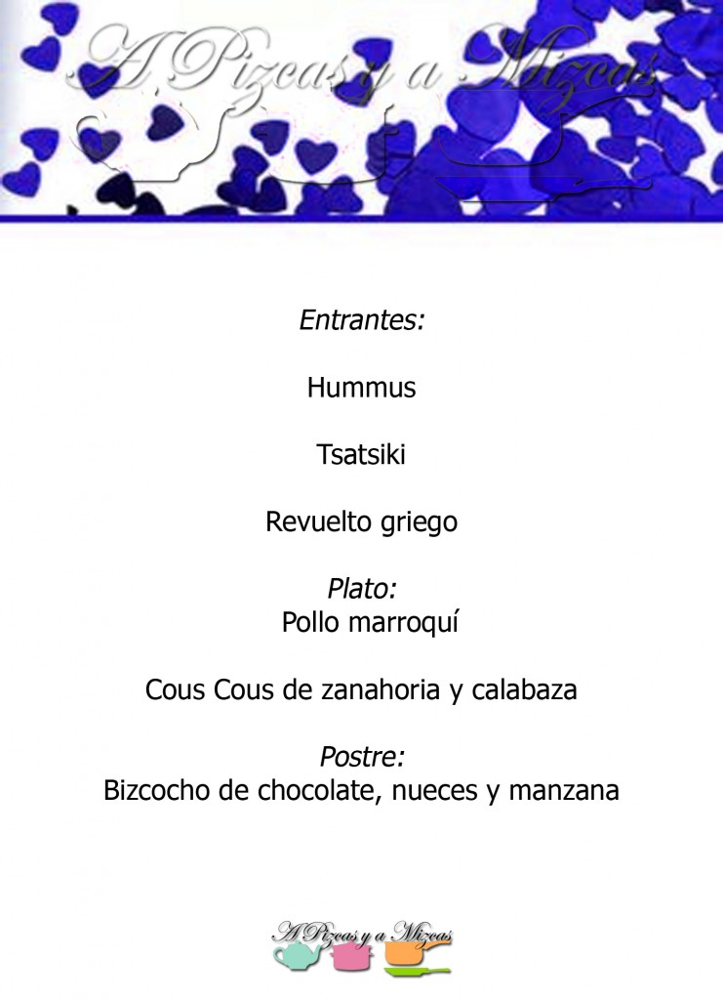
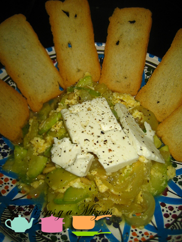
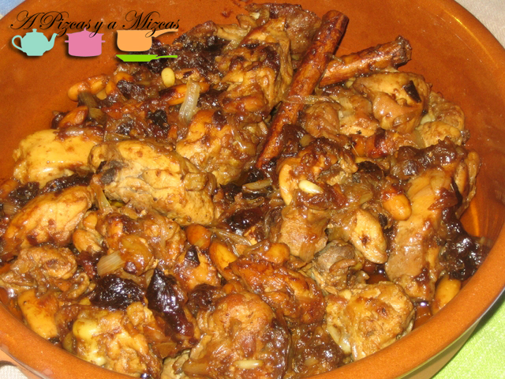
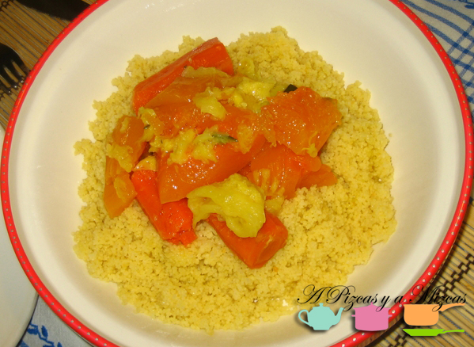
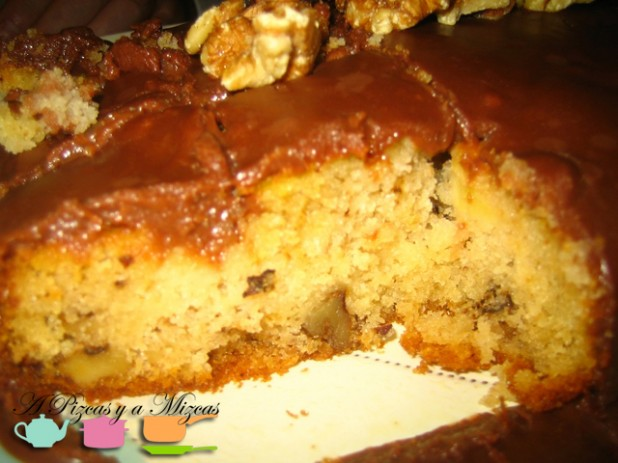

Ya quedan pocos días para celebrar el día de [San Valentín](http://es.wikipedia.org/wiki/D%C3%ADa_de_San_Valent%C3%ADn). Seguro que muchos de vosotros optaréis por salir a cenar en pareja fuera de casa, para los que queráis sorprender con una opción más personal desde A Pizcas y a Mizcas os vamos a sugerir una serie de menús completos. Os dejamos otro  menú para San Valentín os proponemos un cena temática "Las orillas del Mediterráneo", para viajar gastronomicamente a otros países sin movernos del salón de casa. Esta vez nos trasaladamos a Santorini y a Tunez...

## Menú para San Valentín "Las orillas del Mediterráneo"

Para empezar:

[Hummus](/una-cena-desde-la-otra-orilla-del-mediterraneo-kebab-y-falafel-caseros/)

")

[Tsatsiki](/una-cena-desde-la-otra-orilla-del-mediterraneo-kebab-y-falafel-caseros/)

")

[Revuelto griego](/revuelto-griego/)

Plato principal:

[Pollo marroquí](/pollo-marroqui-pizqueado/)

[Cous Cous de zanahoria y calabaza](/couscous-con-calabaza-y-zanahoria/)

Y de postre:

[Bizcocho de chocolate, nueces y manzana](/bizcocho-de-chocolate-nueces-y-manzana/)

