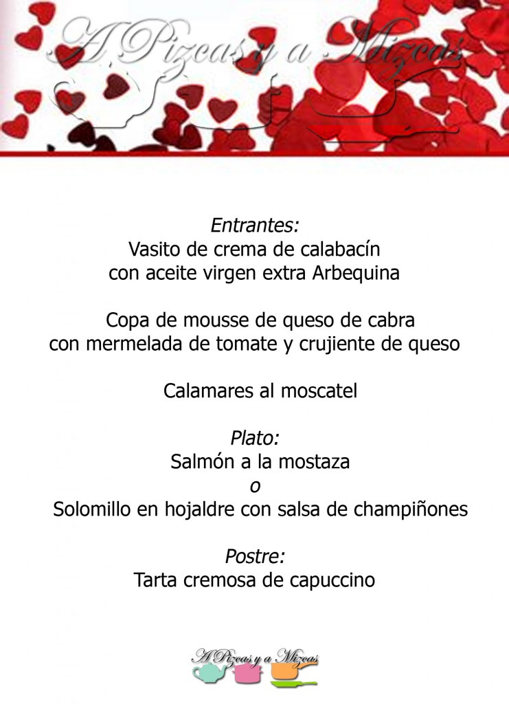
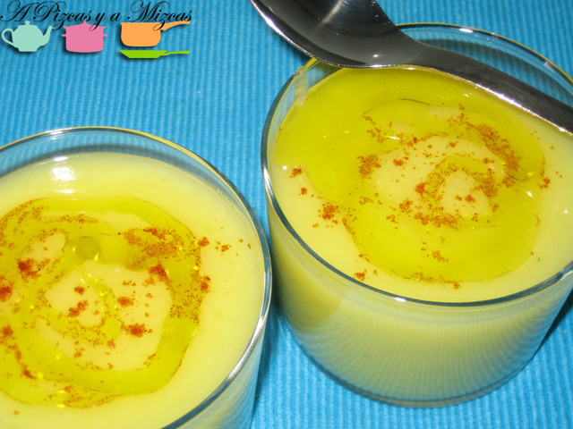
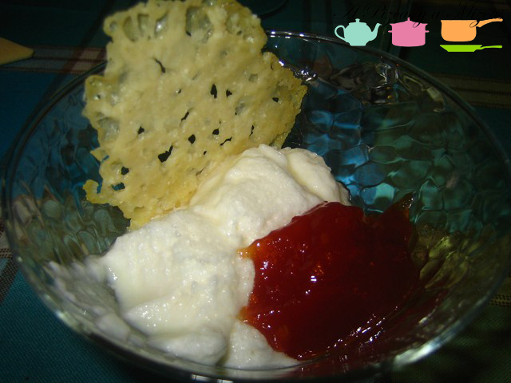
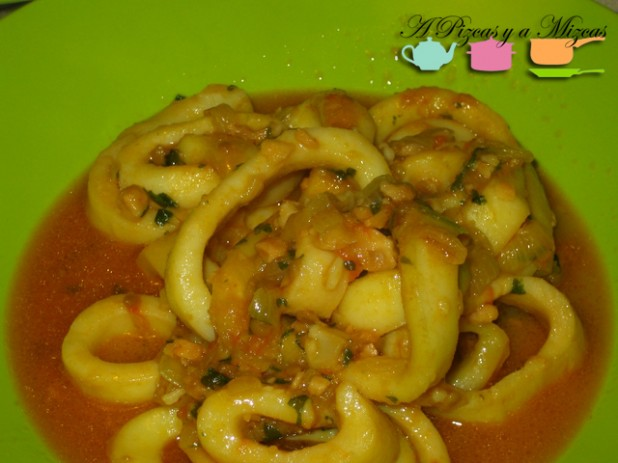
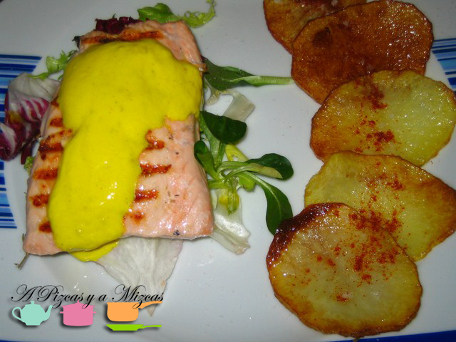
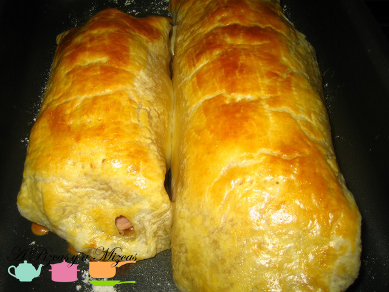
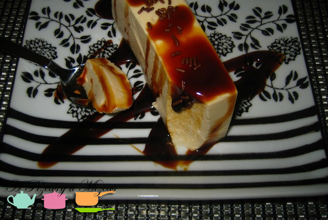

Ya quedan pocos días para celebrar el día de [San Valentín](http://es.wikipedia.org/wiki/D%C3%ADa_de_San_Valent%C3%ADn). Seguro que muchos de vosotros optaréis por salir a cenar en pareja fuera de casa, para los que queráis sorprender con una opción más personal desde A Pizcas y a Mizcas os vamos a sugerir una serie de menús completos. Éste es el segundo menú para San Valentín que os sugerimos, esta vez es un menú para todos los cocinillas.

## Menú para San Valentín para cocinillas

Para empezar:

- [Vasito de crema de calabacín con aceite virgen extra Arbequina](/crema-de-calabacin/)

- [Copa de mousse de queso de cabra con mermelada de tomate y crujiente de queso](/mousse-de-queso-de-cabra-con-mermelada-de-tomate-y-crujiente-de-lodigiano/)

- [Calamares al moscatel](/calamares-al-moscatel/)

Plato principal:

- [Salmón a la mostaza](/salmon-a-la-mostaza/)

- [Solomillo en hojaldre con salsa de champiñones](/solomillo-enrolladito-con-york-y-queso-y-salsa-de-champinones/)

Y de postre:

- [Tarta cremosa de capuccino](/tarta-cremosa-de-capuccino/)

