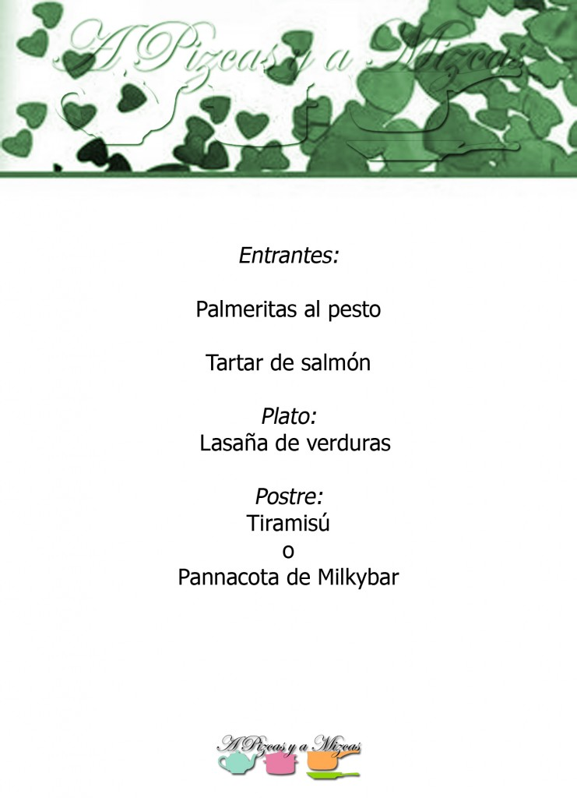
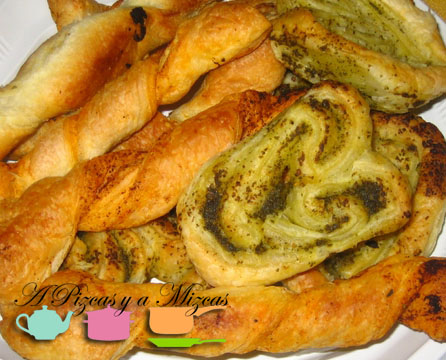
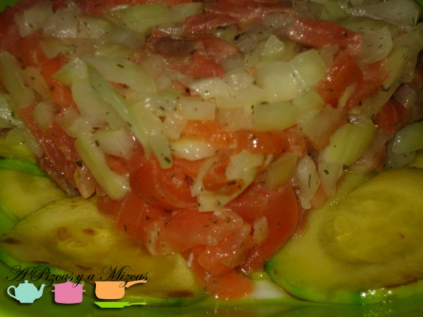
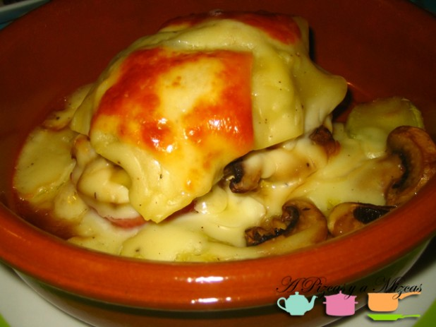
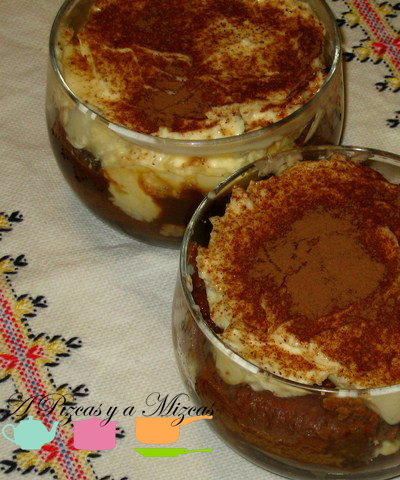
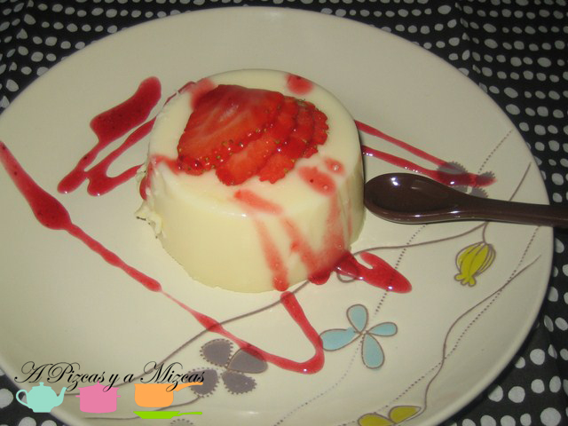

Ya quedan pocos días para celebrar el día de [San Valentín](http://es.wikipedia.org/wiki/D%C3%ADa_de_San_Valent%C3%ADn). Seguro que muchos de vosotros optaréis por salir a cenar en pareja fuera de casa, para los que queráis sorprender con una opción más personal desde A Pizcas y a Mizcas os vamos a sugerir una serie de menús completos. Os dejamos otro  menú para San Valentín os proponemos una cena temática "Sabores de Italia", para viajar gastronomicamente a otros países sin movernos del salón de casa. Esta vez nos trasaladamos a Roma!

## Menú para San Valentín Sabores de Italia

Para empezar:

[Palmeritas al pesto](/palmeritas-al-pesto/)

[Tartar de salmón](/tartar-de-salmon-ahumado/)

Plato principal:

[Lasaña de verduras](/lasana-de-verduras-asadas/)

Y de postre:

[Tiramisú](/tiramisu-apto-para-todos-los-publicos/)

[Pannacota de Milkybar](/pannacotta-de-milkybar/)

