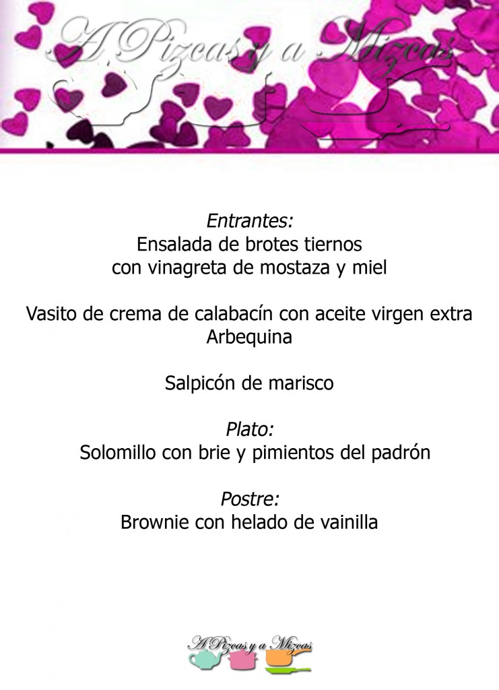
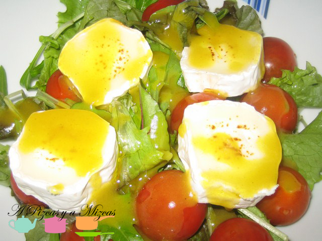
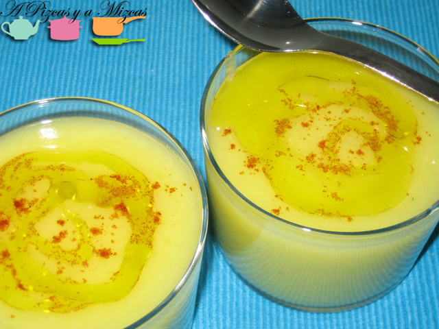
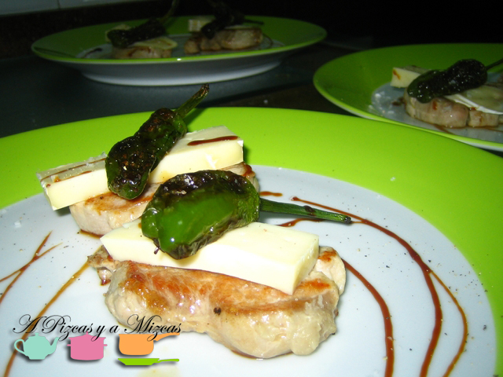
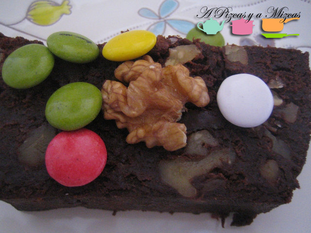

Ya quedan pocos días para celebrar el día de [San Valentín](http://es.wikipedia.org/wiki/D%C3%ADa_de_San_Valent%C3%ADn). Seguro que muchos de vosotros optaréis por salir a cenar en pareja fuera de casa, para los que queráis sorprender con una opción más personal desde A Pizcas y a Mizcas os vamos a sugerir una serie de menús completos. Empezamos con un menú para San Valentín sin complicaciones para todos los que buscáis un buen resultado sin liarte demasiado en la cocina.

## Menú para San Valentín sin complicaciones

Para empezar:

- [Ensalada de brotes tiernos con vinagreta de mostaza y miel ](/brotes-tiernos-con-vinagreta-de-mostaza-y-miel/)

- [Vasito de crema de calabacín con aceite virgen extra Arbequina](/crema-de-calabacin/)

Plato principal:

- [Solomillo con brie y pimientos del padrón](/solomillo-con-brie-y-pimientos-del-padron/) 

Y de postre:

- [Brownie con helado de vainilla](/brownie-express/)  
