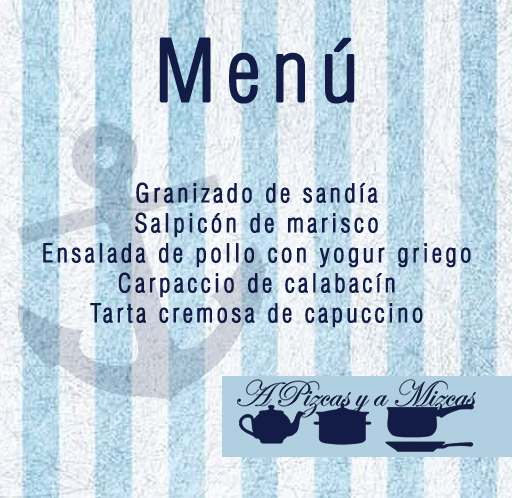
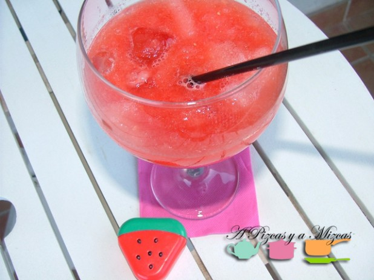
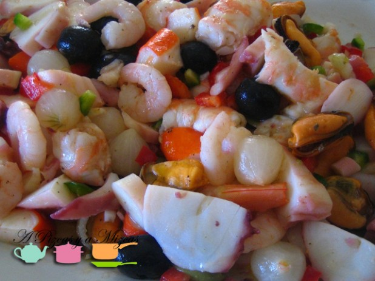
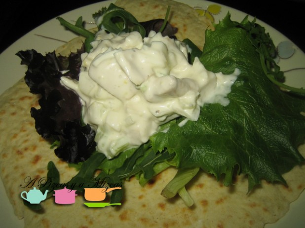
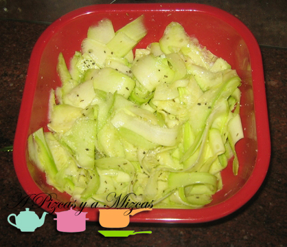

A puntito de empezar las vacaciones, con 24 grados en plena noche, no podíamos despedirnos sin dejaros un rico menú refrescante con platos que ya hemos preparado en el blog. Seguro que más de uno echa mano de él para una espléndida cena fresquita en la terraza. Además, todos lo platos son muy sencillos de preparar.

Empezamos con una propuesta diferente de aperitivo: un refrescante [granizado de sandía](/granizado-de-sandia/). Por raro que parezca, es perfecto para comenzar la velada y pone una nota de color genial para predisponer a los invitados al buen rollo.

A continuación, nuestro menú refrescante incluye un rico [salpicón de marisco](/salpicon-de-marisco-rapido/). Sencillo de elaborar y que podemos dejar preparado con antelación.

El plato "principal" que proponemos es la fresquita [ensalada de pollo con yogur griego](/ensalada-de-pollo-con-yogur/), servida sobre una pita casera. Y cerramos con un [carpaccio de calabacín](/carpaccio-de-calabacin/) con albahaca y queso grana padano o parmesano rallado.

El postre va de maravilla para una noche de verano. Una [tarta cremosa de capuccino.](/tarta-cremosa-de-capuccino/)

No os dan ganas de invitar a los amigos?

NOS VEMOS A LA VUELTA DE VACACIONES!!
