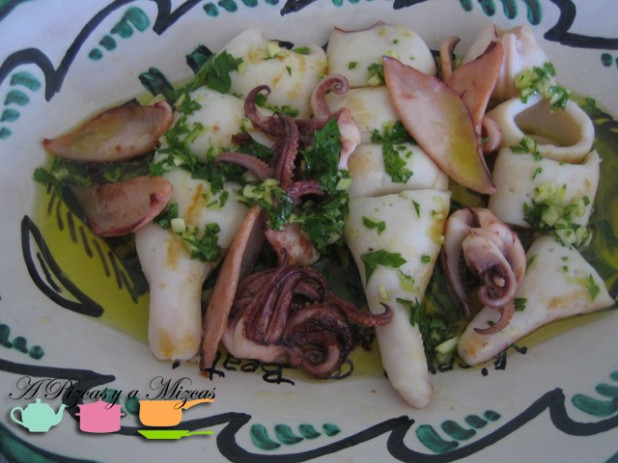
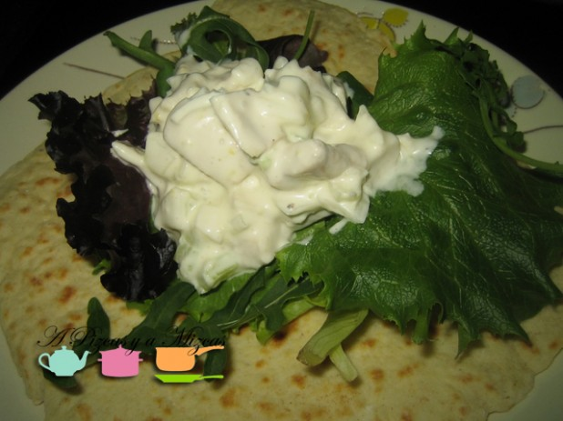
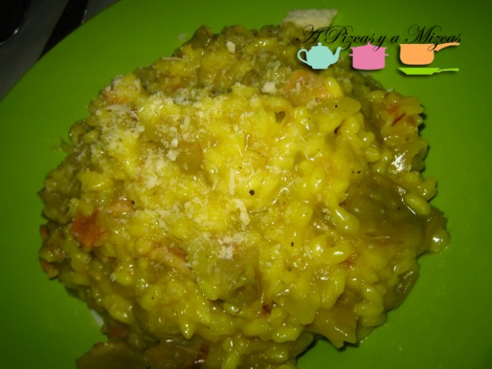
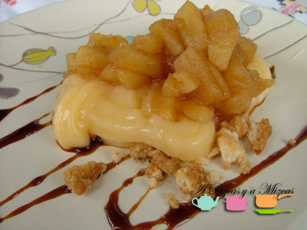

En dos días estamos celebrando el dia de San Valentín... Algunos optaréis por salir fuera y celebrarlo... si queréis sorprender a alguien especial en casa os sugerimos un menú San Valentín especial. Comprobaréis que son unos platos sencillos pero muy resultones... seguro que quedas de lujo con tu amad@

## Menú San Valentín especial

Para abrir boca

[Tapa de calamares a la plancha](/tapa-de-calamares-a-la-plancha/)

[Ensalada de pollo con yogur](/ensalada-de-pollo-con-yogur/)

Plato principal

[Risotto de alcachofas y Moscatel](/risotto-de-alcachofas-y-moscatel/)

Postre

[Delicias de manzana en compota y crema pastelera con tierra de galleta](/delicias-de-manzana-en-compota-y-crema-pastelera-con-tierra-de-galleta/)

