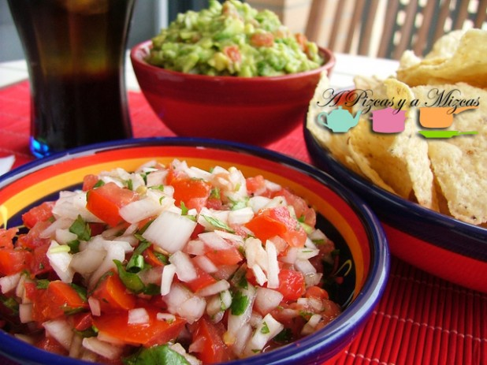
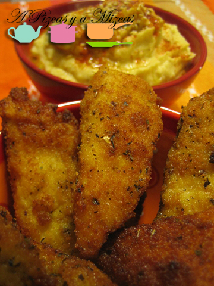
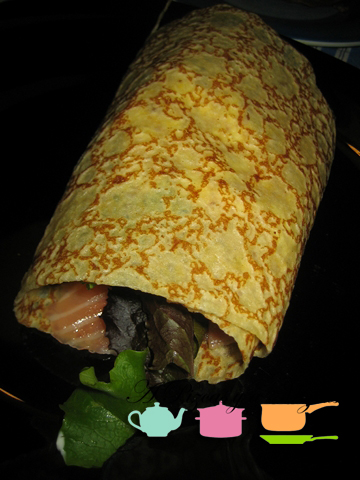
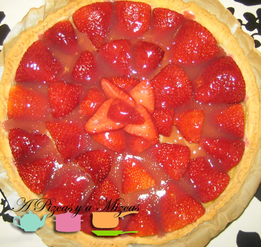

Otra propuesta más para una cena especial con los que más quieres. Esta vez os proponemos un menú San Valentín fusión, un menú para compartir con tu pareja, con los amigos, con la familia, con los hijos... Es una selección de platos para poner al centro y comer con las manos... que nos encanta. Cualquier momento es bueno para reunirte y repartir amor....

Esperamos que os gusten los platos que hemos escogido para elaborar este menú

## Menú San Valentín fusión

Para abrir boca

[Pico de gallo (salsa mexicana para aperitivo)](/pico-de-gallo/ "Pico de gallo")

[Fingers de pollo al curry con hummus](/fingers-de-pollo-al-curry-con-hummus/)

Plato principal

[Crepe de salmón](/crepe-de-salmon/)

Postre

[Tarta de fresa](/tarta-de-fresa/)

