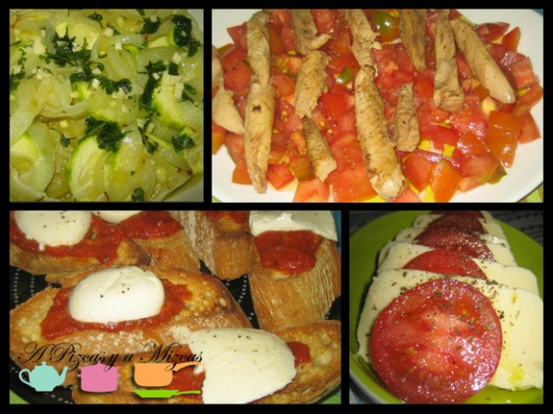
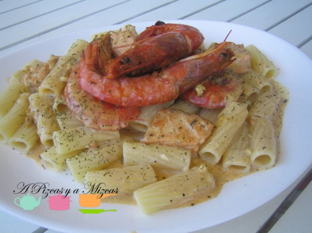
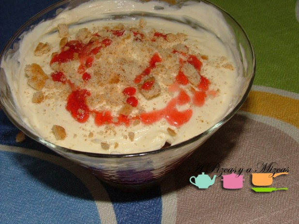

Sabemos de buena tinta que el año pasado a más de uno nuestras propuestas de menús de San Valentín le salvó el día y le sirvió de escusa para hacer de cualquier día un día especial. Así que este año actualizamos los menús de San Valentín.

Ya sabéis que somos unos enamorados de la gastronomía italiana... si, nos pierde la pasta, je je je. El primer menú que os proponemos es Menú San Valentín ti amo... bon appetit!

Esperamos que os guste

## Menú San Valentín ti amo

Para abrir boca

[Antipasti, entrantes a la italiana](/antipasti-entrantes-la-italiana/ "Antipasti")

Plato principal

[Rigatoni con salmón y gambas](/rigatoni-con-salmon-y-gambas/)

Postre

[Copa de mascarpone y fresa](/copa-de-mascarpone-y-fresa/)

