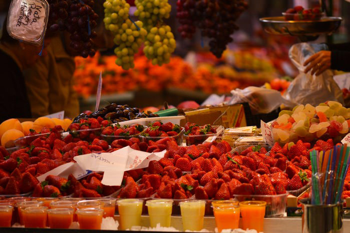

Hace unas semanas tuvimos la oportunidad de disfrutar de dos de los mercados que más nos gustan. El Mercado de San Miguel en Madrid que lo tenemos menos visto y del Mercado Central de Valencia que nos encanta escaparnos siempre que podemos ya que lo tenemos muy cerquita.

Pizcas tuvo una escapada rápida a Madrid por cuestiones de trabajo... y una de las cosas que nos encanta siempre que visitamos alguna ciudad es perdernos en sus mercados y no lo podemos evitar se nos van los ojos al ver todas las cosas buena que hay en los mostradores de todos los puestos. Visitamos el [Mercado de San Miguel](http://www.mercadodesanmiguel.es/el-mercado/ "Mercado de San Miguel"), ya que por su ubicación, Plaza de San Miguel, s/n , junto a la Plaza Mayor está muy céntrico. Os dejamos una pequeña descripción para que podáis entender el concepto de este mercado.... aunque lo mejor es visitarlo y disfrutarlo.

> El Mercado de San Miguel pretende llegar a ser un Centro de Cultura Culinaria, donde el protagonista es el producto, y donde tengan presencia activa todos los grandes hechos y acontecimientos del universo de la alimentación. Un lugar de encuentro, dirigido al cliente, al profesional, al gourmand, al que busca información y consejo. Un lugar dónde, además de hacer la compra cotidiana, se pueda participar en actividades, degustar lo que se va a llevar a casa o, simplemente, pasear o tomar algo.Un mercado tradicional con las ventajas de los nuevos tiempos.

Pizcas no se pudo ir de Madrid sin disfrutar del típico bocadillo de calamares "in plaza Mayor"... ji ji ji

Y así de fugaz fue la visita de Pizcas a Madrid...

Y de Madrid nos venimos para la terreta y a nuestro paseo por el [Mercado Central de Valencia](https://www.mercadocentralvalencia.es/ "Mercado Central de Valencia"), fuimos a hacer la compra y de paso a pasear y a disfrutar de todas las maravillas que nos ofrecen cada día los tenderos. Ya os hemos contado otras veces [nuestros paseos por el Mercado Central De Valencia](/visita-al-mercado-central-de-valencia/ "Visita de A Pizcas y a Mizcas al Mercado Central")

Y para que sepáis un poquito más sobre el Mercado Central de Valencia:

> El Mercat Central de València se ha caracterizado siempre por la calidad, variedad y frescura de sus productos, así como por el trato atento y personalizado de sus vendedores.
>
> El carácter innovador y comercial de sus vendedores ha hecho que este Mercado crezca y se supere día a día. En la actualidad es no sólo un importante espacio para la venta de productos frescos, sino también un gran atractivo cultural y turístico tanto para visitantes extranjeros como para los propios valencianos.

Esta vez compramos unos fresones que estaban más que buenísimos, un manojo de calçots para nuestra [calçotada](/calcotada-en-casa/ "Calçotada") y embutido del bueno en el puesto de [Rosa Lloris](http://rosalloris.es/ "Carnicería Rosa Lloris") porque nos encantan sus longanizas a las finas hierbas por ese saborcito que tienen a casero (a pueblito bueno) y su gran variedad de hamburguesas.

