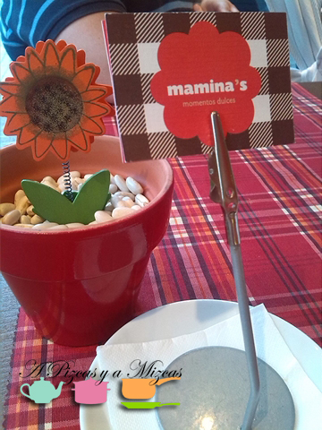
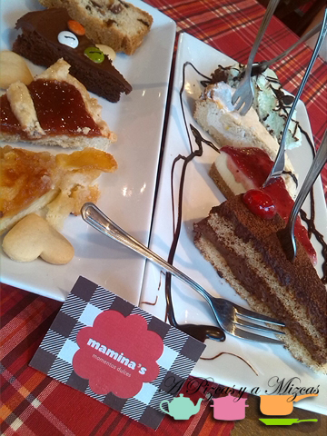
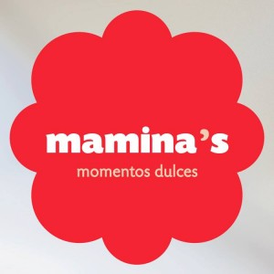

Como ya os contamos en el post de "La vuelta al cole"... A Pizcas y a Mizcas vamos a ir de excursión de vez en cuando y nos lo hemos tomado muy en serio. Nos habían contado que habían puesto un nueva cafetería en Benimaclet (en la calle Barón de San Petrillo, 7) y que tenía un encanto especial... y allá que nos fuimos Pizcas, Mizcas, Trizcas y los yayos Mizcas.

Así es como se describen en Mamina´s:

"_En Mamina's te sentirás como en casa, ven y descubre nuestra increíble repostería casera, nuestras sorprendentes propuestas artesanales y refréscate con nuestros zumos naturales y bebidas..."_

## Merendando en Mamina´s (momentos dulces)

Llegamos a la hora de la merienda y en la puerta vimos la siguiente promoción: "café o infusión + degustación de tartas, por dos euros".  Nos sentamos en una mesa amplia pegada a un enorme ventanal. Parece que estes en el salón de casa contemplado la actividad del barrio de Benimaclet.

La decoración es sencilla y hogareña... aunque cuando entras los ojos se van (aunque no quieras)  hacia el mostrador de tartas (menos mal que nos pusieron una degustación) que sino hubiera sido muy dificil elegir... menuda pinta!!!

Nos sacaron ocho porciones de tartas distintas y eramos cinco adultos

- De manzana
- Pastaflora con dulce de membrillo
- Tarta de chocolate con chocolatitos de colores
- Bizcocho de pasas y nueces
- Chocolate
- La clásica cheese cake
- Queso y limón
- Brownie de chocolate con crema de menta

Con tanta variedad hubo para todos los gusto... aunque cada uno tuvo su favorita. Mizcas se quedó con la de chocolate, Pizcas prefiere la de cheesecake, la yaya Mizcas la pastaflora, el yayo Mizcas la de manzana. Aunque tenemos que decir que todas estaban de muerte!

Cualquier escusa será buena para pasarnos por Mamina´s para volver a probar esas exquisitas tartas...mmmmmmmmmmmmmmm

