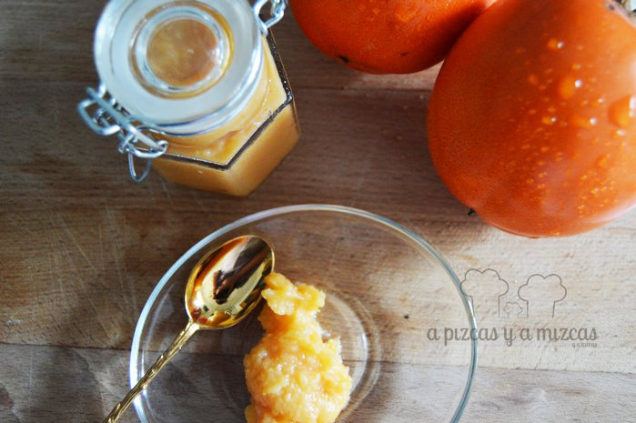
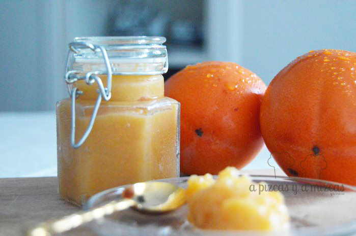

Seguro que a estas alturas muchos de vosotros ya sabéis que el iaio Mizcas tiene un bonito campo de caquis en La Ribera. Hoy os presentamos nuestra mermelada de caqui persimon. Es una fruta que no gusta a todo el mundo, pero a Pizcas le agrada bastante. Incluso una vez recogidos los caquis de los árboles, siempre quedan en el campo frutos en cantidad como para satisfacer el autoconosumo. Para tomar en fresco son riquísimos, la única precaución que ha que tener es que para evitar la astringencia del caqui (esa sensación que deja de la lengua de trapo y boca seca si lo tomas directamente del árbol) es necesario darles un tratamiento casero (si los compráis en la tienda ya vienen tratados).

Este tratamiento es muy sencillo y es el paso previo para elaborar la mermelada de caqui. Lo que hay que hacer es colocar los caquis en un recipiente cerrado (nosotros utilizamos una nevera de cámping, pero puede servir un cubo con tapa o similar), con un vasito pequeño de licor de alta graduación (brandy, vodka, ginebra, whisky...), durante una semana, sin abrir. Una vez pasado ese tiempo ya los podéis tomar perfectamente.

Vamos con la elaboración de la mermelada de caqui.

## Ingredientes para la mermelada de caqui persimon

#### (son proporcionales, por lo que si queréis el doble de cantidad sólo teneis que doblar los ingredientes)

- 600 gramos de caqui persimon pelado y troceado
- 300 gramos de azúcar
- 1 rama de canela
- El zumo de un limón
- La corteza de un limón

Como véis, es una proporción clásica de mermelada casera: la mitad de azúcar que de fruta. Lo primero para elaborar la mermelada de caqui es pelarlo y trocearlo. Es aconsejable quitar la zona del corazón, que es la que tiene más filamentos. En un cazo ponemos la fruta troceada, el zumo de un limón y la cortaza entera de ese mismo limón, una ramita de canela y el azúcar.

Lo ponemos a cocer a fuego medio alto, removiendo constantemente, para evitar que el azúcar se queme. Con nuestras cantidades tardamos unos 45 minutos en que estuviera lista la mermelada de caqui. Si es necesario, podéis pasar la batidora por el cazo para que quede más fina la mermelada de caqui.

Colocamos la mermelada en botes de cristal, los cerramos y los hervimos al baño maría durante unos 10 minutos boca abajo. Es recomendable guardarlas en el frigorífico, o en su defecto en una alacena fresca.

Nosotros utilizamos esta merelada de caqui para tomar en tostadas de pan con un poco de mantequilla, también con yogur griego, para cubrir nuestra tarta de caqui persimon e incluso para acompañar como guarnición carne de cerdo o un poco de queso azul.

