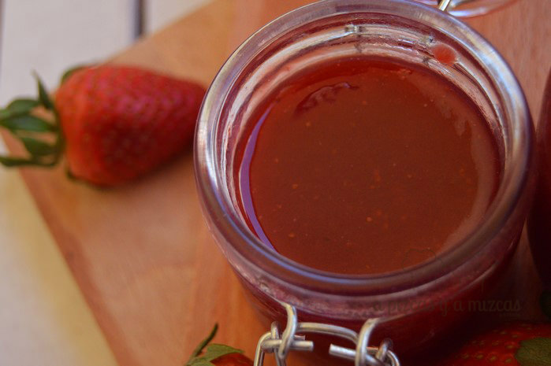
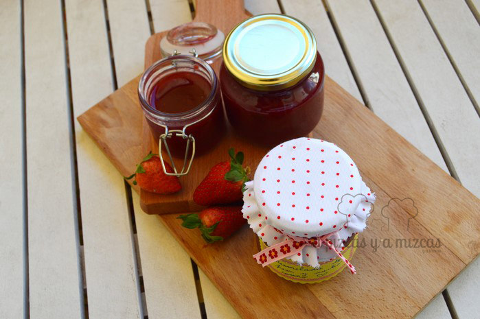
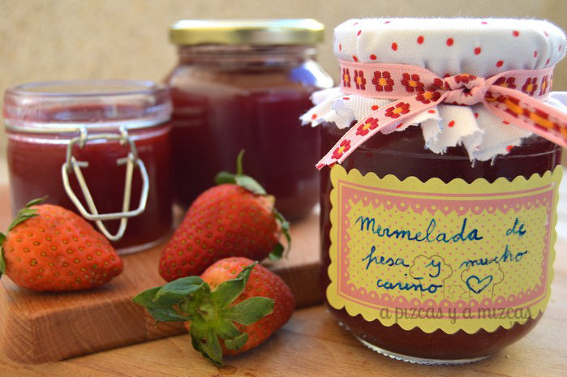
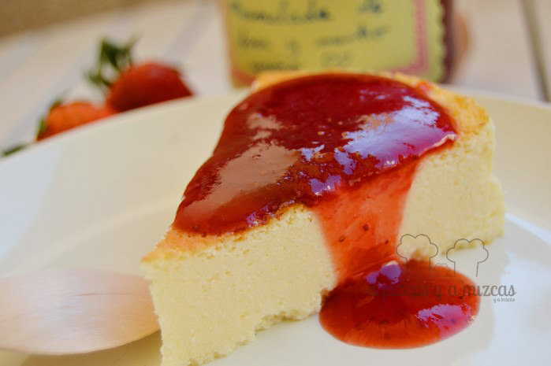

Las fresas son una de nuestras frutas preferidas y ahora es cuando las podemos encontrar a muy buen precio y preparar una rica y deliciosa mermelada de fresa casera es uno de los mejores modos de poder disfrutar de las fresas prácticamente durante todo el año. Es una receta de confitura de fresa muy sencilla, tan sólo es necesario un poco de paciencia, por lo demás, no presenta ninguna complicación. ¿Te animas a preparar tu propia mermelada de fresa?

Lo más importante es utilizar fresas que estén bien maduras, pero no pasadas. Con esto te aseguras una mermelada de fresa rica y sin necesidad de utilizar más azúcar del necesario.

## Ingredientes para la mermelada de fresa casera

- Un kilo de fresas
- 500 gramos de azúcar (una mizca más, hasta 600, si las fresas no están óptimamente maduras)
- El zumo de medio limón

El primer paso para preparar la mermelada de fresa casera es limpiar las fresas. Es importante lavarlas antes de cortarles el pedúnculo (la parte verde) y secarlas bien con un trapo, para que conserven todo su sabor. A continuación, retiramos el pedúnculo y troceamos las fresas en cuartos o en seis trozos por fresa.

Colocamos la fruta en una cazuela, añadimos el azúcar y rociamos con el zumo de medio limón. Una buena idea es colar el zumo de limón para asegurarnos de que no caiga por accidente ninguna pepita en nuestra mermelada de fresa. Lo removemos todo, para que las fresas se impregnen bien del azúcar y del limón y empezamos una cocción a fuego medio bien prolongada.

Como hemos dicho, no hay ninguna dificultad, tan sólo se requiere paciencia. Hay que remover de vez en cuando durante al menos una hora. Primero veréis como el azúcar se licua y, poco a poco, las fresas se irán reblandeciendo por efecto del calor de la cocción y finalmente se desharán.

Una vez pasada la hora de cocción, la fruta ya debería tener la consistencia de mermelada de fresa casera, todavía con bastantes trozo de fruta bien visibles. Mizcas prefiere la mermelada de fresa sin tropezones, así que en la misma cazuela lo trituramos con una batidora. Dejamos que cueza así, tritutado, unos cinco o diez minutos más.

Ya tenemos lista la mermelada de fresa casera. Ahora vamos a envasar esta confitura.

Mermelada de fresa lista!

Necesitaréis varios botes con tapa (mejor tener de más que de menos). Bien limpios y secos. Los rellenamos hasta arriba y los cerramos firmemente. Luego, para esterilizarlos y que podamos disfrutar de esta mermelada durante varios meses, colocamos los tarros en una olla amplia con agua que sobrepase la mitad del tarro y la ponemos a hervir durante media hora. Luego, los retiramos con cuidado del agua (con unas pinzas o manoplas para no quemarnos) y los guardamos en la nevera.

mermelada de fresa hecha en casita

Mermelada de fresa hecha con mucho cariño

> Cuando os apetezca utilizar la mermelada de fresa casera para desayunar, rellenar dulces, preparar helados, batidos, limonadas... sólo tenéis que echar mano de estos botes!

Tarta de queso y mermelada de fresa
