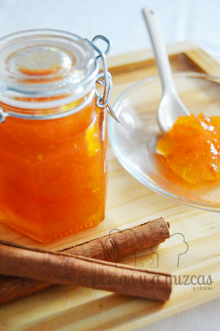

Os traemos hoy una receta de mermelada de mandarina casera fácil con la que hemos triunfado recientemente. Aunque lleva algo de tiempo, os aseguramos que vale la pena el resultado y que vuestros desayunos no volverán a ser lo mismo. Esta mermelada engancha.

En temporada de cítricos, vale la pena hacerse con una buena cantidad de ellos para preparar esta mermelada de mandarina (también podéis hacerla de naranja o de limón siguiendo los mismos pasos e ingredientes). Os recomendamos que antes de prepararla recopiléis tarros de conserva limpios o que, en su defecto, compréis alguno específicamente.

## Ingredientes para la mermelada de mandarina

(para variar la cantidad, lo único que tenéis que hacer es utilizar las mismas proporciones)

- 1 kilo de mandarinas
- 1 limón hermoso
- 1/2 kilo de azúcar
- Una pizca de agua

Como véis, los ingredientes para preparar una mermelada de mandarina casera fácil son muy sencillos y económicos y el resultado es un producto gourmet con muchas posibilidades.

El primer paso es limpiar bien toda la fruta, bajo el grifo y con un cepillo, pues para nuestra mermelada de mandarina vamos a utilizar también la piel (actuará como espesante natural y le proporcionará el amargor justo que la convierte en una delicia.

Con la fruta bien limpia, la exprimimos con un exprimidor y la pulpa y las pepitas que queden en la rejilla las guardamos y las introducimos en una bolsita de tela o de malla (como la de cocer los garbanzos, por ejemplo). Es interesante porque estas fibras ayudarán a que "cuaje" la mermelada de mandarina. El zumo resultante lo guardamos en el frigorífico.

Mientras, con un cuchillo bien afilado, cortamos las pieles de la mandarina en juliana, con cuidado de no coger mucha de la parte blanca de la corteza.

Para seguir con la mermelada de mandarina, ponemos en un cazo el saquito con la fibra y las pepitas de mandarina y las pieles en juliana bien fina y la cubrimos de agua. El agua justa para cubrir las pieles. Las ponemos a fuego medio y las dejamos que hiervan durante unos 20 minutos, removiendo de vez en cuando.

Transcurrido ese tiempo, colamos todo y reservamos el agua de cocción. Las pieles picadas y el saquito también lo reservamos. En el cazo añadimos ahora el zumo que teníamos en la nevera, el azúcar, las pieles picadas, el saquito de fibras y el agua de la cocción de la pieles. Lo dejamos a fuego medio hasta que rompa el hervor. Es importante ir removiendo constantemente.

Una vez que haya roto a hervir, bajamos el fuego, retiramos el saquito de fibras y pepitas,  y seguimos removiendo de vez en cuando. Con el tiempo irá reduciendo y espesándose. Cuando notéis que empieza a espesar, con una batidora de mano damos unas pasadas para "romper" las pieles. Seguimos cocinando hasta que adquiera la consistencia deseada (tened en cuenta que cuando enfríe espesará más, por lo que debe quedar como una mermelada ligera).

Un truco: si véis que pasado un tiempo prudencial, como unos 45 minutos hirviendo a fuego bajo, no os coge la consistencia de mermelada de mandarina deseada podéis "ayudarla" con una hoja de gelatina. La hidratamos un poco y la añadimos al cazo y removemos. Dejamos hervir un poco más y ya estará lista.

Ya tendremos la mermelada de madarina lista para meter en botes y conservar.

En tostadas es una delicia, como relleno de un croissant es casi un pecado, con algo de requesón o cuajada es algo estratosférico y con un poquito de foie de vicio.

Variaciones: podéis hacerla sólo de naranja, o de naranja y limón, ¿por qué no sólo de limón? ¿de pomelo?
