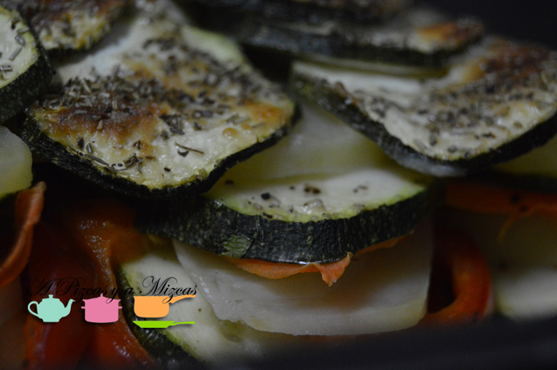
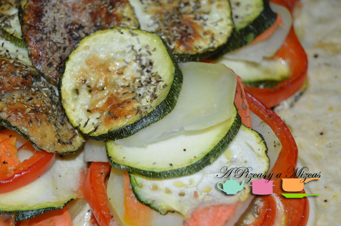

Uff... ya hacía tiempo que no nos metíamos en la cocina... pero cuando nos metemos nos metemos... empezamos con el milhojas de patatas y verduras y terminamos haciendo un postre de chocolate espectacular (muy pronto os lo contamos) je je je. Esta es una de esas recetas que se hacen casi casi solas... además es perfecta para todos lo que estáis pensando ya en la operación biquini. Preparar el horno que en un periquete tenéis preparado el milhojas de patatas y verduras para la cena o la comida.

## Ingredientes para preparar milhojas de patatas y verduras (para cuatro personas)

- dos o tres patatas medianas
- 1 calabacín grande
- dos zanahorias
- medio pimiento rojo
- 250 ml de nata líquida (opcional)
- parmesano
- romero
- aceite de oliva virgen extra
- sal
- pimienta

Primero pondremos el horno a precalentar a 200º. A continuación pelamos el calabacín, limpiamos y lavamos el pimiento y las zanahorias. Ahora le toca el turno a las patatas, las pelamos y lavamos. Cortamos todas las verduras muy finitas. Ya tenemos casi toda  la faena hecha!

Engrasamos una bandeja de horno con aceite y vamos colocando capas de verduras, empezamos con el pimiento, patata, zanahoria y calabacín, salpimentado cada una de las capas, hasta terminar con todas las verduras y formar nuestro milhojas de patatas y verduras. Cubrimos con la nata , o con un poco de aceite de oliva virgen extra (de esta forma quitamos una cuantas calorías al plato). Espolvoreamos con el queso parmesano.

Añadimos el romero y lo tendremos en el horno a 180º durante 45 minutos aproximadamente (según cada horno. ir controlando el colorcillo de las verduras). Ya tenemos preparado nuestro milhojas de patatas y verduras... y mmm que bien huele toda la casa!

No encantan las verduras al horno... un plato tan sencillo de preparar y que rico que está!

A la mesa... platos preparados y a disfrutar!
