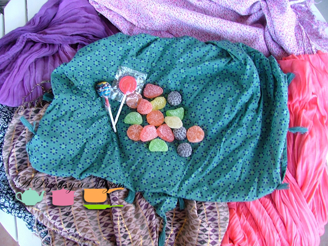
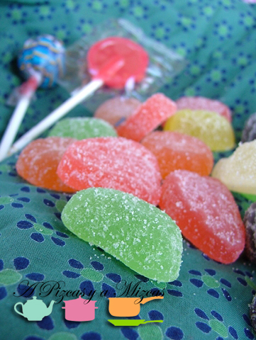

El 9 de octubre celebramos el día de la Comunitat Valenciana. Pero no solo eso. Este día festivo tiene una vertiente más dulce, más amorosa: la mocaorà (mocadorada --pañolada en castellano--). Es el día de los enamorados valencianos, que se celebra coincidiendo con la festividad de Sant Donís. En esta fecha, la tradición marca que el enamorado entregue a su enamorada un pañuelo en el que van envueltos frutas de mazapán de vivos colores y dos piezas del mismo dulce : la piuleta y el tronador. Es un regalo muy simbólico: el hombre entrega a la mujer los frutos de la huerta, como señal de prosperidad. En cuanto a la piuleta y el tronador esto trae más miga. La "versión oficial" es que se trata de la reacción de los panaderos valencianos a la prohibición que las tropas borbónicas impusieron de celebrar la entrada de Jaume I en Valencia con cohetes de estos mismos nombres, pero lo bien cierto es que guardan una sospechosa similitud con los órganos sexuales masculino y femenino. Pero tal vez seamos nosotros, que tenemos una "mirada sucia".

## 

- Dulces o goninolas en forma de frutas
- Una piruleta
- Un chupachup
- Un pañuelo bonito

La norma dicta que la mocaorà sea a base de mazapán. Desde hace unas semanas, los escaparates de los hornos tradicionales de Valencia y provincia lucen auténticas huertas de dulce, con la mayor variedad imaginable de frutas, verduras y hortalizas. No obstante, nosotros no somos demasiado aficionados al mazapán, por lo que nos regalamos todos los años una mocaorà especial, con chucherías. Lo importante es el detalle y el mensaje que se transmite con él.

