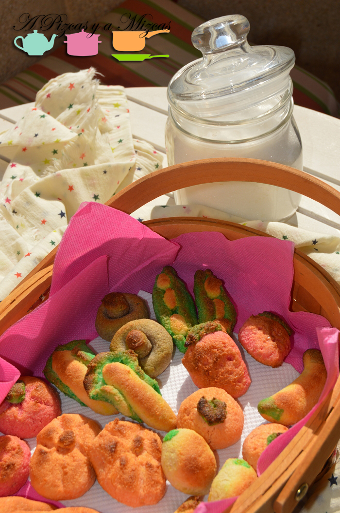
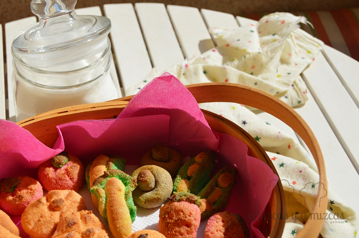

El 9 de octubre en la Comunitat Valenciana celebramos el día de Sant Dionís, que, además del día de nuestra autonomía, es el día de los enamorados valencianos. La gastronomía no podía faltar a tan señalada fecha y lo más tradicional es la mocaorà o mocadorà. Se trata de un dulce hecho a base de mazapán, con ell que se representa, por un lado la huerta y sus productos; y por el otro, dos elementos más "sexuales", como son la piruleta y el tronador. En definitiva, la mocaorà simboliza la entrega a la amada/o de los frutos de tu trabajo, junto con una importante carga simbólica relativa a la fertilidad. El presente se suele acompañar con un pañuelo (mocador, en valenciano). Este año, A Pizcas y a Mizcas nos animamos a preparar nuestra mocadorà casera (versión libre), aunque pasear durante los primeros días de octubre por Valencia y sus alrededores y ver los hornos y pastelería es una maravilla. Hay mocaoraes que son auténticas obras de arte. La imaginación y la gracia de los pasteleros, panaderos, reposteros y confiteros valencianos es infinita.

## Ingredientes para la mocadorà casera (25 piezas aproximadamente)

- una patata pequeña (aprox 50 gramos)
- la ralladura de una mandarina y la de un limón
- 200 gramos de azúcar
- un sobre de azúcar vainillado
- 220 gramos de almendra molida
- colorantes alimenticios

Pelamos y troceamos la patata y la ponemos a hervir. Es importante controlar la cantidad, pues si hacemos más patata puede que luego la masa quede demasiado suelta y sin "fuerza". Después dejaremos que se enfríe un poco y chafaremos hasta que quede fina.

Por otra parte, en un bol ponemos el azúcar, el azúcar vainillado, y la ralladura de la mandarina y la del limón. Después incorporamos la patata y removemos para que se mezclen todos los ingredientes. A continuación incorporamos la almendra molida poco a poco hasta obtener un masa uniforme. Tapamos el bol con papel film y lo metemos en el frigorífico durante 3 o 4 horas para que coja cuerpo.

Mientras, nosotros aprovechamos que Trizcas quería jugar con la plastelina para practicar y hacer varias piezas de frutas y hortalizas de plastelina. De este modo, ganamos algo de destreza a la hora de preparar la "huerta" que íbamos a representar con nuestra mocadorà casera. Hicimos, fresas, tomates, vainas de judías, champiñones, calabazas, zanahorias, limones, naranjas... Así ya sabíamos más o menos qué tamaño teníamos que darle a cada pieza y que partes íbamos a necesitar de cada color.

Transcurrido ese tiempo amasamos y formamos varios pegotes de igual tamaño (tantos como colores queráis hacer o necesitéis). Nosotros preparamos montones de los siguientes colores: rojo (para las fresas y los tomates), naranja (naranjas, zanahorias y calabazas), amarillo (limones y plátanos), marrón (champiñones), verde (para las hojas de nuestras verduras...). Para preparar los colores utilizamos el pack de colorantes de Vahiné. Vienen tres tubos (rojo, azúl y amarillo) y con una práctica tabla de proporciones puedes crear prácticamente cualquier color que necesites para tu mocadorà casera y amasamos cada bola hasta que tuvo el color deseado. Si veis que se os ablanda mucho la masa, añadid algo más de almendra molida.

Mientras hacíamos manualidades (preparar los colores y dar forma a las frutas), precalentamos el horno a máxima potencia. Colocamos toda nuestra huerta en una bandeja con papel de horno e introducimos en el horno a 200º donde los tendremos unos 15 minutos aproximadamente. Abrimos y miramos cómo va la cosa (tiene que quedar seco por fuera, pero algo jugoso por dentro. Si es necesario, dejamos otros cinco minutos. Es importante que no se os tuesten demasiado (nosotros nos despistamos un segundo y alguna fruta se quedó demasiado moreneta).

Ya tenéis la mocadorà casera perfecta para sorprender en casa!
