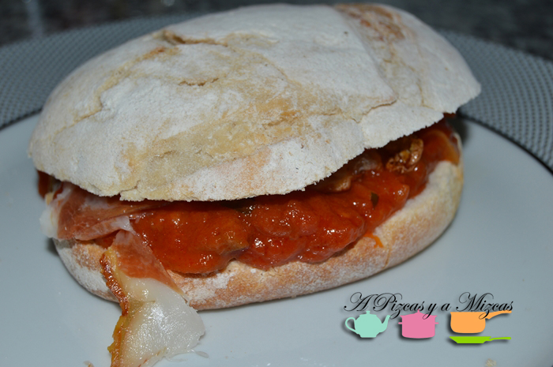
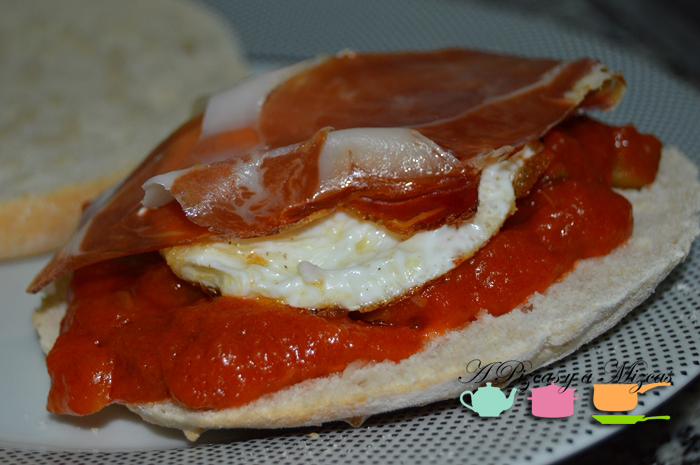
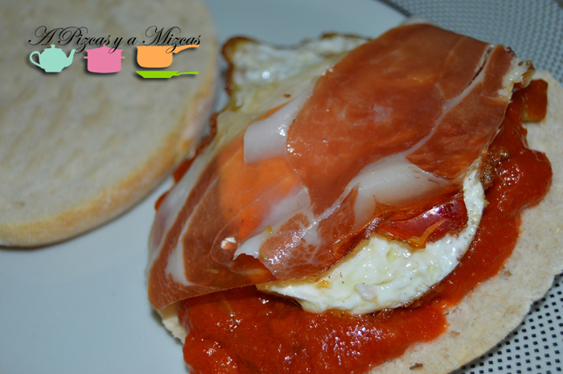

El mundial ya está aquí, así que hemos preparado un bocadillo muy ibérico para apoyar a La Roja. Nuestra aportación para las noches de fútbol es un mollete de pisto, huevo y jamón ibérico.

Aunque en estos días os iremos recordando los mejores bocadillos y sandwiches de A Pizcas y a Mizcas para que podáis sorprender a vuestros amigos durante el mundial. Ya nos contaréis cúal es vuestro favorito!

## Ingredientes para preparar el mollete de pisto, huevo y jamón ibérico (para 4 personas)

4 molletes

100 gr de jamón ibérico muy fino

4 huevos pequeños

2 cebollas

1 diente de ajo

2 calabacines

1 pimiento rojo

aceite de oliva virgen extra

pimienta y sal

Primero prepararemos el pisto. Que lo podéis preparar el día de antes y si váis muy apurados pues siempre se puede echar mano de un pisto preparado. Pero como se suele decir, lo hecho en casa se nota. Lavamos los calabacines y cortamos en daditos. Pelamos y picamos las cebollas y el diente de ajo. Cortamos el pimiento rojo a daditos.

En una sartén rehogaremos la cebolla. Añadiremos el ajo picado, los daditos de calabacín y el pimiento. Cocemos todo junto durante 10 minutos. Salpimentamos y reservamos.

Ahora vamos a preparar los molletes. Abrimos los molletes y doraremos en la tostadora u hornearemos ligeramnte bajo el grill. Repartimos el pisto por encima.

Freímos los huevos, de uno en uno. Los escurrimos, salpimentamos y los pondemos encima del pisto. Por último añadiremos el jamón ibérico. Y ya está nuestro mollete de pisto, huevo y jamón ibérico para apoyar a La Roja.

Un bocadillo muy ibérico para compartir con los amigos. Todos con la Roja!
