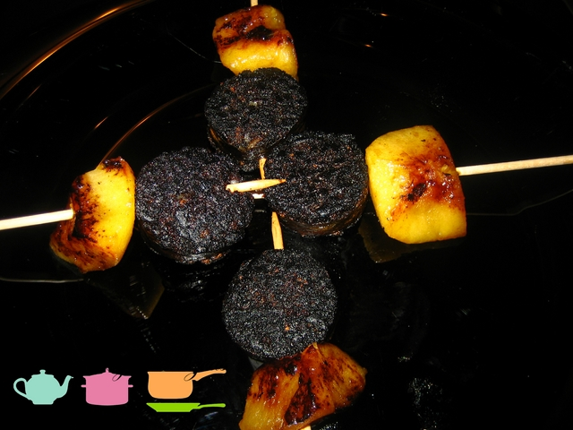

Hace unos días que Pizcas y Mizcas tuvimos en casa a Lore y Max, unos muy buenos amigos que viven en Milán. Pasamos una noche muy agradable y disfrutamos de una cena muy rica. La intención era que fuera una cena que no se hiciera pesada (sé que la idea cena no pesada y morcilla de Burgos pueden parecer contradictorios, pero veréis como es posible casarlos). Si la memoria no me falla, el menú fue el siguiente:

Entrantes:

1. Morcilla de Burgos enamorada de manzana
2. Tartar de aguacate y feta

Plato principal:

1. Solomillo con brie y padroncitos

Postre:

1. Tarta de queso con frambuesa.

Acompañamos toda la cena con el vino Celeste Roble 2010, de Bodegas Torres. Un vino todoterreno.

Bueno, vamos a la morcilla que se nos va el santo al cielo.

- Cuatro rodajas de morcilla de Burgos de 1 cm de grosor.
- Cuatro dados de manzana de calidad.

La preparación es de lo más sencilla. En una sartén o una plancha bien caliente ponemos un chorrito de aceite de oliva virgen. Cuando tome temperatura, ponemos las rodajas de morcilla, un minutillo o así por cada lado, para que se haga bien. Lo reservamos.

Tomamos una manzana y la pelamos. De cada cuarto sacamos dos dados hermosos de manzana. En la sartén, con un poco de aceite de oliva virgen, los doramos por todos los costados y le ponemos una pizquita de azúcar a cada uno de ellos. Ahora, para presentar el pincho, nosotros utilizamos unas brochetas de madera. Pinchamos el dado de manzana y colocamos la morcilla (le quitamos previamente la piel) de forma graciosa (con la idea de una piruleta). Ya está.
