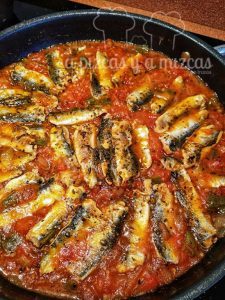

Esta vez hemos preparado un plato rico y sano que lo podéis tener listo en apenas media hora. La moruna de sardinas es una receta típica de Andalucía. Aunque dicen que los [meses sin erre](https://www.diariosur.es/sociedad/meses-erre-mejores-20180307134416-nt.html) son los mejores para comer sardinas, si no las encontráis en el súper las podéis sustituir por boquerón que estará igual de bueno. Nos acompañáis a la cocina y preparamos este plato...

## Ingredientes para preparar la moruna de sardinas (para 4 personas)

- 600 gramos de sardinas
- 6 tomates
- 1 pimiento verde
- orégano
- sal
- 2 cebollas
- 50 ml de vino blanco
- aceite de oliva virgen extra
- pimienta

En primer lugar limpiaremos las [sardinas](https://www.hogarmania.com/cocina/escuela-cocina/tecnicas/201305/limpiar-sardinas-19977.html) (os dejamos en el enlace cómo limpiar las sardinas). Les quitamos la cabeza, las tripas y la espina central. De esta forma nos quedarán dos lomos de cada una de las sardinas. Las dejamos en un plato.

A continuación, pelamos y picamos las cebollas en dados pequeños y las rehogamos en una sartén honda con un chorro de aceite. Limpiar el pimiento verde: quitamos el tallo y retiramos las semillas. Lo cortamos en dados y lo añadimos a la sartén. Sazonamos.

Pelamos los tomates y los troceamos a dados y lo agregamos. Salpimentamos y cocinamos todo junto.

Añadimos el vino. Sazonaremos las sardinas y las colocaremos en la sartén con la piel hacia arriba y de forma circular. Espolvoreamos con orégano y seguimos cocinando (con la tapa puesta en la sartén) durante tres minutos más.

Y lo más importante, no te olvides de [un buen pan](/pan-casero/). Va a ser el acompañante imprescindible.
