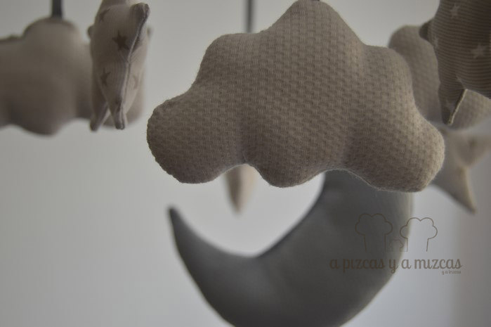
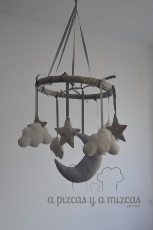
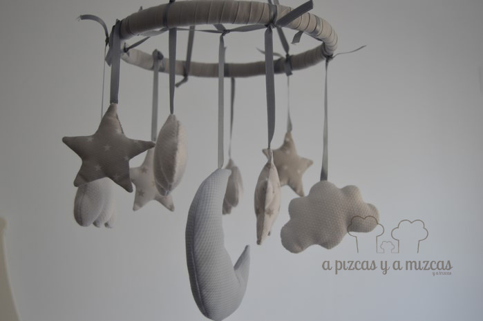

Se nos ilumina la cara y nos sale una sonrisa al pensar que un nuevo querubín se duerma viendo nuestras estrellitas, nubes y luna con este móvil para habitación de bebé que le hemos preparado con un montón de cariño. Además de ser un elemento decorativo puede ser un gran aliado para entretener a lo peques y a ellos le encanta jugar a intentar atrapar todo lo que da vueltas encima de ellos.Cuando Trizcas era bebé también teníamos un móvil de ositos que giraba y sonaba música. Se lo poníamos para intentar que se relajara... pero nunca nos funcionó, ella era más de bailar al ritmo de la música... le encantaba ver los ositos girar, qué recuerdos parece que fue ayer.

Queríamos hacer algo totalmente hecho por nosotros. Primero pensamos la combinación de las telas, compramos una tela estampada con estrellas en blanco y gris para nuestras piezas en forma de  estrellitas, otra blanca para las nubecitas y otra azul bebé para la luna.

Hicimos una plantilla con las formas que queríamos incluir en el móvil para habitación de bebé y lo cortamos en la tela. Un poquito de relleno y con la ayuda de la iaia Mizcas cosimos todas las formas.

Con un lazo de raso gris que cosimos a cada una de las nubes, estrellas y la luna. Ya teníamos listas todas nuestras piezas para el móvil.

Ya tenemos lista nuestra mini nube

Por último forramos con una cinta gris un aro y atamos a distintas alturas todas las estrellas y nubes y en el centro la luna.

Y listo para colgarlo del techo

A nosotros nos ha encantado el resultado final. Ahora sólo esperamos que disfrute querubín mirando las estrellas y la luna.

Deseando ver la carita del bebé disfrutando con su móvil

Ya sabéis si os gustan y queréis un móvil para la habitación de vuestros peques o queréis preguntarnos o contarnos cualquier cosa podeís poneros en contacto con nosotros a través de nuestro [formulario de contacto](/contacto/ "Contacto A Pizcas y a Mizcas").
