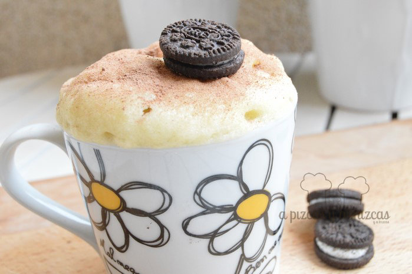
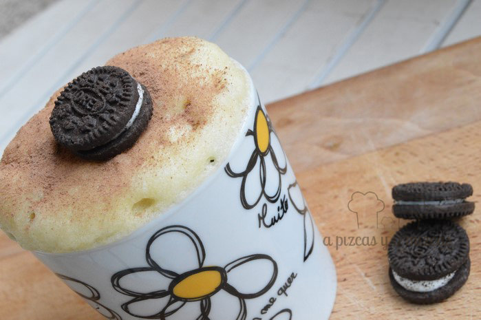

Después de ver tantas fotos de mug cake por las redes sociales queríamos probar. Después de ver algunas recetas nos decidimos por una [receta de mug cake](http://www.objetivocupcake.com/2015/02/oreo-mug-cake.html "Mug cake de oreo de Objetivo Cupcake perfecto") de Alma Obregón de "[Obejtivo: Cupcake perfecto](http://www.objetivocupcake.com/ "Objetivo Cupcake perfecto")". Seguimos su receta casi casi al pie de la letra y la verdad es que se prepara en un periquete.

Un mug cake es un bizcocho de los de toda la vida pero que se prepara en una taza y al prepararse ahí se puede cocinar en el microondas muy rápido. Lo podemos preparar todos en un momentín!

Ahora ya lo tenemos claro, cuando nos apetezca algo dulce al instante un mug cake es la solución... ji ji ji

## Ingredientes para preparar un mug cake con galletas Oreo

- 50 gramos de chocolate blanco
- 3 cucharadas de leche (nososotros pusimos leche desnatada
- 1/2 cucharada de aceite de girasol
- 4 cucharadas de harina
- 1/4 de cucharadita de levadura química
- 3 galletitas oreo en trocitos

Nosotros escogimos una taza de las desayuno. Ponemos el chocolate blanco y la leche en la taza. Metemos al microondas y calentamos unos 30 segundos. Removemos hasta que el chocolate esté deshecho.

Luego agregamos la harina y la levadura y removemos bien. Añadimos el aceite y las galletitas Oreo a trocitos. Calentamos otra vez en el microondas durante un minuto y medio aproximadamente.

Por último, para decorar acompañamos el mug cake con una galletita Oreo encima... ahora irresistible :)

Os recomendamos que lo comáis enseguida que es cuando está más bueno, si lo dejáis más tiempo se quedará un poco seco.

Lo podeís comprobar vosotros mismos fácil, rápido y bueno!

