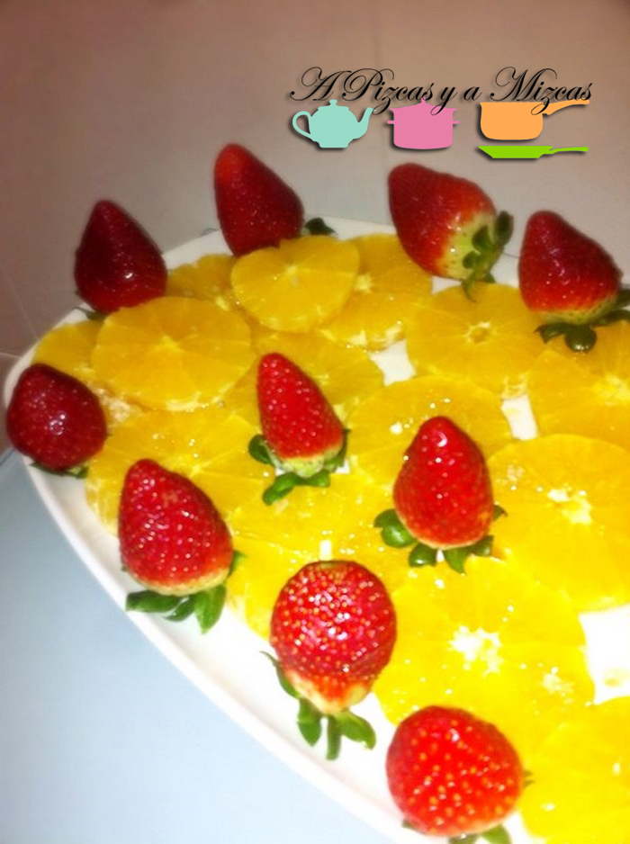
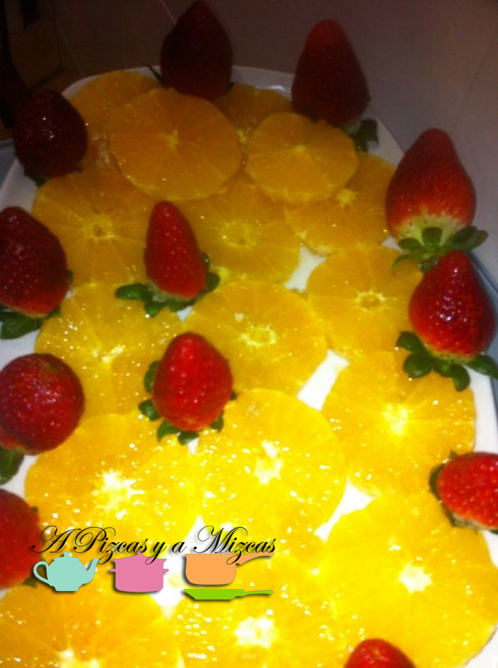

Estas navidades Papá Noel y los Reyes Magos también se han acordado de Pizcas y Mizcas.... y ahora que ya han pasado unos días... hemos sacado nuestro libro de La comida de la familia Ferran Adrià. Hemos empezado por un postre... y muy fácil: la naranja preparada. Nosotros siempre la habíamos preparado con miel y nueces o simplemente con azúcar y canela. Pero después de leer el libro seguro que incorporamos esta forma de preparar la naranja.

## Ingredientes para hacer la naranja preparada (dos personas):

- 2 Naranjas
- 2 cucharadas de miel
- 3 cucharadas de aceite de oliva virgen extra
- 3 caramelos de miel duros
- sal en escamas

Ahora vamos con la preparación... es fácil, fácil. Empezamos con los caramelos de miel. Los machacamos entre dos papeles de horno con la ayuda de un rodillo. A continuación pelamos la naranjas, eliminando toda la parte blanca y las cortamos en rodajas de un dedo de ancho y las ponemos en una bandeja o plato grande.

Después repartimos la miel por encima y el aceite de oliva virgen extra. Por último añadimos los caramelos de miel troceados y unas escamas de sal.

Nosotros las preparamos un par de horas antes de la comida y las pusimos en la nevera.... y el resultado es espectacular! No nos pudimos resistir y acompañamos las naranjas con unos fresas.... que por cierto, que para ser de las primeras... estaban buenísimas!

Seguro que os sorprenderá la mezcla de ingredientes y de sabores en la boca. Animaros a prepararlo y nos contáis! Nosotros ya lo hemos incorporado a nuestro recetario.

