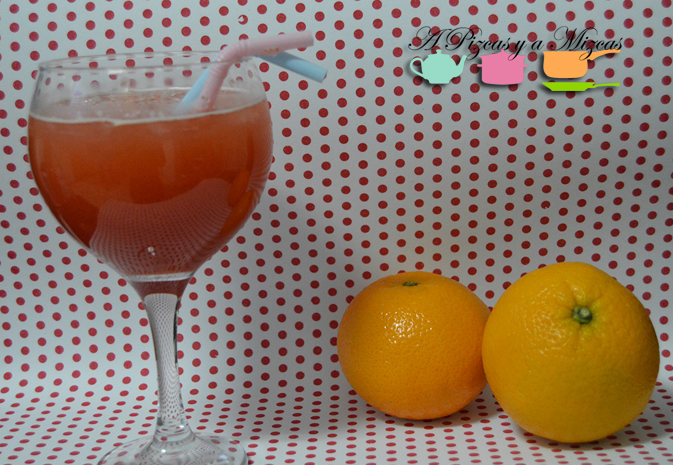

Hace unos días nos animamos con la limonada de fresa... y pensamos que si cambiábamos los  limones por naranja también estaría bueno... y pensado y hecho. El resultado fue esta naranjada.

Además aprovechamos que estamos en temporada de fresas y naranjas!

Tenemos que decir que hasta Trizcas la probó... y eso que ella anda un poco reñida con la fruta. Nos pedía "fesita, fesita" y se enfadó cuando se acabó.... je je je... Menos mal que congelamos parte del concentrado y lo tenemos listo para otra tarde primaveral. Es una forma que los peques tomen fruta aunque sea en zumo...

## Ingredientes para preparar la naranjada (para un litro aproximadamente)

- 300 gramos de fresas
- dos naranjas
- 140 gramos de azúcar
- cuatro vasos de agua fresquita
- hielo picado

La preparación es muy sencillita. Limpiamos las fresas y le quitamos la parte verde. Las troceamos y las trituraremos con la batidora. Para que quede más fino os recomendamos que lo paseís por el colador. Añadimos el azúcar y removemos.

Ahora le toca el turno a las naranjas. las exprimimos, colamos y añadimos a las fresas. Esto ya va cogiendo color... y que color más bonito!

Añadimos el agua y hielo picado y listo para disfrutar. Nosotros en esta ocasión, utlizamos un poquito de concentrado (de fresas y naranja) y el resto lo congelamos para poder disfrutarlo en otra ocasión.

Ya estamos pensando en montarla mesa en nuestra mini terraza para empezar a disfrutar de las tardes primaverales con este refresco tan saludable. ¿Qué os parece?

