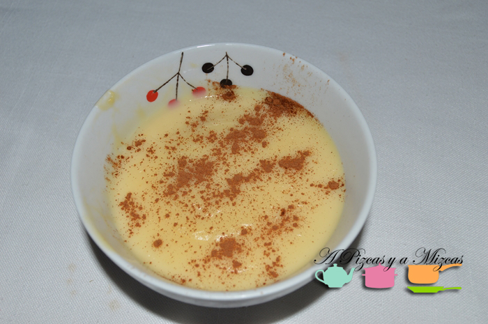
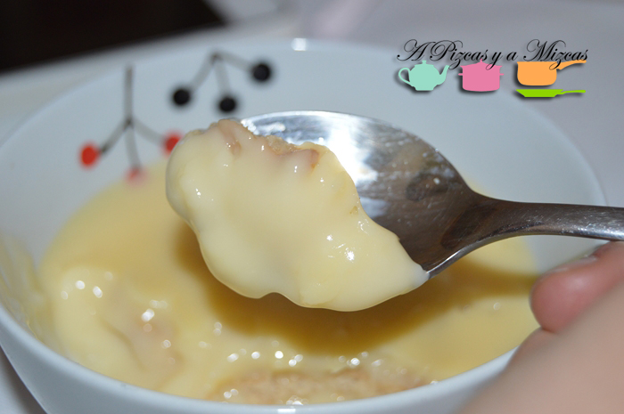

Hoy os traemos la receta de las natillas caseras... como las que preparaban nuestras abuelas cuando éramos pequeños. La verdad que es uno de los postres sencillos y rápido de preparar pero que hace las delicias de grandes y pequeños.

Las natillas es otro de los [postres](http://es.wikipedia.org/wiki/Natillas "origen de las natillas") que nació en los conventos: "Aunque se desconoce el origen exacto de las natillas, generalmente se sitúa su nacimiento en los conventos a lo largo de Europa. Esta teoría presenta coherencia debido a la naturaleza sencilla de su elaboración, su reducido coste económico y su riqueza alimentaria basada en grasas animales y proteínas al contener huevos y leche. Por todo esto, constituiría un plato idóneo para los conventos, donde siempre ha existido cierta potenciación en el desarrollo de la cocina dulce a la par de cierta cultura de austeridad que potenciaba la sobriedad en el yantar, lo que derivaba en el máximo aprovemiento posible de los alimentos y sus recetas en pos de platos sencillos pero alimenticiamente completos"

Así que hoy os desvelamos la auténtica receta de las natillas de la yaya de Mizcas.

## Ingredientes para preparar las natillas caseras: (6 porciones)

- 750 ml de leche
- 100 gramos de azúcar
- 4 yemas de huevo
- 20 gramos de harina de maíz
- 10 gramos de mantequilla
- la cáscara de un limón
- una ramita de canela
- canela molida
- galletas maría
- dos magdalenas

Ponemos en un cazo dos vasos de leche junto la cáscara de un limón, el azúcar y la ramita de canela y la mantequilla. Mientras con el vaso de leche restante añadiremos la harina de maíz y las yemas huevo. Removemos bien y vertemos en el cazo, removemos sin parar para evitar que se pegue.

Cuando notemos que espesan retiramos del fuego. Quitamos la cáscara del limón y la ramita de canela y servimos en cuencos. Nosotros pusimos unas galletas maría en algunas de las natillas y en otras trocitos de magdalenas. Espolvoreamos con canela e introduciremos en la nevera... dejaremos que enfríen dos o tres horas aproximadamente y a comer. Seguro que desaparecen en un abrir y cerrar de ojos de la nevera!

