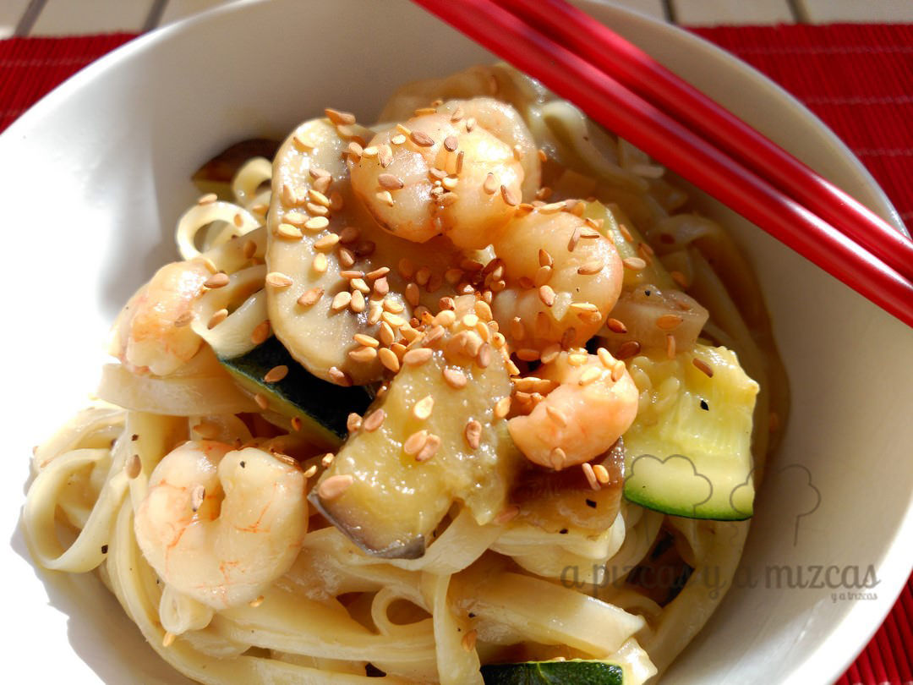
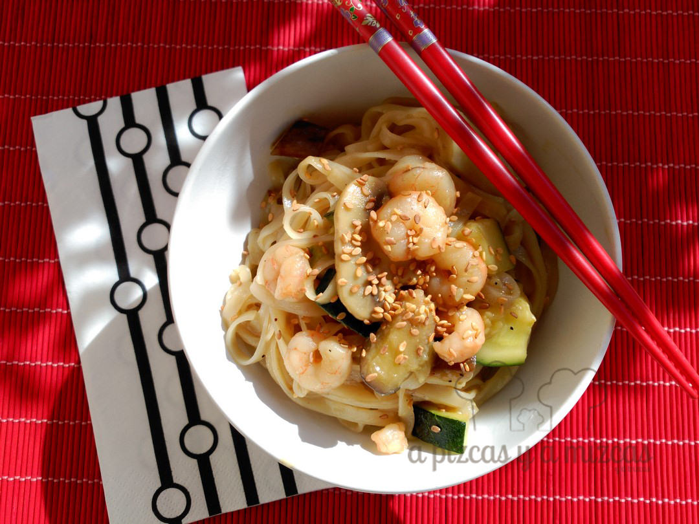
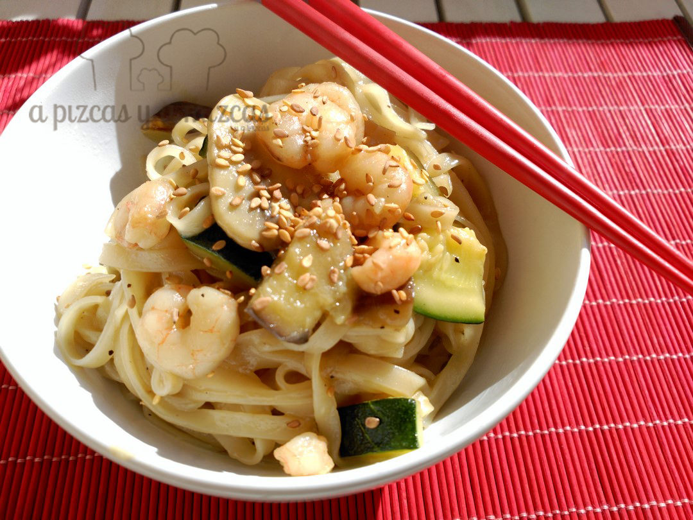

Hoy os traemos una receta con toque oriental: noodles con calabacín y gambas. Podéis adaptar la receta según lo que tengáis vosotros en la despensa. Es una buena forma de empezar la semana de forma positiva.

## Ingredientes para preparar  los noodles con calabacín y gambas (para dos personas)

- 125 gramos de noodles (fideos chinos)
- un puñadito de gambas peladas congeladas
- un calabacín
- media berenjena
- un puñado de champiñones
- aceite de oliva virgen extra
- 300 ml de caldo de pollo
- salsa de soja al gusto
- semillas de sésamo

Nosotros vimos la receta en [Cuuking](http://www.cuuking.com/) y la hemos adaptado a nuestro gusto

Vamos al lío.... delantal colocado y a los fogones!

En una sartén onda ponemos el aceite de oliva y calentamos. Cortamos las verduras a cuadrados y  continuación, agregamos la berenjena, el calabacín y los champiñones a la sartén.

También podéis utilizar otras verduras como zanahoria, la cebolla y el pimiento verde... en la variedad está el gusto... a innovar!

Cuando esté salteada agregaremos las gambas. Cocinamos un pelín más y echaremos el caldo de pollo y un poco de soja y dejaremos que hierva.

Para esta receta hemos utilizado pastillas de caldo pero si tenéis caldo de pollo casero se lo podéis añadir. Las dos opciones son válidas e igual de buenas!

Por último añadimos los noodles a la sartén y dejamos cocer. Ya está lista la comida. Rápido, fácil y bueno. Si queréis podéis espolvorear un poco con semillas de sésamo.

A comeeer!

Queremos ver vuestros noodles... animaros a preparar esta receta. Os va a encantar!

