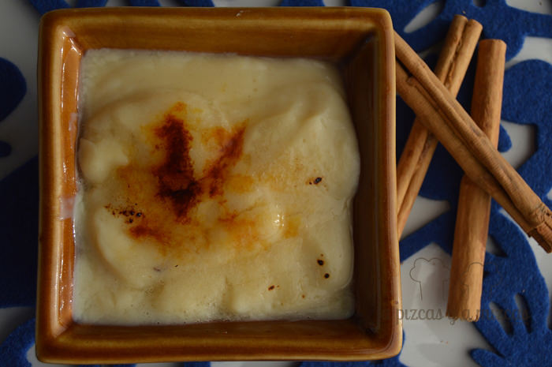
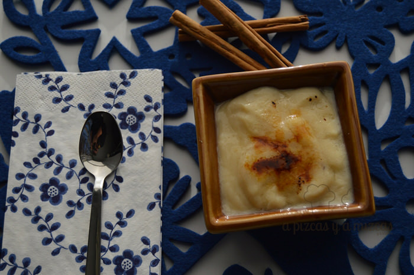

La crema catalana es uno de esos "pecados" que no se pueden cometer muy a menudo... pero qué buena que está. Hay veces que las cosas más ricas son las más sencillas, como esta versión particular de crema catalana que os presentamos aquí. En el origen está una receta básica de crema pastelera, que reutilizamos como crema catalana.

## Ingredientes para la crema catalana / crema pastelera

- Medio litro de leche
- Seis cucharadas colmadas de azúcar convencional
- Dos cucharadas de azúcar vainillado
- Dos cucharadas de maicena
- Cuatro yemas de huevo
- Dos ramitas de canela
- Azúcar para quemar

El primer paso de nuestra versión de la crema catalana es medir la leche. Del medio litro total reservamos medio vaso. Ponemos la leche a fuego medio con el azúcar vainillado y la canela en rama. Es importante que no llegue a hervir en ningún momento. Por lo que hay que controlar la potencia del fuego y remover constantemente.

Mientras se caliente la leche, en un bol mezclamos el azúcar convencional con las cuatro yemas de huevo con un tenedor. Hasta que quede una masa homogénea. Reservamos.

Seguimos preparando nuestra crema catalana disolviendo la maicena en la leche que habíamos reservado al principio. Cuando esté bien disuelta la integramos con la mezcla de azúcar y yemas.

Cuando la leche que tenemos al fuego esté a punto de romper a hervir (pero sin llegar a hacerlo), bajamos el fuego al mínimo y añadimos la mezcla de maicena, leche, azúcar y yemas y removemos con unas varillas constantemente, hasta que espese y alcance la consistencia deseada.

Como hemos dicho al principio, nosotros preparamos esta crema catalana/crema pastelera para utilizarla en nuestra tarta de caqui, así que tampoco queríamos que quedase espesa, espesa. Si queréis hacerla más propiamente crema catalana, solo tenéis que aumentar el tiempo de cocción (siempre removiendo con las varillas nuestra crema) e incluso podéis incrementar en una yema de huevo los ingredientes.

La colocamos en los recipientes en los que queramos servirla y los dejamos enfríar en el frigo. Cuando queramos tomarla, añadimos una cucharadita de azúcar por encima y con ayuda de un soplete de cocina lo caramelizamos en el momento de servir.

