En el corazón comercial de Valencia se encuentra una de las promesas gastronómicas más potentes de la actualidad. Con apenas 26 años, el joven Sergi Peris, ya ha pasado por alguno de los templos de la cocina valenciana y de fuera de la ciudad, como el Restaurante Torrijos (con Josep Quintana), Abac Barcelona (Jordi Cruz), Alejandro del Toro (Alejandro del Toro), Casa Pepico y Kaymus (Nacho Romero). Luego abrió su propio restaurante en el Paseo de la Alameda y desde junio de 2016 se encuentra en el Restaurante [Sergi Peris Gastronòmic](http://www.sergiperis.com/), en la [Galería Jorge Juan](http://www.lagaleriajorgejuan.com/), enfrente del [Mercado de Colón](http://mercadocolon.es/) de Valencia. Y el pasado 18 de noviembre pudimos probar algunos de los platos que conforman su nueva carta.

## Nuestra cena en el Restaurante Sergi Peris Gastronòmic

- **Comida**: ⭐⭐⭐⭐
- **Local**: ⭐⭐⭐
- **Servicio**: ⭐⭐⭐⭐

Peris presentó un menú basado en el cuidado del producto, pero  con una nueva concepción donde se percibe un punto rebelde dentro de una cocina con base de tradición.

Arrancamos con una degustación de ostras proporcionadas por Oyster & Co. En concreto una sorprendente ostra normanda de Utah Beach (donde se produjo el Desembarco de Normandía en la fase final de la II Guerra Mundial). Resultó una ostra muy fina, con un intenso sabor a mar, muy equilibrada. Así al natural y con el acompañamiento de un Champagne Lallier R.012 Brut (elaborado con Pinot Noir y Chardonnay) fue un entrante perfecto. El champagne, con una acidez muy cítrica acompañó divinamente las notas yodadas y a la textura de la ostra. Un acierto.

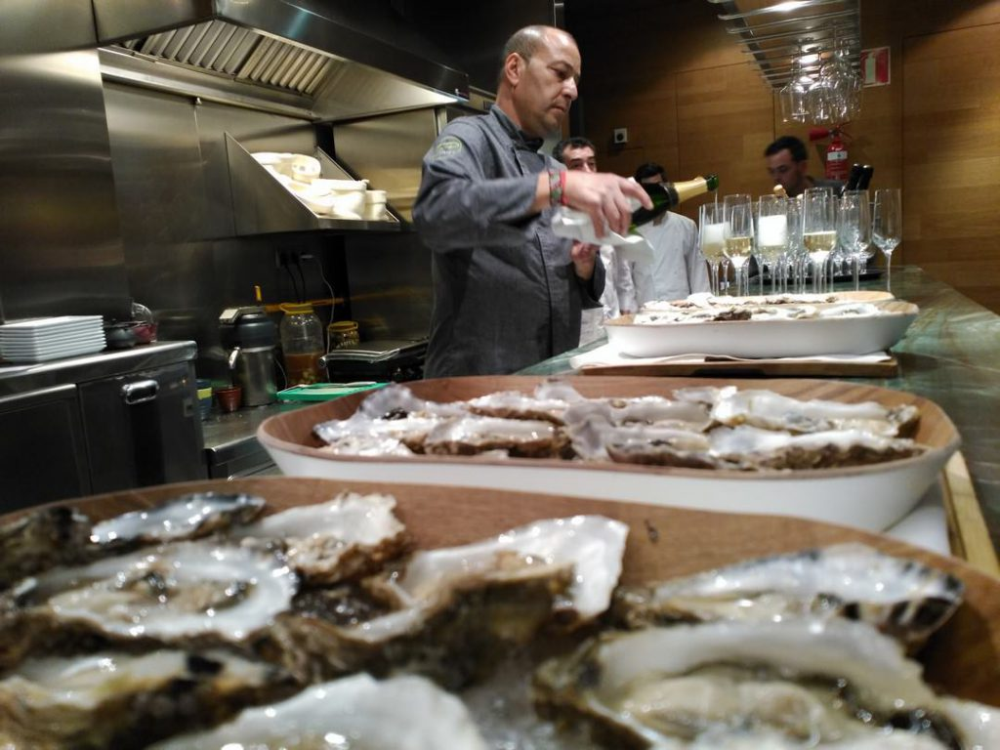

Ya en la mesa, probamos una rica ensaladilla de atún picante, con patata cocida, chile chipotle, sobre una galleta de arroz y algas y una “pizzita” de anchoa con crema de mozzarella. Sorprendente la galleta de arroz, en serio, una base crujiente pero esponjosa al tiempo y muy gustosa. El vino que se eligió para estos entrantes fue el Mersé, una Merseguera Fermentada en Barrica, de Vinos Alto Turia, con D.O.P. Valencia.

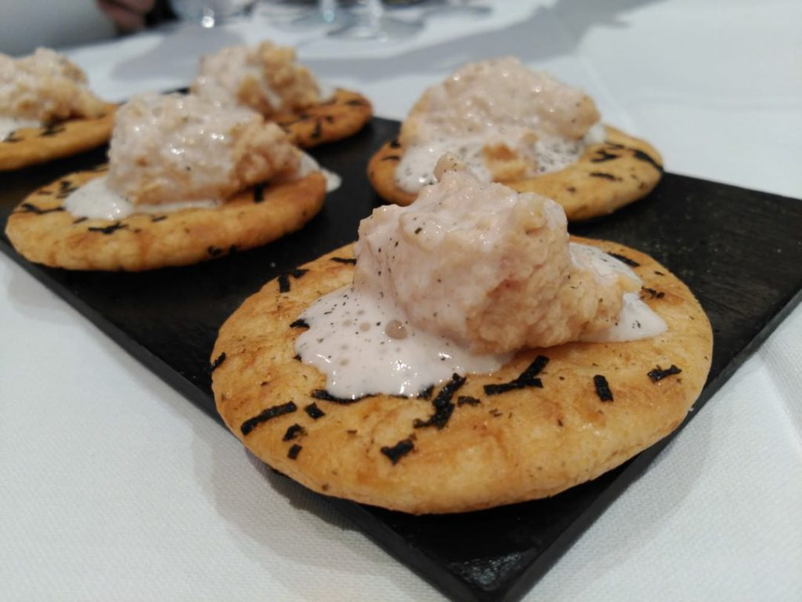

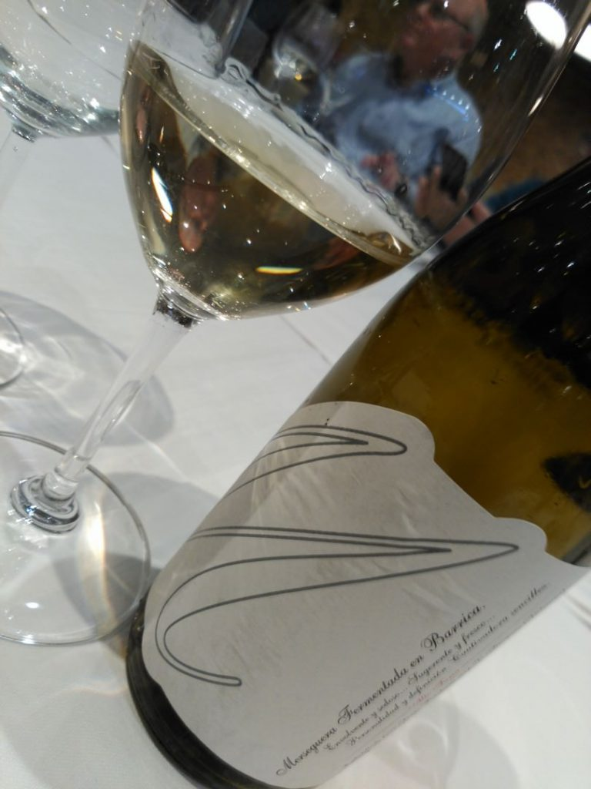

Siguiendo con las ostras, Sergi propuso un duo formado por una ostra valenciana y una ostra normanda aderezadas con escabeche y con granizado de agua de naranja (para la valenciana) y remolacha smoker y crema agria (para la francesa). El acompañante líquido esta vez fue el gran cava Opus Evolutium Gran Reserva, de Alta Alella, con un puntito de acidez menor que el champagne anterior, pero con gran salinidad y una crianza con sus levaduras que le aportan una gran estructura. Nos gustó mucho.

Luego llegó a la mesa un capuccino, y no es que Sergi nos quisiera echar de allí por pesados, se trataba de un capuccino de parmesano y setas, que se acompañó con Peña El Gato Garnacha 2014 (D.O.Ca. Rioja), del gran Juan Carlos Sacha. Un vino que me enamoró. Expresión elegante de cepas de más de 90 años, madera medida y fruta viva y golosa. Fantástica acidez, que limpió a la perfección lo que pudiera quedar de capuccino. Dejamos la botella cerca de nosotros en la mesa…

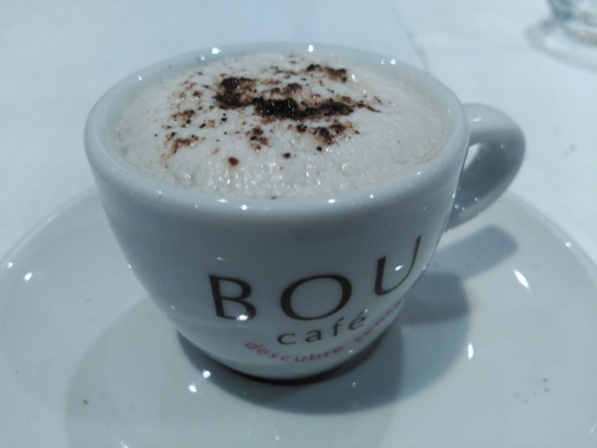

El siguiente plato de la nueva carta de Sergi Peris Gastronòmic fue un foie sobre puré de chirivía y regaliz. Y aquí se apostó por un maridaje clásico del foie: un vino dulce. El elegido fue Apasionado de José Pariente 2014 (D.O.P. Rueda), elaborado con la variedad Sauvignon Blanc. Un dulce alejado de lo empalagoso, gracias a un perfil algo herbáceo, amargo y ácido, pero dulce y sedoso. Fresco y equilibrado.

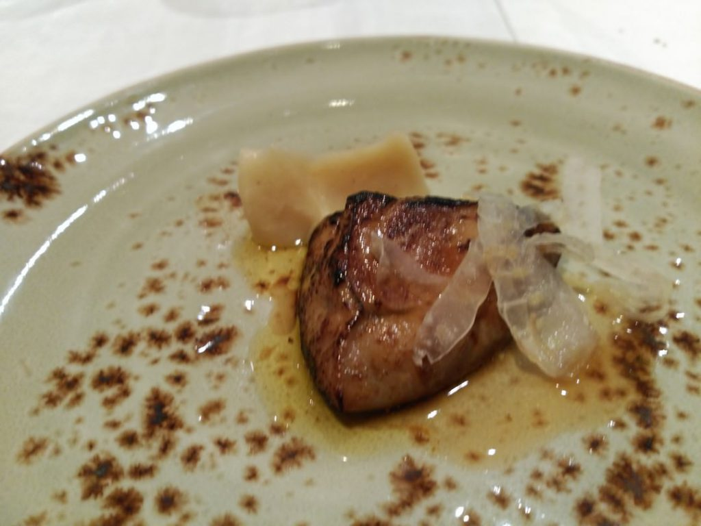

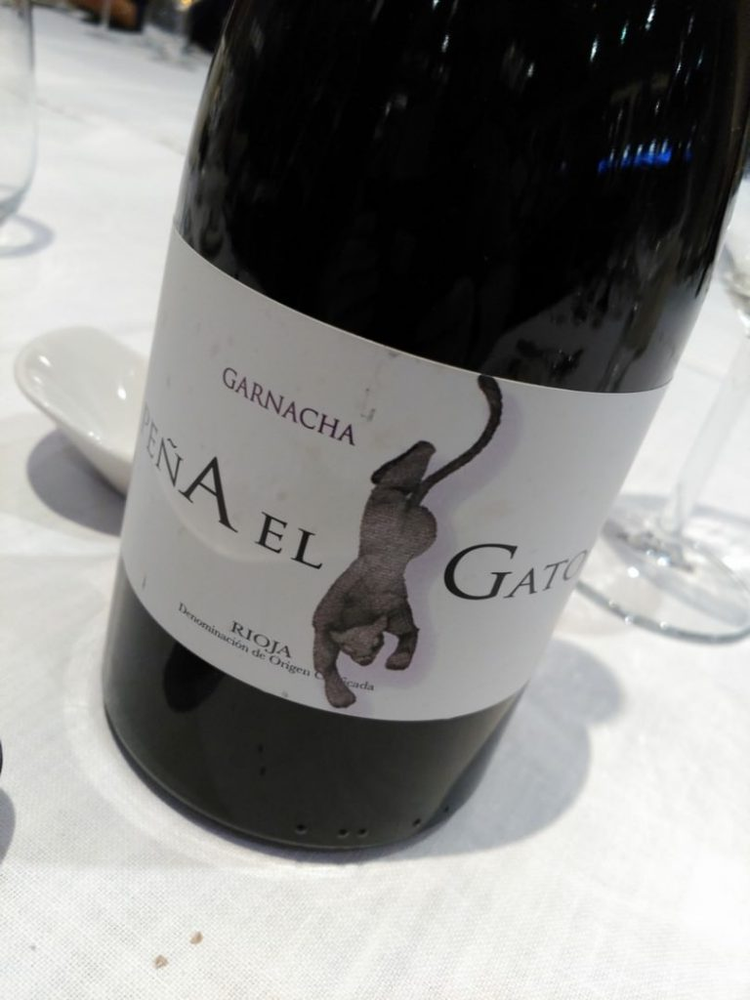

El mar llegó de nuevo a los platos en forma de una ortiguilla en tempura, con mahonesa especiada, que se acompañó del Albariño Pedralonga, denota un gran trabajo con las lías, buena acidez, carga frutal y final salino. Imposible fallar en este maridaje. Mar y Mar.

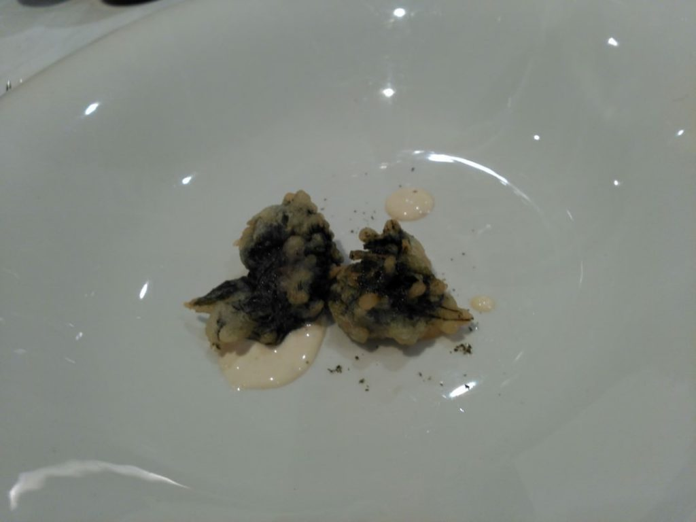

A continuación, llegó una carrillera de atún con caldo de miso, con el que mantuvimos el mismo vino, pero que aguantaba perfectamente esa Garnacha que teníamos a mano.

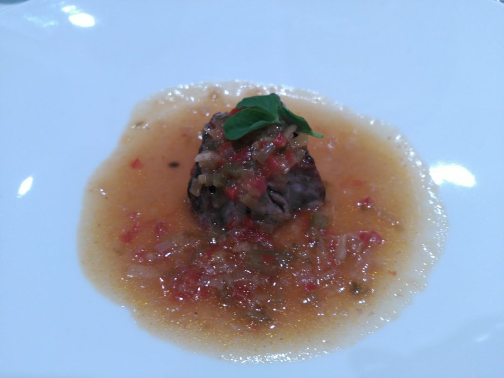

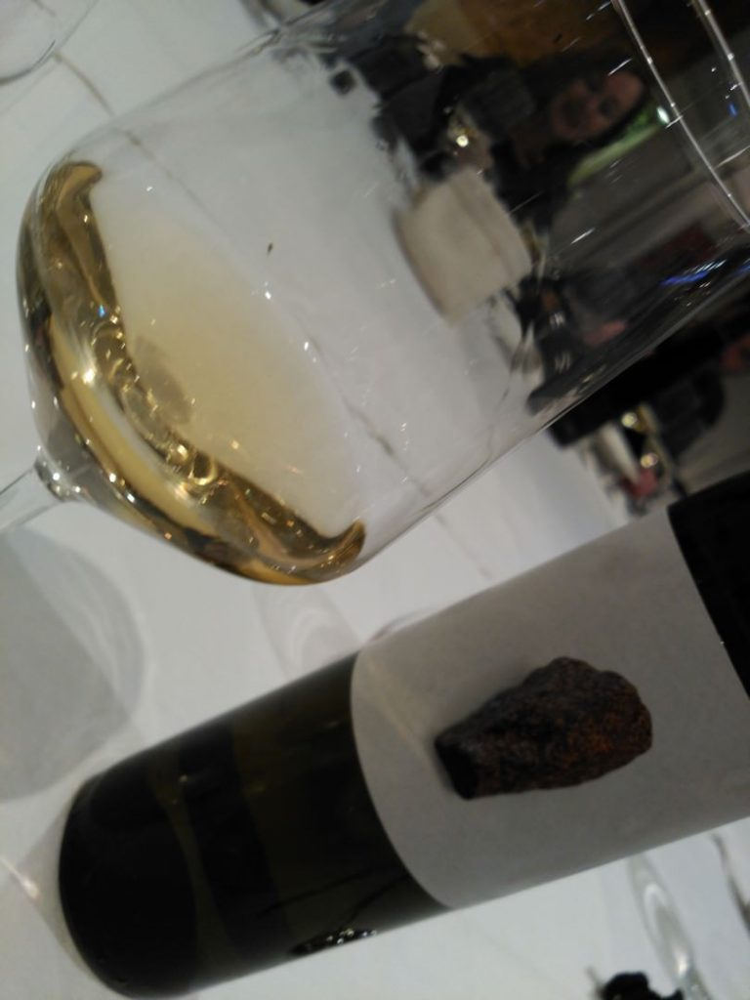

El último plato que degustamos fue una codorniz ahumada en horno Kamado y puré de boniato. Humo, especias y carne de caza. Y para bailar con esta propuesta, un ángel, el tinto ecológico L’Angelet 2013 (D.O.P. Utiel-Requena), de Bodegas Palmera, a partir de viñas viejas de Tempranillo, Cabernet Sauvignon y Merlot, concentrado e intenso y especiado. El agradable punto animal del vino casó a la perfección con la codorniz.

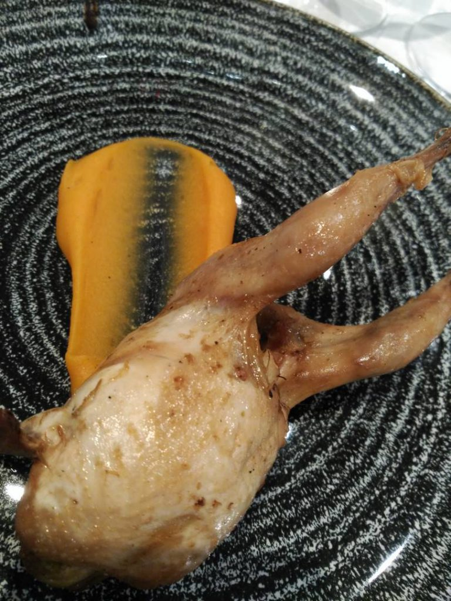

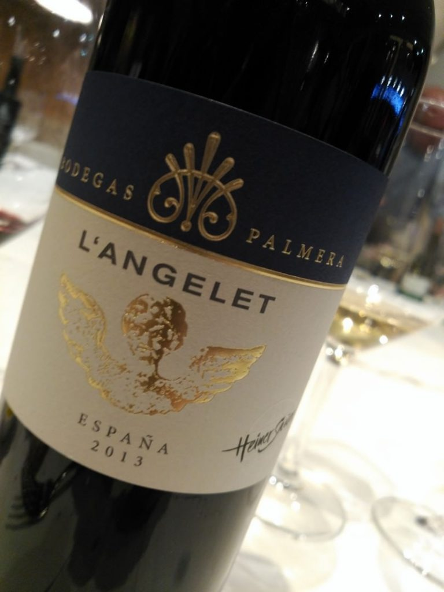

Y hasta aquí lo que probamos de la nueva carta de Sergi Peris Gastronòmic. Volveremos para conocer el resto, pues promete y aunque tenga que luchar contra elementos tangibles e intangibles, el talento de Sergi está a prueba de bombas.
