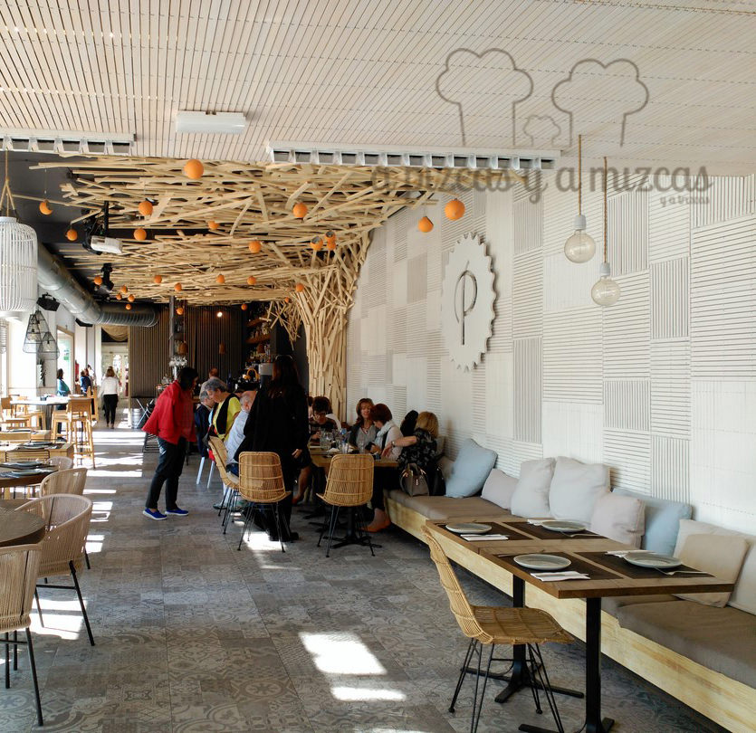
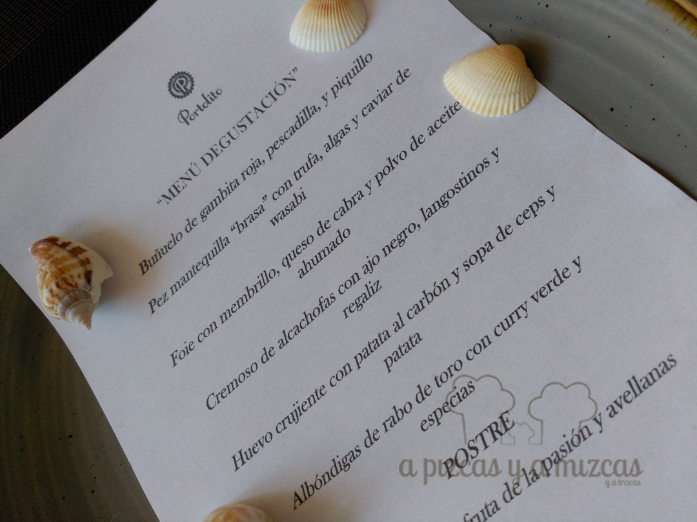
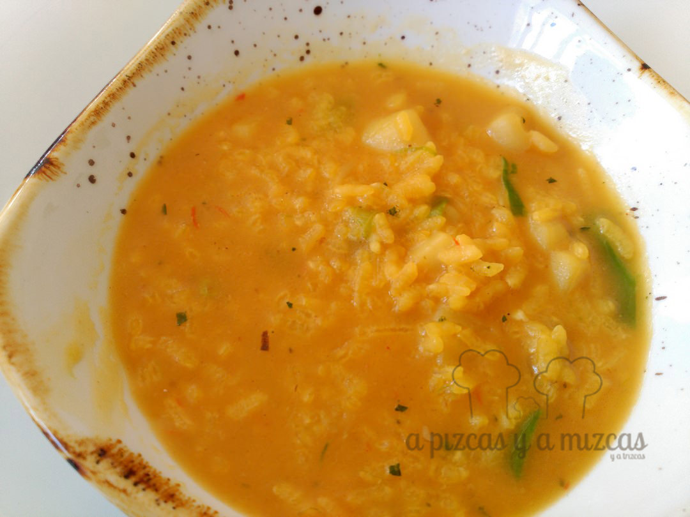
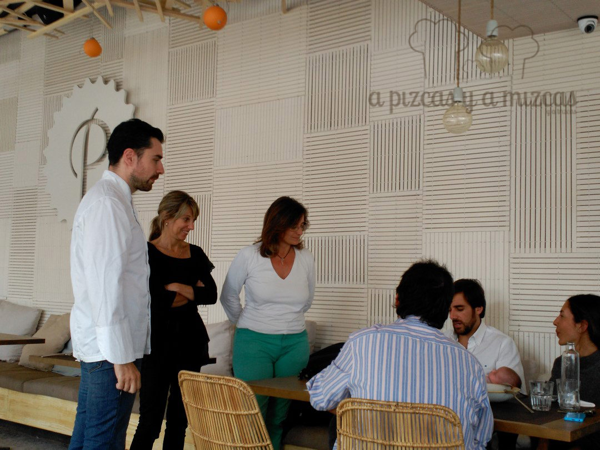

¿Es posible innovar culinariamente cuando tu emplazamiento te condiciona mucho? Al parecer sí, y esta es la apuesta que el restaurante [Portolito](http://www.portolito.com/) hace en un lugar tan emblemático como el Paseo Neptuno (en el número 34), en la playa de Las Arenas de Valencia. Un sitio que automáticamente se vincula a arroces, clótxinas, ensalada valenciana... Su chef, Enrique Campos (también en [Lotelito](/cena-en-lotelito/)), ha preparado platos muy interesantes. Os lo contamos.

## Nuestra comida en restaurante Portolito

- **Comida**: ⭐⭐⭐
- **Local**: ⭐⭐⭐⭐
- **Servicio**: ⭐⭐⭐

Acudimos, junto con un grupo de periodistas y bloggers gastronómicos a conocer la nueva propuesta gastronómica. La selección que nos presentaron fue la siguiente:

Nueva carta Portolito

- Buñuelo de gambita roja, pescadilla y piquillo
- Pez mantequilla "brasa" con trufa, algas y caviar de wasabi
- Foie con membrillo, queso de cabra y polvo de aceite ahumado
- Cremoso de alcachofas con ajo negro, langostinos y regaliz
- Huevo crujiente con patata al carbón y sopa de ceps y patata
- Albóndigas de rabo de toro con curry verde y especias
- Chocolate con fruta de la pasión y avellanas

Como véis, una apuesta por ofrecer algo diferente y a precios muy, muy competitivos, para ser el entorno que es. La selección nos pareció fantástica. Y nos encantó el buñuelo de gambita roja, el cremoso de alcachofas y las albóndigas (que traigan más pan para la salsa, jeje). Además, Enrique "improvisó" un arroz marinero que le pedimos y que estuvo riquísimo.

Arroz marinero

Tras la agradable comida, llena de risas y de buen rollo, Enrique Campos salió de los fogones y se interesó mucho por conocer nuestras opiniones. Saber escuchar es un gran don que muy poca gente tiene.

