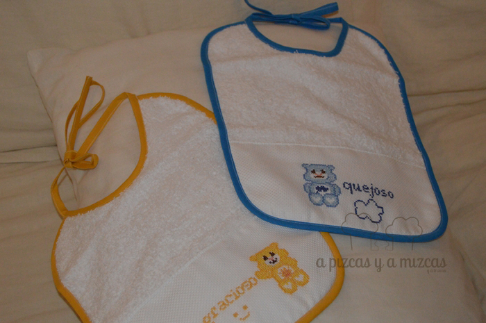
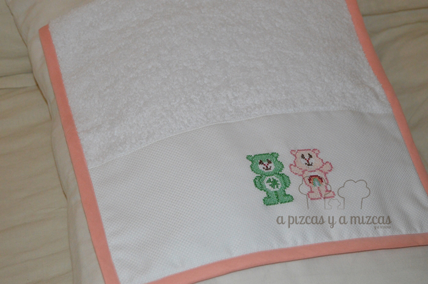
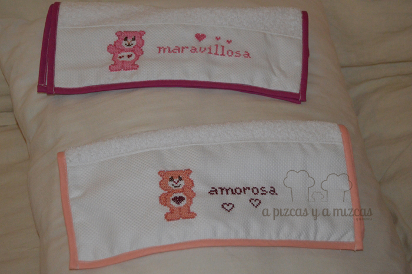
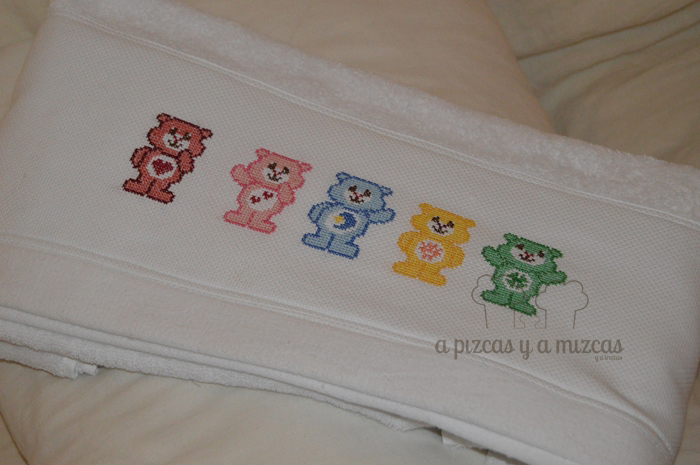
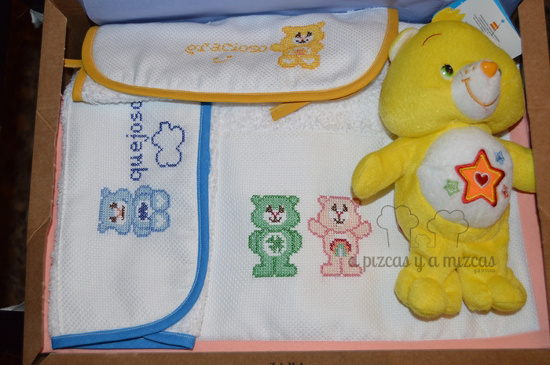

Es verdad eso que dicen que está todo inventado... y hasta los dibujos de nuestra infancia como la Abeja Maya o los Osos Amorosos han vuelto y Trizcas los ha descubierto y le han chiflado. Como todos los niños, nuestro peque ser tiene muy claro que su oso amoroso favorito es el amarillo (Gracioso) y empezamos a buscar por todas las partes el oso amarillo... pero ni rastro. Al final recurrimos al sitio donde se encuentra todo y dimos con él. Pero pensamos, Gracioso se iba a sentir muy solo... así que hicimos un poco de duendes de Papá Noel y Mizcas rescató sus hilos y agujas de punto de cruz y empezó su labor de estos osos amorosos bordados para Trizcas.

La verdad es que siempre me ha gustado bordar a punto de cruz... y he hecho muchas cositas, pero desde que nació Trizcas es más complicado... pero busqué mini huecos y bordé todo este regalo amoroso. La yaya Mizcas cosió una toalla de mayor y bordé un montón de osos que la llenaron de color, tambíen cosió una toalla de lavabo, dos mini toallas y dos pechitos.

Y este encargo de Papá Noel ha quedado súper Maravilloso, Gracioso, Amoroso, Fabuloso, Grandioso...

