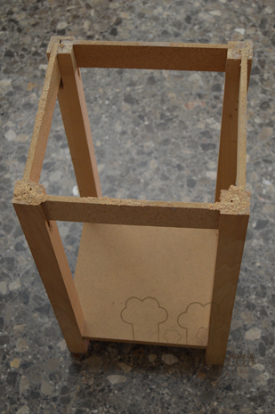
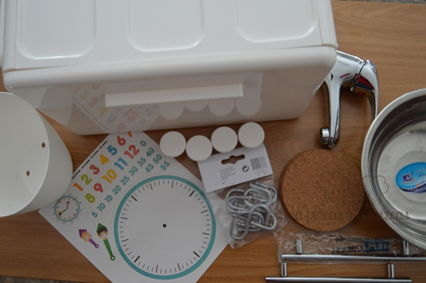
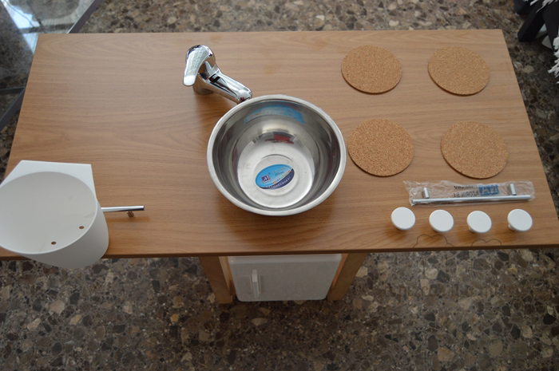
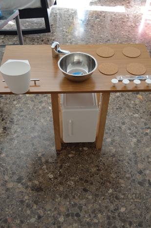
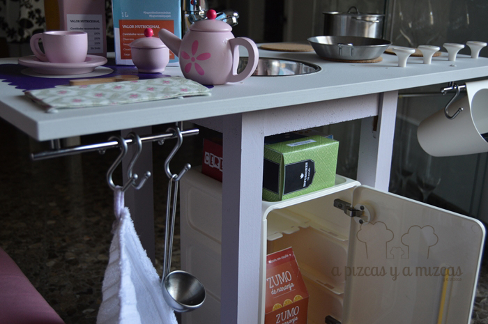
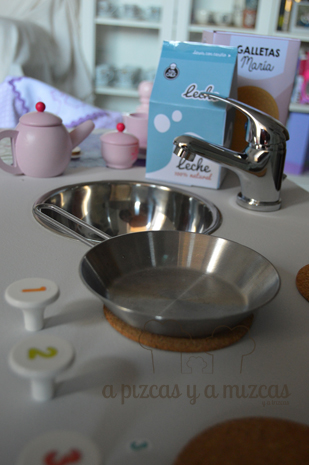
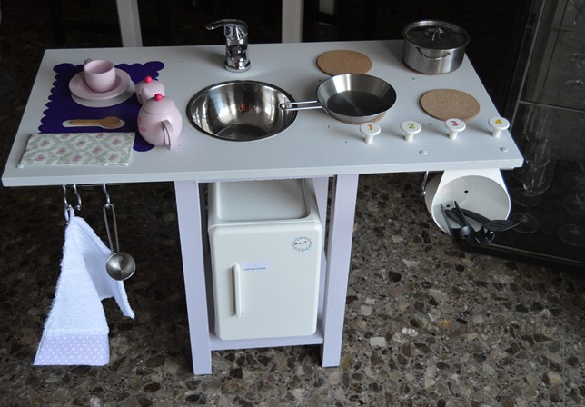

De vez en cuando, Papá Noel y los Reyes Magos nos envían un mensaje de ayuda, para que colaboremos con ellos. En esta ocasión nos pidieron que preparáramos una cocinita de juguete para una niña muy especial. Aquí os contamos cómo lo hicimos, transformando las patas de una vieja mesita auxiliar en una cocinita de juguete de fantasía. Ahora lo compartimos con vosotros para que en otra ocasión podáis recibir el encargo de Sus Majestades de Oriente o de Santa Claus y seáis partícipes de la magia...

En A Pizcas y a Mizcas ya tenemos algo de experiencia en esto de preparar una [cocinita de juguete](/cocinita-infantil-handmade/ "Cocinita de juguete de Trizcas"), pues a Trizcas le montamos una el año pasado. Aquí podéis ver cómo quedó y qué materiales empleamos. Con esta base este año respondimos de nuevo al reto de Papá Noel y nos pusimos manos a la obra.

## Materiales para la cocinita de juguete

- Las patas de una mesita auxiliar / también puede servir una mesita de noche, o incluso un módulo de estantería 1x2
- Un tablón/estante
- Un bol de aluminio
- Cuatro posavasos de corcho o de goma eva
- Cuatro tiradores redondos
- Dos tiradores alargados metálicos
- Ganchos de colgar
- Un grifo
- Un escurridor pequeño (lo compramos en IKEA)
- Un armarito de plástico (lo compramos en IKEA)
- Pintura en dos colores que queráis
- Adhesivo de montaje

Para preparar nuestra cocinita de juguete, lo primero fue desmontar la tapa de la mesita auxiliar, que era redonda, para quedarnos sólo con las patas, que serán la base de la cocinita. Venían sin pintar, por lo que sólo nos hizo falta lijar las patas y limpiarlas bien de polvo. Una vez limpias, las pintamos. Nosotros empleamos para las patas un color morado claro. Le dimos dos pasadas.

Luego empleamos un estante que se ajustaba a las medidas que necesitábamos (si no, tendréis que cortarlo) y lo pintamos de color gris clarito. Le dimos dos pasadas. Una vez seca la que será la encimera de la cocinita de juguete, marcamos con un lápiz el contorno del bol de aluminio, que será el fregadero, y los agujeros donde irán los tornillos de sujección del grifo (nosotros empleamos un grifo de bidé, que por su tamaño se ajustaba bien). Tened en cuenta las patas de la mesita a la hora de situar el grifo y el fregadero, pues luego es posible que no podáis montar bien la cocinita. El contorno del bol de aluminio, lo tendréis que reducir un poco (como unos 5 milímetros), para que luego, al cortarlo el bol pueda apoyar sobre la encimera.

También tenéis que marcar el lugar dónde irán los posavasos (como si fueran los quemadores) y los pomos redondos (que serán los mandos de nuestra cocinita de juguete) y los tiradores alargados (como si fueran barras de colgar).

Ahora, vamos con el bricolaje. Con una sierra de calar cortamos el círculo donde irá el fregadero. Un truco consiste en hacer varios agujeros con una broca grande a lo largo del perímetro. De esta forma podremos introducir la sierra más fácilmente y "dividir" el corte en tramos. Si con la sierra hemos hecho alguna marca en la pintura, la retocaremos después.

Ahora con unos clavos largos montamos la encimera sobre las patas de la cocinita de juguete.

Hacemos los agujeros para los tiradores. Los atornillamos. También pegamos con el adhesivo de montaje los quemadores/posavasos. Numeramos los quemadores y los mandos de la cocinita de juguete.

Con ese mismo adhesivo pegamos el bol/fregadero y luego atornillamos el grifo. Ya casi tenemos nuestra cocinita de juguete.

Como teníamos espacio, a la izquierda pintamos una zona de desayuno en color morado oscuro. Buscando ideas para nuestra cocinita encontramos en el blog de [Ahora soy Mamá](http://ahorasoymama.com/comida-de-juguete-de-papel-set-de-desayuno-descargable-gratis/ "Set desayuno imprimible") un set de desayuno descargable para imprimir y ya lo completemos, que quedó así de bien:

En la zona baja de las patas de nuestra cocinita de juguete instalamos un armarito que vimos en IKEA y que parece totalmente una mini nevera. Lo mantuvimos fijado con un poco de blue-tac. Y le pusimos un adhesivo en forma de reloj.

Luego, la iaia Mizcas preparó un mini delantal que Mizcas bordó y un trapo de cocina.

Con los ganchos de colgar podemos sujetar de las barras el menaje y los trapos. En esas mismas barras colgamos el escurridor de plástico.

Así quedó nuestra cocinita de juguete. ¿Os gusta?
