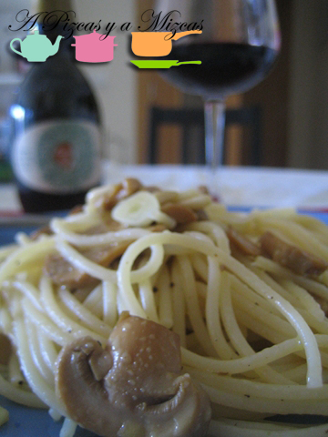

Últimamente andamos algo despistados... y se nos presentó un día que no teníamos nada preparado para comer, por lo que decidimos cocinar pasta. Ya sabéis que Pizcas es muy apañado y mientras unos espaguetis estaban en la cacerola... preparó una comida deliciosa. En nueve minutos teníamos preparado un plato exquisito

## Ingredientes para cocinar pasta (para dos personas)

- 200 gramos de espaguetis
- 1 lata de champiñones laminados
- 1 ajo
- piñones
- aceite de trufa
- sal
- queso parmesano rallado

Ponemos los espaguetis en abundante agua con sal a fuego medio y seguimos las instrucciones del fabricante. En una sartén ponemos un chorro de aceite de oliva y rehogamos los champiñones y añadimos el ajo laminado. Agregamos un chorro de aceite de trufa y un puñadito de piñones.

Una vez que la pasta estén cocinados los escurrimos y los añadimos a la sartén con los champiñones. Mezclamos todos los ingredientes y lo tenemos a fuego suave durante un par de minutos. Añadimos otro chorrito de trufa y servimos.

Una vez en la mesa espolvoreamos una cucharada de queso rallado y a disfrutar de nuestra comida rápida.
