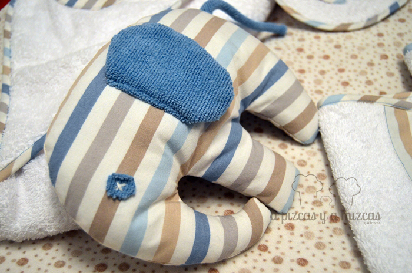
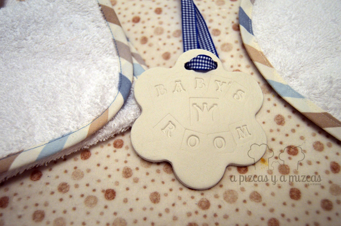
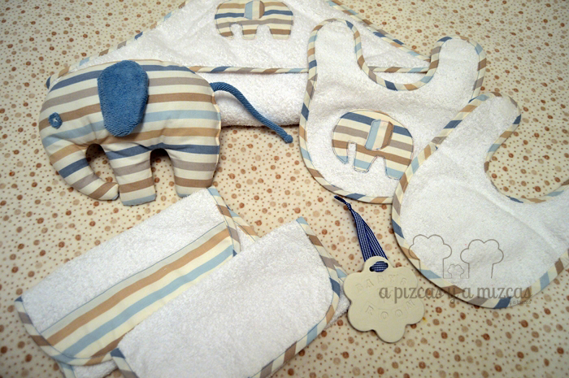

Ahora que hemos descubierto nuestras habilidades con la máquina de coser ya no hay quién nos pare. Todo empezó con el [regalo de bienvenida del elefante rosa](/un-regalo-de-bienvenida/ "Regalo de bienvenida elefante rosa") y después de ver el éxito nos animamos a preparar otro.  Así que esta vez hemos hecho un regalo muy especial para un pequeñín y unos papis muy importantes para nosotros. Le hemos puesto un poquito de los ingredientes secretos: un poco de cariño y mucho corazón y el resultado ha sido otro regalo de bienvenida amoroso.

Para esta ocasión hemos seleccionado una tela de rayitas de colores azules y beiges y rizo blanco (que nos encanta el blanco). Cosimos una capa de baño, un pechito con un elefantito, otro pechito liso, dos trapitos a juego con los pechitos y no podía faltar nuestro elefantito amoroso. A nosotros nos ha encantado el resultado, espero que a su dueño y a sus papis también les encante.

Nuestra experiencia con Trizcas nos ha hecho saber que hay cosas de las que nunca tienes suficiente cuando los pequeseres son recién nacidos: los pechitos y los trapitos. Así que confiamos en que este regalo de bienvenida para este pequeñajo les sea de utilidad a sus papis y que nuestro elefantito le acompañe mucho tiempo.

Para acompañar al elefante hicimos una plaquita de cerámica para poner el puerta de su habitación, que prometemos explicaros cómo hicimos en otro post del blog. Así no habrá duda de cuál es el cuarto del chiquitín (aunque como todos los papis sabemos, los territorios de los pequeseres se expanden sin control, hasta hacerse con la totalidad de la casa, jeje).

Y ahora nos dejamos de rollos y os enseñamos lo bonito que ha quedado el regalo.

Si os interesa algún regalo de bienvenida para nenes o cualquier otra cosa que veáis en el blog, poneros en contacto con nosotros puedes utilizar nuestro [formulario de contacto](/contacto/ "Ponte en contacto con nosotros") y hacernos la petición o lo que quieras decirnos.
