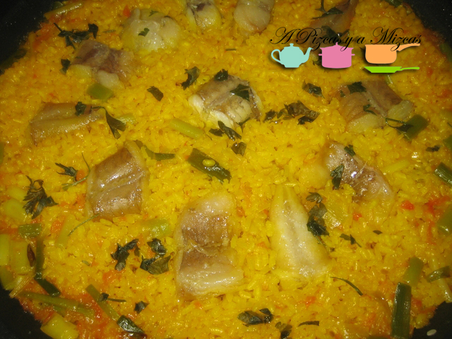
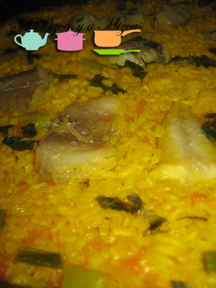
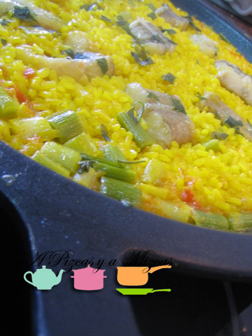
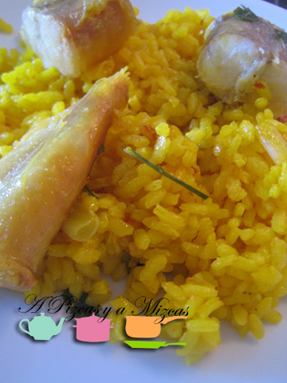

La paella de rape y ajos tiernos no es muy habitual, tal vez por lo complicado de darle al rape el punto de cocción justo para que quede rico y no esté "gomoso". Lo más común es ver la paella de bacalao, coliflor y ajos tiernos, por ejemplo. Sin embargo, si se presta algo de atención a la cocción del pescado, este arroz es fantástico.

## Paella de rape y ajos tiernos (cuatro raciones)

- Cuatro colas de rape
- Un manojo de ajos tiernos
- Dos dientes de ajo
- Media cebolla tierna
- Un tomate grande maduro
- Arroz (la medida de cinco tazas de café)
- Caldo de pescado (la medida de 11 tazas de café)
- Aceite de oliva virgen extra
- Una cucharadita de las de café de pimentón dulce
- Un sobre de azafrán molido (en su defecto, colorante alimentario)
- Sal
- Una cucharada de perejil picado

Vamos con la elaboración de la paella de rape y ajos tiernos. En primer lugar, os aconsejamos que os preparéis todos los ingredientes y los dispongáis de modo que podáis tener acceso a ellos rápidamente. Así pues, empezamos con los ajos tiernos: les quitamos las barbas y la parte dura del final, además, les sacamos la primera "camisa" y los cortamos en trozos de 1,5 cm de largo aproximadamente. Los reservamos.

El tomate lo rallamos y lo reservamos. Rallamos la media cebolla y picamos bien fino los ajos y lo reservamos junto.

Las colas de pescado para nuestra paella de rape y ajos tiernos las cortamos en tres o cuatro rodajas. Lo reservamos también.

Medimos el arroz y el caldo, con la misma taza. El caldo lo ponemos a calentar a fuego medio, para que tenga algo de temperatura cuando le llegue el turno de incorporarlo a la paella.

Con todo esto listo, cogemos la paella y la colocamos al fuego, no demasiado fuerte. Cuando tome temperatura, sellamos ligeramente los trozos de rape y los retiramos. En ese mismo aceite, sofreímos la cebolla y los ajos con un poco de sal. Cuando la cebolla esté ya casi hecha, incorporamos el tomate y dejamos que fría unos minutos. Luego, subimos un poco el fuejo, incorporamos los ajos tiernos y salteamos, hasta que veamos que los ajos tiernos empiezan a estar dorados.

Ahora le llega el turno al arroz. Lo incorporamos a la paella y damos varias vueltas, para que se impregne bien del aceite. Con un minuto o así bastará. Añadimos una cucharadita de las de café de pimentón dulce y removemos rápidamente para que no se queme. Ahora incorporamos el caldo caliente y dejamos que hierva durante unos 18-20 minutos, los primeros cinco minutos a fuego fuerte, luego a fuego muy bajo, para evitar que se evapore todo el caldo y quede el arroz entero, y de nuevo los últimos minutos a fuego muy vivo (para lograr el ansiado socarrat). A media cocción del arroz, disponemos los pedazos de rape en nuestra paella de rape y ajos tiernos.

Transcurrido el tiempo del arroz, espolvoreamos el perejil picado, dejamos reposar fuera del fuego unos 6/7 minutos y luego... a disfrutar con un buen vino blanco o con un tinto joven afrutado!!

