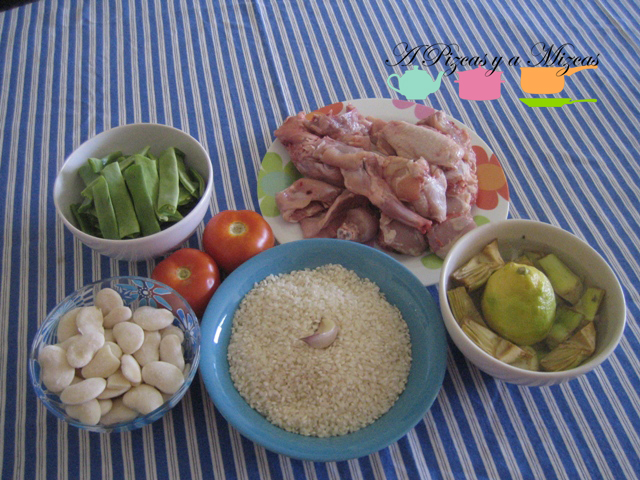
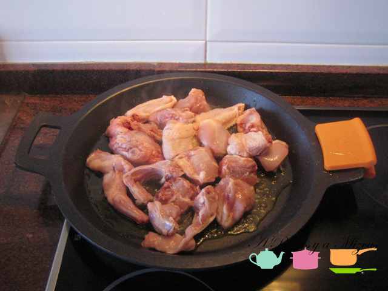
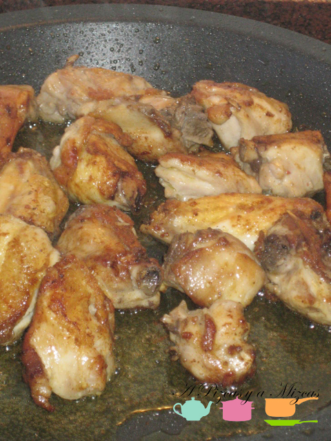
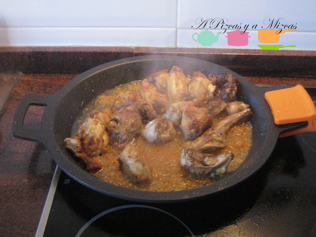
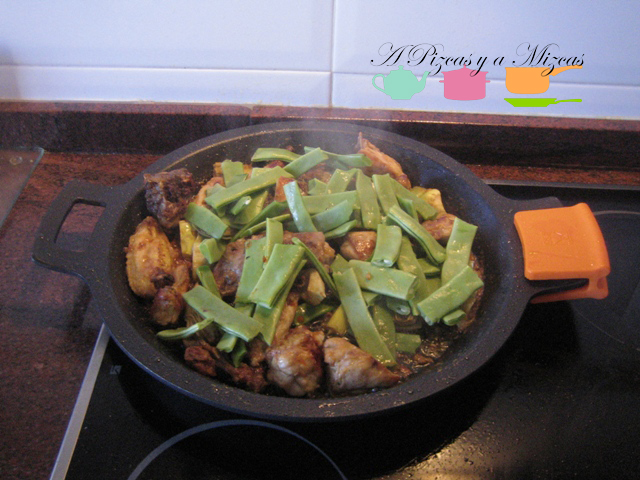
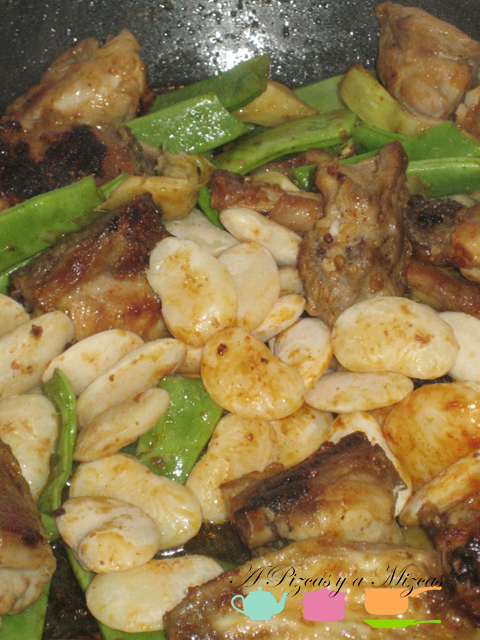
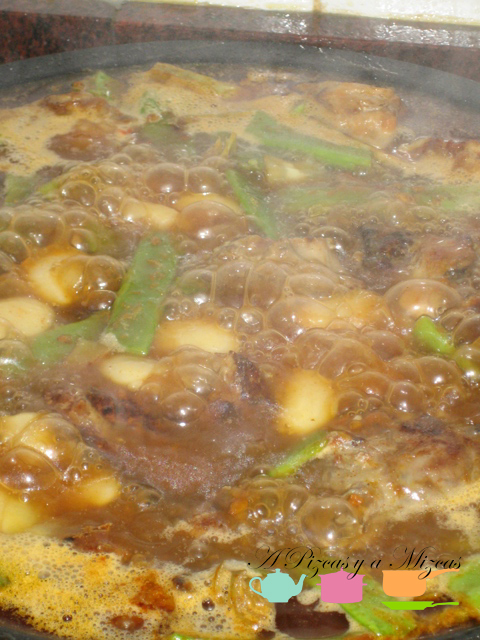
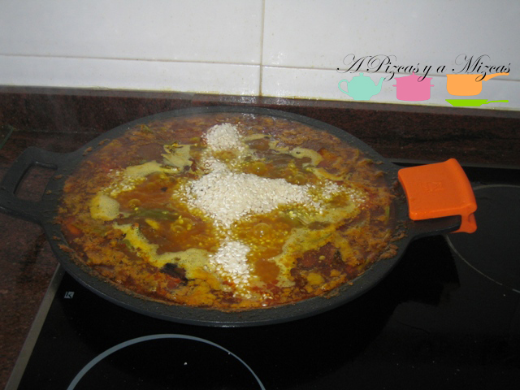
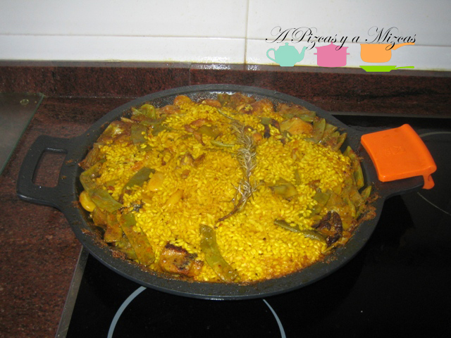
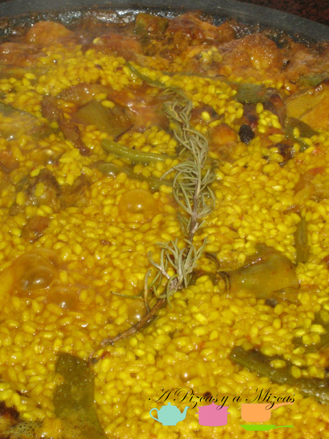

Recientemente se ha aprobado una Paella valenciana con Denominación de Origen. Cosa de puristas, tal vez necesaria para evitar desmadres gastronómicos, especialmente fuera de la Comunitat.

Aquí, nuestra aportación dominical y guía para elaborar una buena paella, con D.O. Pizcas y Mizcas, puesto que añadimos a los ingredientes ortodoxos la alcachofa. Es una versión adaptada a nuestros gustos.

Os dejamos aquí una pequeña explicación de lo que es la paella, tomada del litro "Cocina Valenciana", de Lorenzo Millo, en la editorial Everest:

> La paella toma su nombre del recipienten en que comenzó a elaborarse, pues paella significa "sartén"; posteriormente, al hacerse para más de cinco o seis raciones, se fabricaron unos recipientes de hierro colado "ad hoc", que en los pueblos de Valencia se denominan "calderos",  y, en otros lugares, "paellas" o "paelleras" (en realidad, una paellera es una señora que guisa paellas).
> 
> La paella (manjar) es un plato extraordinario, de día festivo. En Valencia nunca se guisaron paellas en las cocinas domésticas, pues sus fuegos no lo permitían; se elaboran "paelletes", es decir, versiones más modestas. La gran paella se elabora a la intemperie, o en fogones (que esos sí se llaman paelleros) adecuados, que hay en el exterior de todas las casas de campo.

Así pues, nuestra paella, en realidad es una "paelleta". Eso sí, hecha con mucho cariño.

Ingredientes para 4 raciones

- 2 muslos de pollo
- 1 trocito de pechuga de pollo
- 1/4 de conejo
- Dos tomates maduros, ajo
- 200 gramos de judía ancha o ferraura (judía valenciana)
- 100 gramos de garrofón
- Cuatro o cinco alcachofas
- Seis puñados de arroz
- Azafrán
- Pimentón
- Sal y aceite

Lo primero es echar en la paella un buen chorro de aceite. Lo calentamos bastante y cuando está ya caliente, echamos la carne, que salaremos. Un consejo es dejar que la carne se haga bastante, como si fuera para comer así, frita.

 

Cuando tengamos la carne ya bien hecha, añadimos los tomates rallados y el ajo picado para hacer un buen sofrito. Podemos bajar un poco el fuego para que no se queme.

Con el sofrito ya bien hecho, añadimos la ferraura y el garrofón y las alcachofas, lo dejamos que se haga un poco (6/8 minutos). A continuación, añadiremos una cucharadita de pimentón dulce. Hay que remover muy bien en cuanto lo echemos al aceite para que no se queme y deje un sabor desagradable. Inmediatamente añadiremos agua caliente, para evitar que baje mucho la temperatura.

Ahora llega el momento de la paciencia, pues el secreto de la paella es hacer un buen caldo. Subimos el fuego para que hierva a fuego vivo.

El agua menguará, por lo que habrá que volver a echar más a mitad de cocción. El punto nos lo dará la ferraura, cuando esté tierna será señal de que tenemos el caldo listo. Entonces será el momento de añadir el azafrán o colorante alimentario en su defecto, y la sal.

Añadimos el arroz, en línea recta o en cruz, y lo repartimos por la paella. El agua en el momento de echar el arroz debe ser el doble de la cantidad de arroz. Debe hervir durante 20 minutos. Lo ideal es que los 5 primeros hierva a fuego fuerte, luego los 10 siguientes a fuego bajo, para volver a subirlo los 5 últimos (así conseguiremos el apreciado socarrat, que no requemado, ojo). En el último paso se le puede añadir una ramita de romero, que le deja un gusto muy bueno.

Cumplido el tiempo, retiramos la paella del fuego y la dejamos reposar unos 5/6 minutos y... a comer se ha dicho.

Mmmm.
