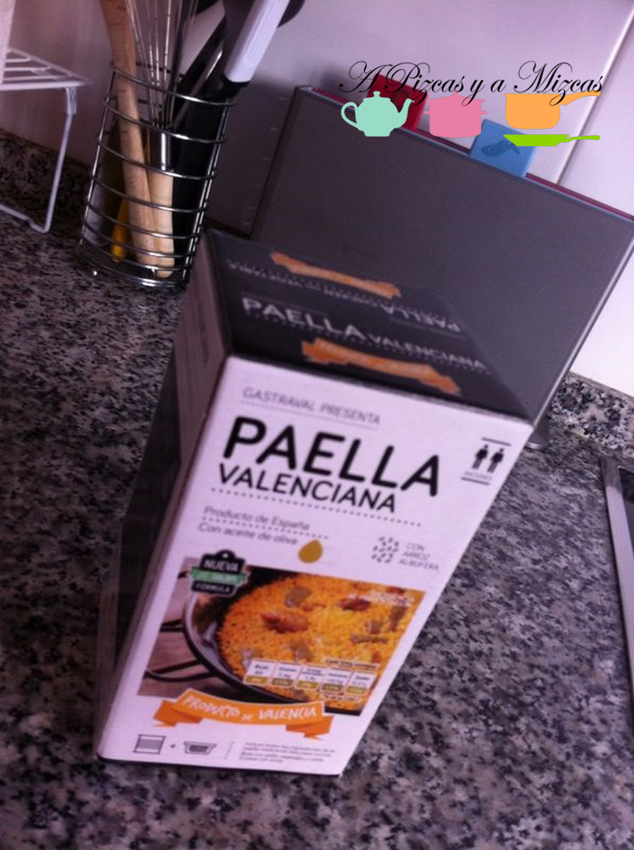
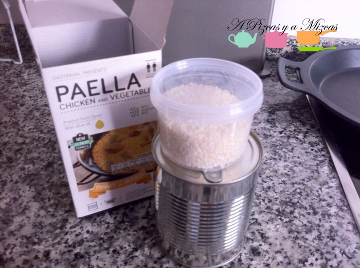
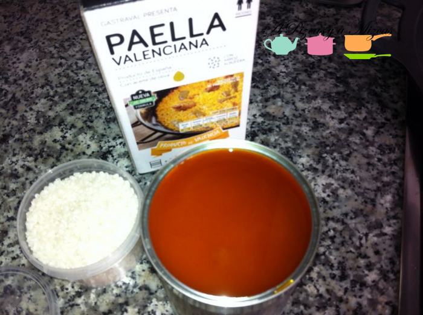
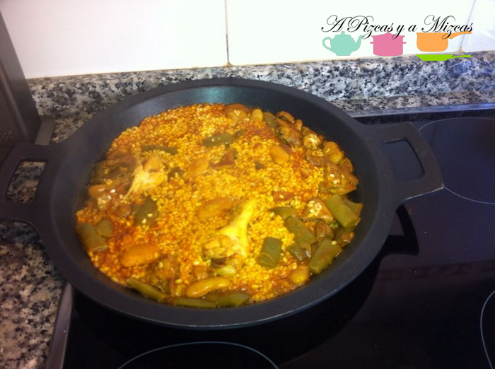

Parece que las cajas poco a poco salen de nuestra casa y de nuestras vidas... pero aún se nos hace un poco cuesta arriba meternos en los fogones... con tantas cosas que colocar y las navidades encima... ufff!

Así que un día recurrimos a esta paella que en nada la teníamos preparada... y la verdad es que nos sorprendió por su sabor. Sabe a paella!!!

## Ingredientes para preparar la paella (2 raciones):

Comprar una cajita de [paella valenciana en bote](http://paellasgastraval.infocif.es/paella-valenciana/paella-valenciana-en-bote "Paella valenciana en bote"). Hay está todo lo que necesitas para preparar la paella

\- Una cajita con la medida exacta de arroz de la albufera

\- Una lata con el caldo, el pollo, la judía verde y el garrofón

Ahora sólo hay que seguir las indicaciones del fabricante y en un ratito a degustar una paella rica rica

Así nos lo explican ellos:

"Auténtica **Paella Valenciana** lista en 21 minutos. No es necesario añadir nada. Caliente el contenido del bote, hierva y agregue el arroz. Sirva todas las paellas iguales siempre, sin variaciones en el sabor, color, presentación. Ahorre tiempo y dinero con un producto garantizado. Preparada en método tradicional a pocos metros del Parque Natural de L’Albufera.

No es necesario conocimiento de preparación de paella."

Colocamos el contenido del bote en una sartén o paella, calentamos hasta hervir. Cocinamos a fuego lento durante 21 minutos. Dejamos reposar aproximadamente 3 minutos y servir.

Después de probarla nosotros repetiríamos. Os animamos a que la probéis!

