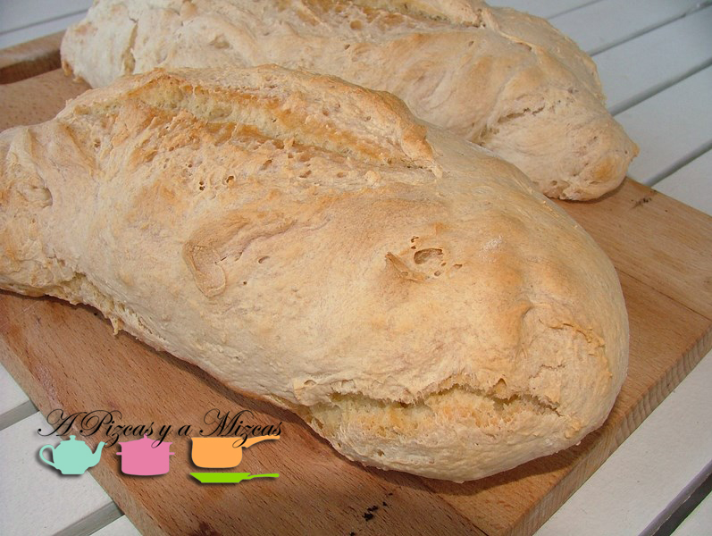

Hace un par de semanas en uno de nuestros blogs favoritos [Viva el viernes](http://vivaelviernes.com/) subieron una entrada de cómo hacer pan de pueblo... siempre habíamos pensando que era más lioso... pero al ver lo sencillo que era nos animamos a prepararlo. Ahora veréis el resultado de nuestro pan casero.

Seguimos la receta de [Viva el viernes](http://vivaelviernes.com/pan-casero-2/ "Pan casero - Viva el Viernes") al pie de la letra para que nos saliera bien... aquí os la dejamos

## Ingredientes para preparar el pan casero (dos panes)

- 500 gr de harina de trigo normal
- 300 gr de agua
- 10 gr de levadura fresca
- 10 gr de sal

Ponemos en un bol la harina, el agua, la sal y la levadura fresca desmigada. Lo mezclaremos todo hasta que tengamos una masa uniforme. Ayudaros con la manos, será mucho más fácil.

Taparemos la masa de nuestro pan casero con papel film y a la nevera. Lo dejamos toda la noche y al día siguiente le daremos forma a la masa, que habrá doblado su tamaño gracias a la levadura. Amasaremos lo mínimo, para no perder el aire y la esponjosidad de la miga. Damos forma y lo dejamos un par de horas antes de meter en el horno.

Precalentamos el horno a máxima potencia. Nosotros lo hicimos tal y como indicaban en Viva el viernes, primero a 250º veinte minutos y después lo bajamos a 220º y metimos el pan. Es bueno meter un pequeño recipiente con agua para que cree vapor dentro del horno. En media hora tendremos nuestro pan casero preparado

Y tal y como decían.... querréis hacer pan todas las semanas...

Nosotros utilizamos nuestros dos panes para lo siguiente:

- Para acompañar el desayuno

- Tosta pan casero con emulsión de cherry biológico y brie

Para acompañar nuestra primera experiencia con el pan casero pensamos en una rica tosta con emulsión de tomate cherry biológico y queso brie. Para preparar la emulsión tomamos unos 12 tomates cherry ecológicos, los metimos en el vaso de la picadora, añadimos una pizca de pimienta, una mizca de sal, una cucharada de albahaca seca picada y tres cucharadas soperas de aceite de oliva virgen extra. Lo trituramos todo hasta que emulsione el tomate con el AOVE.

En una tosta extendemos la crema de tomate, dos rodajas de queso brie y decoramos con dos tomatitos cherry partidos por la mitad. Lo introducimos en el horno a potencia fuerte, hasta que veamos que el queso empieza a fundirse.

Con nuestro pan casero funcionó perfectamente.

