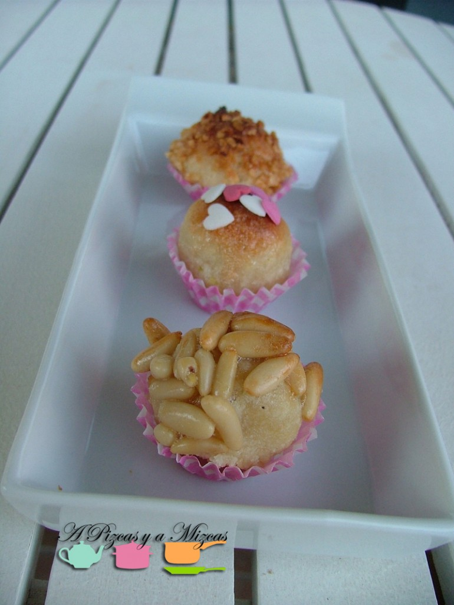
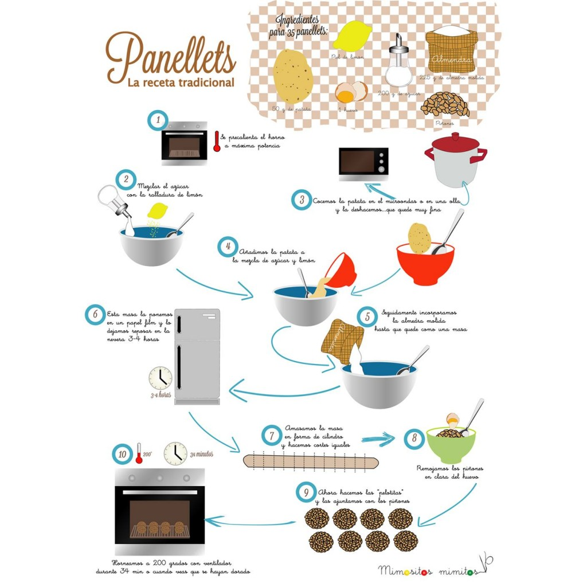
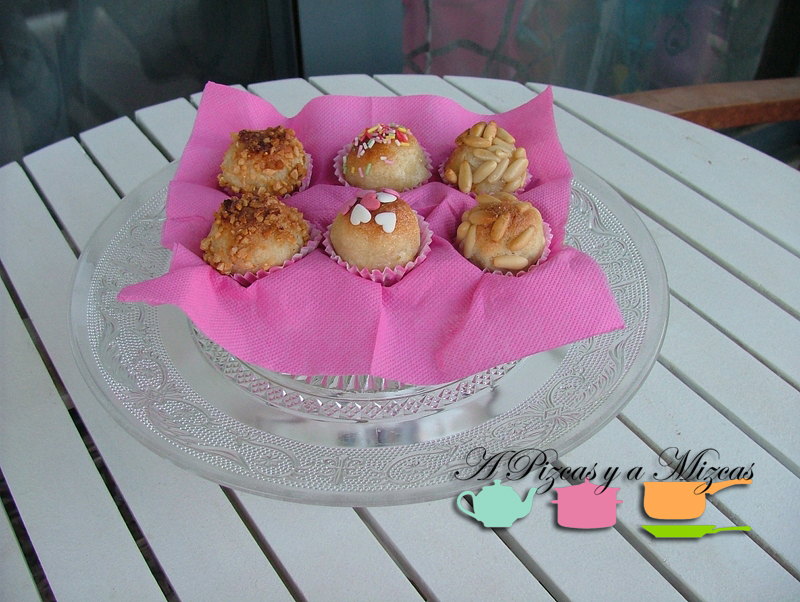
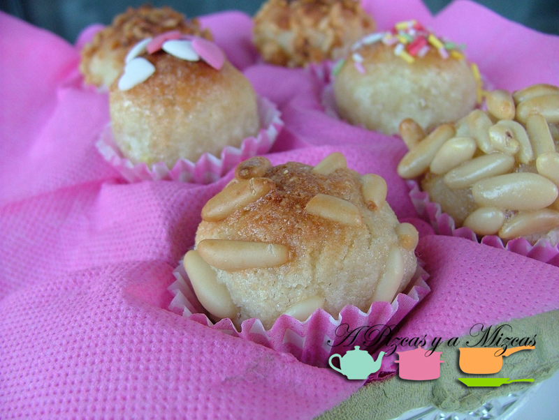

A principios de esta semana vimos una ilustración de [Mimositos Mimitos](http://mimositosmimitos.blogspot.com.es/2013/10/receta-ilustrada-panellets-todos-los-santos-receipt-ilustracion-postre-castanada-casero-homemade.html "Ilustración panellets Mimositos Mimitos") de cómo preparar los famosos panellets. La verdad es qué nos pareció una buena idea para celebrar la festividad de todos los santos... que no todo van a ser calabazas.... je je je

Antes os contamos un poco de [historia](http://es.wikipedia.org/wiki/Panellet "Historia de los panellets") de este dulce típico de todos los Santos.... es un dulce típico de la zona de Cataluña, Aragón, Baleares y Valencia. Datan del siglo XVIII, cuando se usaban como comida bendecida para compartir después de las celebraciones religiosas.

Resultaban muy útiles para comer el Día de Todos los Santos (1 de noviembre) y el Día de Difuntos (2 de Noviembre), en los que se tocaban a muertos en las campanas de las iglesias durante toda la noche del día 1 al 2, por lo que gran parte de la población hacía vigilia.

## Ingredientes para preparar los panellets

- una patata pequeña (aprox 50 gramos)
- la ralladura de una mandarina
- un huevo
- 200 gramos de azúcar
- 200 gramos de almendra molida
- un puñadito de piñones
- un puñadito de almendra crocanti
- un puñadito de fideos de colores

Como veréis nosotros hemos adaptado un poco la receta que nos proponían en [Mimositos Mimitos](http://mimositosmimitos.blogspot.com.es/ "Mimositos Mimitos") a nuestro gusto y os explicamos los pasos que nosotros seguimos para la elaboración de los panellets.

Pelamos y troceamos la patata y la ponemos a hervir. Después dejaremos que se enfríe un poco y chafaremos hasta que quede fina.

Por otra parte, en un bol ponemos el azúcar y la ralladura de una mandarina (también puede servir la ralladura de limón) y después incorporamos la patata y removemos para que se mezclen todos los ingredientes.

A continuación incorporamos la almendra molida poco a poco hasta obtener un masa uniforme. Tapamos el bol con papel film y lo metemos en el frigorífico durante 3 o 4 horas.

Transcurrido ese tiempo amasamos y formamos varios cilindros e intentamos hacer cortes iguales y formamos bolitas.

Precalentamos el horno a máxima potencia.

En otro bol batimos la clara del huevo y prepararemos los piñones y el crocanti de almendra. Ahora viene la parte curiosa de la receta... Pasamos las bolitas por la clara de huevo y con cuidado las rebozaremos unos con los piñones y otros con  el crocanti de almendras.

Colocaremos la bolitas en  una fuente apta para el horno que habremos espolvoreado de harina previamente para evitar que se pegue. Introducimos en el horno a 200º donde los tendremos unos 15 minutos aproximadamente (o hasta que veais que estén dorados)

Una vez que pierdan algo de calor seguiremos rebozando el resto de los panellets con los fideos y corazones de colores para darle un toque divertido a nuestras bolitas.

A disfrutar del día de todos los santos que con este típico dulce.

