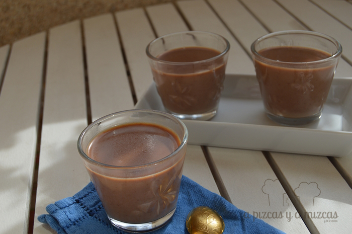
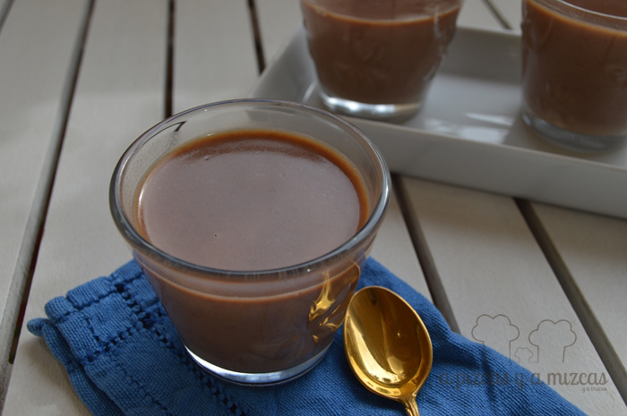

Ya sabemos que las navidades están a la vuelta de la esquina y que debemos cuidarnos un poquito más... pero no hemos podido resistirnos a preparar una panna cotta de chocolate. Para no sentirnos tan culpables lo hemos servido en pequeñas porciones :P

La [panna cotta](http://es.wikipedia.org/wiki/Panna_cotta "Panna cotta wikipedia") es un postre típico de la región italiana del Piamonte, elaborado a partir de crema de leche,  azúcar y gelatificantes, que se suele adornar con mermeladas de frutas rojas. Recuerda al flan, pero su sabor es más lácteo y tiene una textura más parecida a la de la gelatina que a la del flan

Casi casi en los inicios del blog preparamos una [panna cotta de milkybar](/pannacotta-de-milkybar/ "Panna cotta de milkybar") que fue todo un éxito entre los invitados y nos apetecía probar con chocolate con leche y la verdad es que gustó. Así que seguimos la receta cambiando el milkybar por el chocolate con leche y actualizando las cantidades.

## Ingredientes para preparar la panna cotta de chocolate (para 10 raciones pequeñas)

- 400 ml de leche desnatada
- 400 ml de nata para cocinar
- 300 gramos de chocolate con leche
- 120 gramos de azúcar
- Diez hojas de gelatina

Es un postre muy rápido de preparar. En un cazo ponemos la leche, la nata y el azúcar y antes de que empiece a hervir, añadimos el chocolate troceado. Ahora removeremos constantemente para ayudar que el chocolate se disuelva y no se pegue. Cuando se haya disuelto todo el chocolate, bajamos el fuego y removemos un poco más hasta que espese. Lo apartamos del fuego.

En otro recipiente, ponemos en remojo en agua tibia la gelatina (unos minutos) y añadiremos las hojas, una a una, en el cazo hasta que se diluya

Para servirlo utilizamos vasitos de cristal para que las raciones fueran pequeñas. Los rellenamos y al frigorífico. Tendrán que permanecer en el frigorífico al menos un par de horas.

¿Cúal es vuestro postre favorito con chocolate? Cuentánoslo
