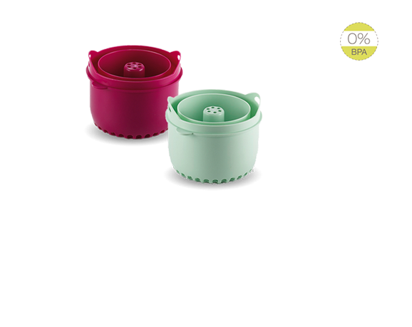

Seguimos avanzando con la alimentación de Trizcas...superamos la fase de sólo verduras, a la semana empezamos con el pollo y cuando pasó un mes empezamos con el solomillo de ternera. Ahora que ya sabemos que le gusta todo hemos empezado a variar sus papillas. Hemos introducido el arroz y el resultado fue una cremosa papilla de arroz con pollo a la jardinera.  Y la verdad es que le ha  encantado!

## Ingredientes para la papilla de arroz con pollo a la jardinera (dos raciones de ser menudo)

- 2 zanahorias pequeñas
- 6 o 7 judías verdes
- 80 gramos de pollo
- 80 gramos de arroz
- aceite de oliva virgen extra

Nosotros que somos muy previsores cuando nos regalaron la [Babycook de Beaba](http://www.beaba.com/) también encargamos la arrocera. La verdad que en el mundo de los bebes nos parece que todo es imprescindible. Nuestra opinión es que podríamos prepararle las papillas a Trizcas de forma tradicional (como lo hacían nuestras madres) pero la Babycook nos ahorra tiempo y esto con un ser menudo se agradece.

El procedimiento es el mismo que con la papilla de verduras. El primer paso es cocer el arroz, ponemos en la jarra medidora  tres medidas de agua y la introducimos en la caldera. En la arrocera ponemos el arroz y 100 ml de agua. Encendemos la Babycook y dejaremos que cueza el arroz aproximadamente 25 minutos.

")

Lavamos y cortamos en trozitos pequeños la judía verde, la zanahoria y el pollo. Lo ponemos todo en la cestita de la Babycook, ponemos tres medidas de agua en la caldera y pondremos el interruptor en la función vapor hasta que la luz se apague. Ponemos el caldo en un vaso y reservamos y trituramos las verduras, el pollo y el arroz. Le añadimos el caldo hasta conseguir la textura deseada y un chorrito de aceite de oliva virgen extra.

")")

")

Separamos en dos recipientes, y ya tenemos la comida de dos días!
