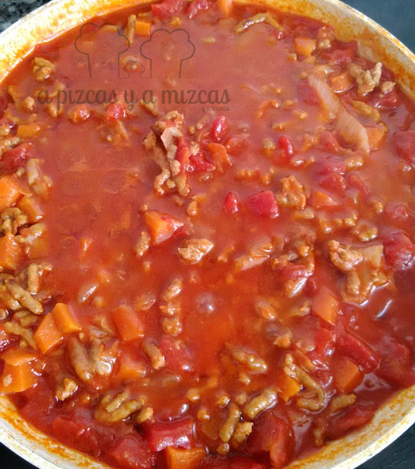
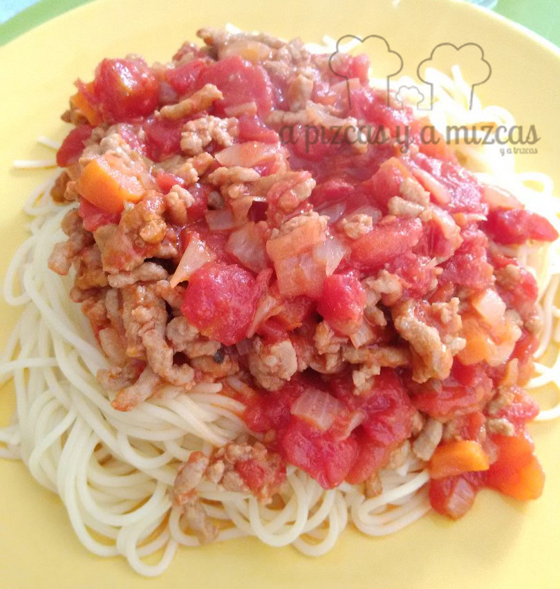

Una receta tan sencilla como la pasta a la boloñesa se puede convertir en un plato con el que tus comensales te hagan la ola. Y como en otros platos italianos, en este caso, el secreto está en la salsa! Si quieres descubrir el secreto de nuestra salsa boloñesa no te vayas...

## Ingredientes para preparar la pasta a la boloñesa

- 300 gramos de carne picada de cerdo y vacuno
- 1 kilo de tomate natural en lata
- 2 cebollas medianas
- 1 zanahoria
- 2 dientes de ajo
- 1 vaso de vino blanco
- azúcar
- sal
- pimienta
- aceite de oliva virgen extra
- pasta

Ponemos una sarten al fuego con un chorro de aceite de oliva virgen extra y los dos dientes de ajo pelados hasta que se doren. A continuación añadimos el tomate. Lo cocinamos a fuego lento durante unos 20 minutos. Añadimos una cucharada grande de azúcar.

Luego picaremos la cebolla y la zanahoria. Y lo pocharemos en otra sartén con un chorrito de aceite de oliva virgen extra. Cuando la cebolla esté doradita añadiremos la carne picada. Removemos de vez en cuando para que se haga todo bien.

Cuando la carne picada esté hecha, añadiremos el vino blanco (podéis echar vino tinto si queréis) y la salsa de tomate. Cocinaremos todo a fuego medio durante unos diez minutos.

Por último cocináis vuestra pasta favorita y ya tenéis la comida lista. Seguro que os encanta. Además la salsa boloñesa la podéis preparar y congelar, así en cualquier momento tenéis una pasta casi casi como la prepararía la auténtica nonna italiana. **BUON APPETITO!!**

