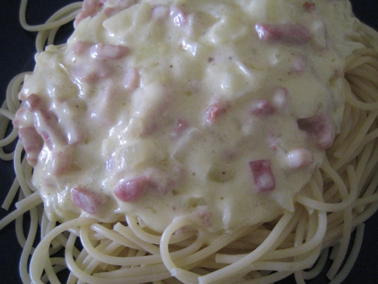

Realmente, un italiano te dirá que esto no es pasta carbonara, que lo que realmente hemos cocinado es pasta con nata y queso. Ellos hacen la carbonara con las yemas de huevo en crudo, sobre las que echan parmesano y bacon caliente. De esta forma se cuaja algo la yema y queda la salsa carbonara. Así los comemos cuando los prepara **Max**.

Sin embargo, Pizcas y Mizcas hacemos una carbonara a nuestra manera. Es un plato que nos gusta hacer en fin de semana, pues es un poco pesado, pero está muy bueno.

Ingredientes para 2/3 personas:

- Pasta (mejor spaghhetti o tallarines)
- Bacon a tiras 150 gramos
- Queso rayado tipo emmental
- Queso grana padano o parmesano
- Una cebolla pequeña
- Sal
- Pimienta
- Nuez moscada
- 200 ml de nata

Ponemos a hervir la pasta en abundante agua, siguiendo las instrucciones del envase, según sea pasta fresca o seca.

Picamos muy fina la cebolla y la ponemos a pochar en una sartén, con una pizca de sal se hará antes. Cuando esté transparente, echamos el bacon. Dejamos que se cocine bien. Cuando esté bien frito, incorporamos la nata líquida y bajamos el fuego. Removemos constantemente para que no se pegue.

   

Salamos y añadimos pimienta y nuez moscada al gusto. Añadimos el queso emmental y una pizca del grana padano. No hay que dejar que espese demasiado. Si os ocurre esto, añadid un poco de leche caliente hasta que tome la consistencia adecuada.

Escurrir la pasta y mezclar bien con la salsa "carbonara".

Exquisita!!

