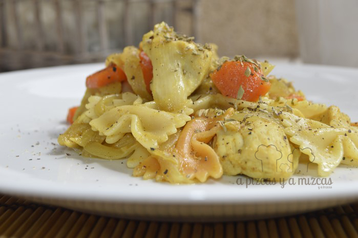
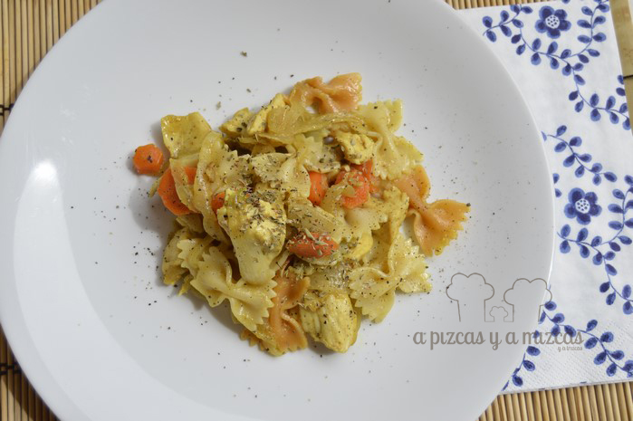

La pasta se puede preparar de muchísimas formas pero esta vez queríamos darle un toquecito oriental. Pizcas es muy aficionado a las especias y siempre nos sorprende con sus platos... así que hoy quería sorprenderle con un plato especial hecho con mis manitas. Con ingredientes que todos tenemos en casa me inventé este plato de pasta con pollo al curry.

El curry es una mezcla d especias muy utilizada en la cocina india cuya composición varía ampliamente. En Occidente el curry suele tener un sabor bastante estándar pero en la cocina india se usa gran variedad de mezclas de especias. La mayoría de recetas de curry en polvo incluyen cilantro, cúrcuma, comino en sus mezclas aunque también pueden añadirse otros ingredientes como jengibre, ajo, canela, clavo, semillas de mostaza, cardamomo negreo, nuez moscada... entre otros.

## Ingredientes para preparar la pasta con pollo al curry (para 4 raciones)

- dos dientes de ajo
- dos zanahorias
- una cebolla grande
- aceite de oliva virgen extra
- 400 gramos de farfalle de colores
- 300 gramos de pechuga de pollo
- sal y pimienta molida
- una cucharadita de orégano picado
- dos cucharadas de curry en polvo
- una guindilla pequeña

Pelamos los dientes de ajo y lo picamos. Cortamos la cebolla en juliana. Ponemos el aceite de oliva virgen extra en la sartén y sofreímos los ajos, cuando estén dorados, agregaremos la cebolla y cocinaremos a fuego lento hasta que tenga color.

Después trocearemos las zanahorias en trocitos pequeños e introducimos en la sartén hasta que la zanahoria esté blandita. Cortamos el pollo a trozos pequeñitos y añadimos sal y pimienta y dejamos que se haga durante unos cinco minutos.

A continuación agregamos dos cucharadas de curry y una guindilla pequeña. Removemos con cuidado y echamos un poquito de agua y volvemos a probar de sal y pimienta. Removemos y dejamos que se cocine todo durante unos cinco minutos aproximadamente.

Una vez que tengamos lista la salsa, prepararemos la pasta, en nuestro caso los farfalle de colores. Seguimos las indicaciones del fabricante para hervir la pasta. Cuando la pasta esté lista mezclamos con la salsa de pollo al curry para que se integren todos los sabores.

Al servir los platos espolvorear un poquito de orégano picado y a disfrutar de la comida!

