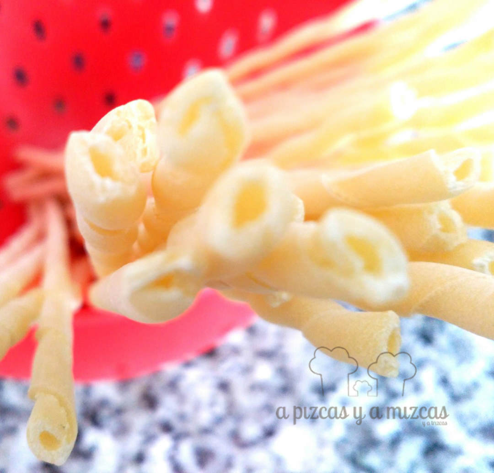
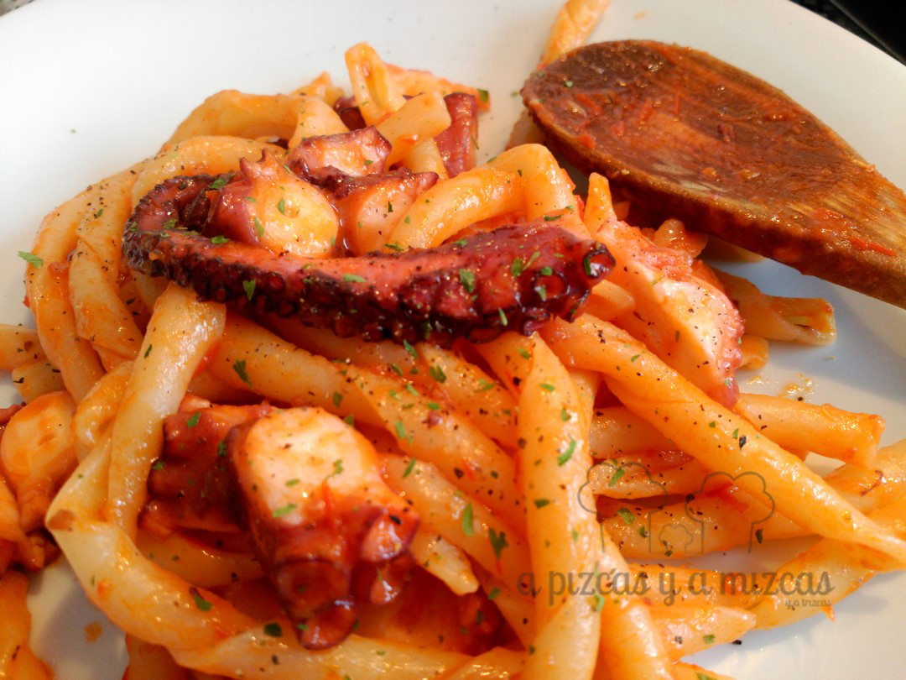

Muchas veces los platos más sencillos son los que más nos gustan. Sólo hace falta buenos productos y a cocinar. Y así nació esta pasta con pulpo, es que Pizcas cuando se mete en los fogones es un artista... ji ji ji.... si queréis saber el secreto de este plato... seguir leyendo :P

## Ingredientes para preparar la pasta con pulpo y tomate (2 raciones generosas)

- 160-180 gramos de pasta
- Dos dientes de ajo pelados
- Salsa de tomate casera (o una de calidad si es comprada)
- Dos patas de pulpo cocido
- Aceite de oliva virgen extra
- Pimentón dulce (o picante, al gusto).
- Sal y pimienta

Para preparar nuestra receta de pasta con pulpo, lo primero es poner a hervir el agua (apróximadamente un litro por cada 100 gramos de pasta), sin nada de sal. Le damos la cocción que aconseje el elaborador de la pasta.

Si es pasta seca, podemos aprovechar mientras cuece para preparar la salsa. Primero ponemos en una sartén dos o tres cucharadas de aceite de oliva virgen extra, y a fuego lento confitamos los dientes de ajo pelados (les damos un golpe para cascarlos) durante unos 8 minutos, para que e aromatice el aceite.

Luego, cortamos las patas de pulpo en pedazos no muy grandes, y lo salteamos a fuego vivo en el aceite con el ajo. Ponemos una cucharadita de pimentón dulce y agregamos tres cucharadas de salsa de tomate casera. Rectificamos de sal y pimienta. Bajamos el fuego y dejamos que se cocine lentamente.

Cuando la pasta esté ya cocida, la escurrimos y la agregamos un minuto a la sartén con la salsa, para que tome todos los sabores.

Mmmm.... a comeeeer!!

Hay que tomarlo caliente y Pizcas no pudo resistirse a añadir una mizca de merkén picante que tiene muy bien guardadito en la despensa... Muy rico, rico.
