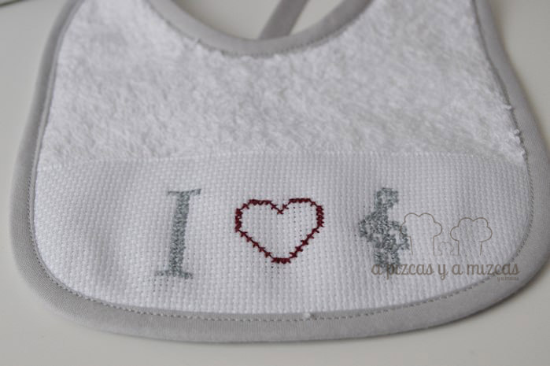

Cuando te dicen que un bebé está en camino siempre es una alegría... pero cuando te lo dice alguien al que quieres mucho pues es lo más de lo más. Por eso este regalo lo hemos hecho con mucho cariño y ha salido casi sólo. Nos pareció buena idea hacer un pechito y trapito de lactancia con notas musicales.Como sabemos que al futuro papá le encanta la música quisimos hacer un pequeño guiño con este regalo.

Compré un par de madejas de hilos de punto de cruz en tonos grises... y empecé mi labor. En el pechito bordé un corazón junto a la clave de sol ( I love music) y en el pechito de lactancia unas notas musicales y la inscripción I (love) music.

Esta vez también nos ayudó la iaia Mizcas y su máquina. Ella se encargó de hacer el pechito y el trapito con rizo blanco y lo acompañó de un ribete en gris a juego con el bordado.

A nosotros nos ha encantado cómo ha quedado... y creemos que a los futuros papis también.

Si os interesa algún regalo de bienvenida para nenes o cualquier otra cosa que veáis en el blog, poneros en contacto con nosotros puedes utilizar nuestro [formulario de contacto](/contacto/ "Ponte en contacto con nosotros") y hacernos la petición o lo que quieras decirnos.
