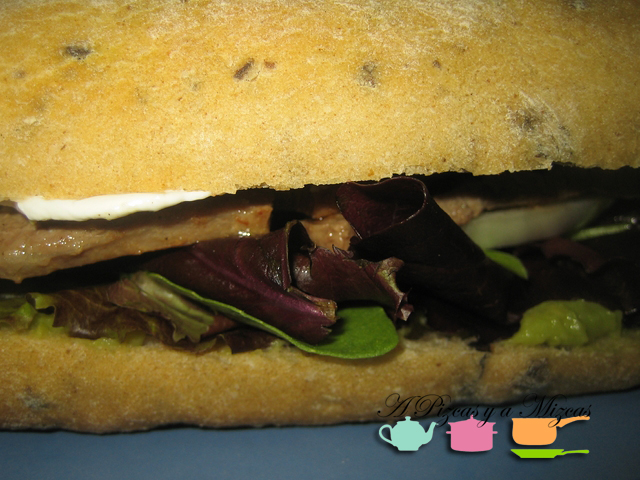
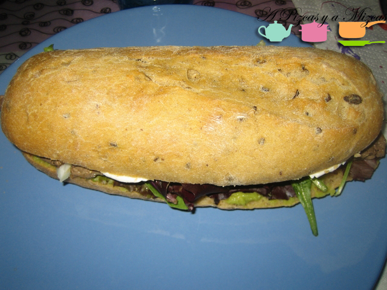

Es posible que el pepito sea uno de los bocadillos más tiernos que existen, ya desde su mismo nombre. En esta ventana a la cocina de A Pizcas y a Mizcas os traemos una versión un poco actualizada, un pepito de ternera y guacamole, con pan de aceitunas, mix de brotes tiernos y queso especiado. Una cena rápida de las que nos gustan.

## Ingredientes para el pepito de ternera y guacamole (dos raciones)

- Dos panecillos de aceitunas
- Un filete grande o dos pequeños de babilla de ternera
- Guacamole (podéis utilizar alguno fresco ya preparado o [prepararlo vosotros](/guacamole/ "Guacamole"))
- Dos puñaditos de mix de brotes tiernos
- Queso blanco de untar
- Pimienta, hierbabuena picada, tomillo picado

Partimos los panes que albergarán nuestro pepito de ternera y guacamole y sobre la base inferior extendemos dos cucharadas de guacamole. Por encima del guacamole añadimos las lechugas.

Preparamos nuestro queso especiado. En un bol añadimos cuatro cucharadas soperas de queso fresco para untar. Pimienta molida, hierbabuena picada y tomillo, al gusto. Untamos con esta mezcla la parte superior del panecillo del pepito de ternera y guacamole.

En una sartén amplia calentamos un poquito de aceite virgen extra. Cuando esté bien caliente añadimos los filetes. Para que no se doblen, es útil hacerles unos cortes en los laterales. Los hacemos vuelta y vuelta, salpimentamos y colocamos sobre las lechugas. Tapamos con la otra mitad de pan y a comérselo antes de que se enfríe la carne!

Es rápida esta cena a base de pepito de ternera o no!!!
