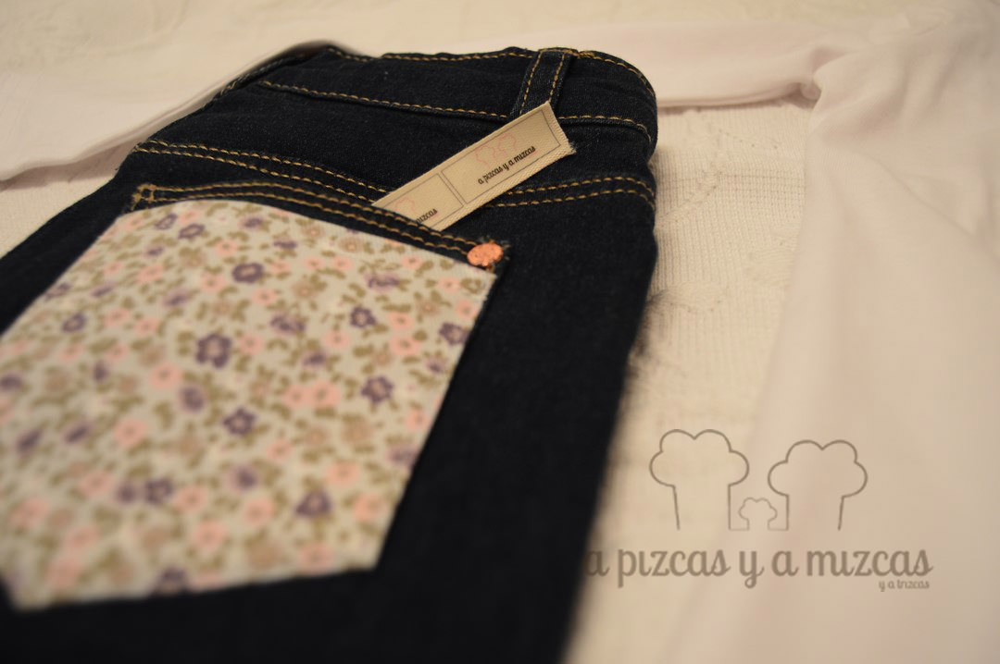
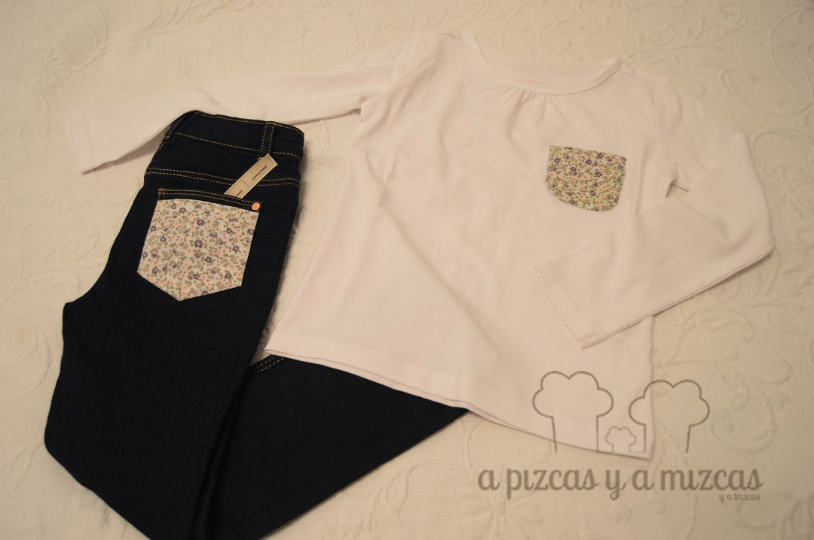

Los vaqueros son una prenda básica en el armario de los mayores y de los peques. Por eso hoy nos ha parecido una buena idea a través de este post: personaliza los vaqueros de los peques de la casa,enseñaros como le customizamos unos jeans a Trizcas. Un diy muy facilito y apto para los que no son muy amigos de la aguja y el hilo.Antes de empezar el cole compramos un par de vaqueros básicos y un montón de camisetas con la idea de más adelante hacer algo con toda esa ropa básica.... y ahora que parece que ya tenemos dominadas las rutinas y tenemos algún hueco libre ha llegado su turno.

Queríamos algo muy sencillo y que no nos llevara mucho tiempo. Así que buscamos algunos retalitos y sacamos un patroncillo del bolsillo trasero del vaquero y lo pusimos encima como un sobre bolsillo. Ya veis súper fácil y queda muy chulo.

Y como a Trizcas le encanta ir conjuntada le cosimos a una de las camisetas básicas blanca otro bolsillito (un poquito más pequeño) con la misma tela que del pantalón vaquero. Y de esta forma tan rápida se personaliza los vaqueros de los más peques. Y tambíen de los mayores...porque Mizcas ya está pensando en customizar los suyos... ji ji ji

De esta forma tenemos otro conjunto para los días de cole de Trizcas.

¿Qué os ha parecido?

Diy: personaliza tú vaquero

Si os ha gustado nuestro conjunto customizado o queréis preguntarnos o contarnos cualquier cosa podeís poneros en contacto con nosotros a través de nuestro [formulario de contacto.](/contacto/)

Y el conjunto nos ha quedado así de bonito
