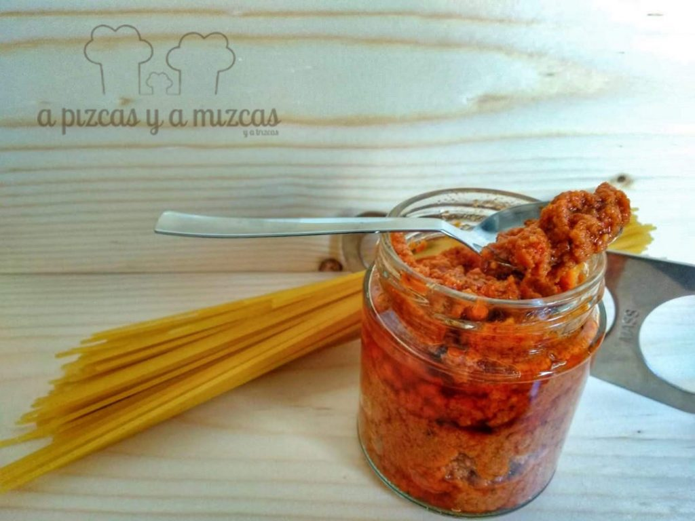

Esta semana la lluvia nos ha acompañado en Valencia casi todos los días... así que una buena opción ha sido meterse en la cocina y dejar planificadas las comidas de la semana. El pesto rojo de tomates secos con almendras es una opción estupenda para acompañar cualquier plato de pasta e incluso junto a pescado blanco o verduras al horno. Además lo tienes preparado en nada... Es una receta fácil que puedes tener hecha con antelación y te puede solucionar cualquier comida o cena, y que está riquísima. Más suave que el tradicional pesto de albahaca, piñones, ajo y parmesano y que suele gustar mucho a los más pequeños de la casa.

Hasta ahora siempre que hemos hecho el pesto rojo en casa hemos utilizado la receta de [Corazón de Caramelo](https://www.corazondecaramelo.es/2018/10/01/pasta-con-pesto-de-tomates-secos-receta-italiana/) pero últimamente la hemos ido adaptando a los gustos de casa con ligeras modificaciones. Ambas están de rechupete, os animamos a que cocinéis las dos y nos comentéis.

## Ingredientes para el pesto rojo de tomates secos y almendras

- 50 gramos de queso grana padano rallado
- 30 gramos de almendras tostadas sin piel y sin sal
- 150 gramos de tomates secos conservados en aceite (o secos total, con lo que tendréis que rehidratarlos antes)
- albahaca picada
- 10 gramos de alcaparras
- 100 gramos de aceite de oliva virgen extra
- 1 diente de ajo

Para preparar el pesto rojo de tomates secos y almendras, primero pelamos el ajo y le quitamos la parte del medio, el germen. En el vaso de la batidora ponemos el queso grana padano rallado y las almendras y trituramos hasta que las almendras se queden en trocitos pequeños.

A continuación, agregamos el resto de ingredientes. Los tomates secos, la albahaca, las alcaparras, el aceite de oliva virgen extra y el ajo y trituramos todo hasta conseguir una textura de pomada granulada.

Ya tenéis listo el pesto rojo de tomates secos y almendras, ahora sólo queda pensar cómo los vais a emplear y sus posibilidades son muchas. Nuestra forma favorita es con pasta corta, tipo macarrones.

Cocemos la pasta al dente, escurrimos y reservamos parte del agua de cocción. En la misma cacerola ponemos la pasta escurrida y agregamos pesto rojo al gusto, junto con medio cucharón de agua de cocción de la pasta, removemos a fuego medio durante un minuto para que ligue todo y servimos bien caliente.

Para conservar el pesto rojo podeis guardarlo en botes de vidrio en el frigo con una fina capa de aceite de oliva virgen extra por encima del pesto rojo de tomates secos y almendras. De esta forma os aguantará varios días en la nevera. Cuando queráis emplearlo, sólo tenéis que remover el pesto bien para homogeneizarlo y ¡voilà!

Esperamos que os haya gustado.
