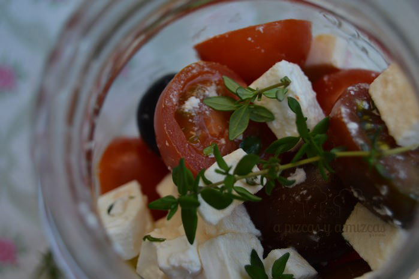
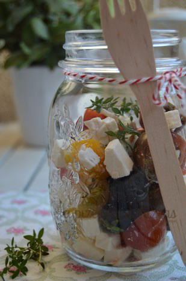
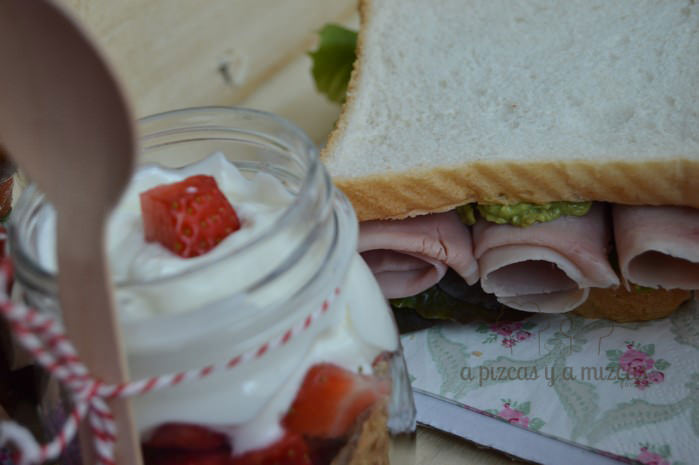
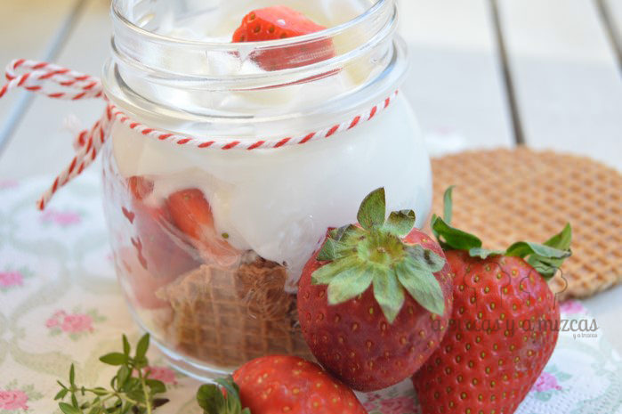
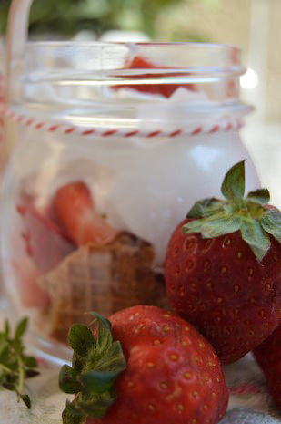
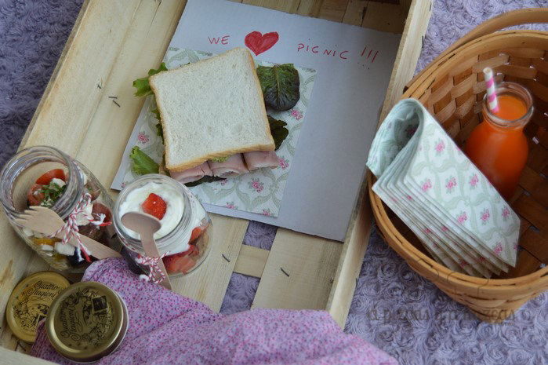

Hay que ser claros, comer en Valencia durante los días de Fallas es una aventura. Si lo que pretendes ya es comer bien, entonces la cosa se convierte en una epopeya. Por eso, nosotros somos muy fans de los días falleros de mochila al hombro y de comer en la calle, en un jardín o en un parque. Una de las soluciones que más nos gustan para estos días es la de realizar un picnic fallero. Éste es sólo un ejemplo de un picnic, pero seguro que tú tienes riquísimas ideas que nos pueden ayudar.

La mochila es básica para la semana (los cuatro días en realidad) y nosotros siempre nos aseguramos de llevar lo siguiente, además de la comida:

- Agua fría (así aguantará fresca más tiempo)
- Zumos fríos (ídem)
- Pañuelos de papel y toallitas húmedas
- Frutos secos para vencer al gusanillo
- Alguna chuchería

De esta manera evitaremos "gastos hormiga" y podremos realizar alguna "inversión" gastronómica como alguna docena de buñuelos o una tapita caliente. Además, siempre podremos echar mano de estos básicos, antes, durante y después de nuestro picnic fallero.

## Nuestra propuesta de picnic fallero

Nosotros os proponemos este menú para un almuerzo urbano fallero perfecto. Se compone de:

- Ensalada mediterránea sin lechugas
- Sandwich de jamón york y aguacate
- Postre de galletas de mantequilla, yogur y fresas

Una idea que nos resulta siempre muy práctica para comer en la calle es utilizar los botes de cristal como los de las conservas para llevar la comida. A nosotros nos sabe casi hasta mejor así, pero si quieres evitarte llevar más peso, puedes llevar tu comida en los recipientes herméticos de plástico de toda la vida.

Para la ensalada mediterránea sin lechugas utilizamos:

- Queso feta o similar
- Tomates cherry
- Aceitunas negras
- Tomillo fresco
- Aceite de oliva virgen extra
- Sal

Simplemente, cortamos el queso en dados, los tomates en mitades y las aceitunas enteras. Lo introducimos en el bote, con hojas de tomillo fresco del que tenemos en el balcón (puedes utilizar tomillo seco o la hierba aromática que prefieras). Aliñamos con aceite y sal al gusto.

Para el sandwich de jamón york y aguacate empleamos.

- Pan de molde
- Aguacate maduro
- Mezclum de lechugas
- Sal y pimienta
- Vinagre
- Jamón de York

Partimos el aguacate y machacamos la pulpa con un tenedor hasta tener una pomada. Salpimentamos y añadimos una pizca de vinagre. Esta salsa la extendemos en las rebanadas de pan de molde, añadimos unas hojas de lechuga y tres lonchas de jamón de York enrolladitas.

Para el postre de galletas de mantequilla, yogur y fresas necesitaremos:

- Galletas de mantequilla (nosotros empleamos unas que gastamos para acompañar el té)
- Yogur griego
- Fresas

Partimos las galletas y las ponemos en el fondo del bote, a continuación colocamos las fresas cortadas en cuartos y el yogur griego. Adornamos con algún trozo de fresa más.

En Valencia hay un montón de sitios donde podréis descansar un rato y coger de nuevo fuerzas para seguir viviendo el ambiente fallero. Pero os dejamos una lista con algunos:

\- El parque de [Viveros o Jardines del Real,](http://www.valencia.es/ayuntamiento/Infociudad_accesible.nsf/vDocumentosWebListado/FF9C0E294CBAE260C12572C20023FD3B?OpenDocument "Viveros") está abierto desde las 8 de la mañana hasta que oscurece y su entrada en gratuita.

\- El Jardín del Turia, está en el antiguo cauce del río Turia. Es uno de los parques más visitados de Valencia y España. Es el mayor jardín urbano de España. El Jardín cruza la ciudad desde prácticamente el puerto, más concretamente desde la Ciudad de las Artes y las Ciencias hasta el nuevo Bioparc.

\- Los jardines de la Biblioteca de Valencia en la calle Hospital también puede ser otra opción.

\- Por último los paseos de la Gran Vía Antiguo Reino de Valencia que tiene un paseo central con banquitos puede ser una buena elección.

Aunque estos días cualquier rinconcito puede ser bueno para parar un momentito coger fuerzas y continuar nuestra ruta fallera.

Espero nos contéis vuestra experiencia. Felices fallas!!
