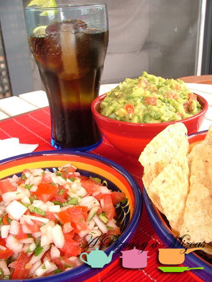
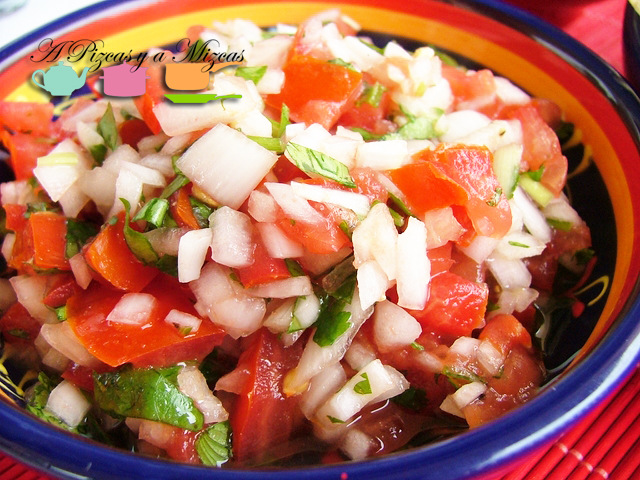

Teóricamente, el pico de gallo es una salsa, en la que los ingredientes no se presentan homgeneizados, sino cortados en dados pequeños. Tal vez por eso, por mucho que nos empeñamos en explicarle a la abuela Mizcas que era una salsa originaria de Máexico que habitualmente se sirve como aperitivo y con el acompañamiento de tortillas de maíz o nachos, su respuesta fue: "sí, pero es una ensalada fresca con cilantro y lima". Tampoco es mal resumen, ¿no? Habíamos probado el pico de gallo en anteriores ocasiones, en casas de amigos, o en alguna de nuestras salidas. Nuestra versión del pico de gallo es muy sencilla y se prepara en apenas cinco minutos. Eso sí, luego necesita unos 20 minutos o media hora en el frigo para que maceren bien los ingredientes.

## Ingredientes para un pico de gallo (como aperitivo para cuatro personas)

- Media cebolla dulce.
- Tres tomates (nosotros utilizamos los de pera).
- Una cucharada de cilantro picado.
- El zumo de media lima.
- Una pizca de sal y pimienta.
- Una mizca de aceite de oliva virgen extra.

Para preparar un pico de gallo como toca, es necesario picar bien la cebolla. La colocamos en un bol. A continuación, partimos los tomates por la mitad, les retiramos las pepitas y la gelatina que las envuelve y cortamos la carne del tomate en daditos. Los añadimos al bol. Picamos el cilantro y lo incorporamos (si no queréis incorporarlo de golpe, podéis incorporar ahora la mitad y el resto reservarlo para luego, así podréis regular la intensidad de sabor de vuestro pico de gallo). Salpimentamos al gusto y exprimimos media lima. Probamos y rectificamos de aquello que sea menester (sal, pimienta, lima o cilantro). Removemos bien el pico de gallo, tapamos el bol con papel film y lo llevamos a la nevera. Es importante qe repose entre 20 y 30 minutos como mínimo antes de servir. De esta manera los sabores quedarán más integrados.

En el momento de servirlo, echamos unas gotas (muy, muy poco) aceite de oliva virgen extra (nosotros empleamos un monovarietal de Serrana de Espadán) y removemos bien antes de llevarlo a la mesa.

Un acompañamiento clásico para el pico de gallo son los nachos. Por experiencia, los que más nos han gustado son los de marca blanca y sin sabor (ni tex-mex, ni barbacoa, queso....). Junto con el pico de gallo preparamos un [guacamole](/guacamole/ "Guacamole"). Nos quedó un aperitivo de lo más rico, sencillo y muy económico.

