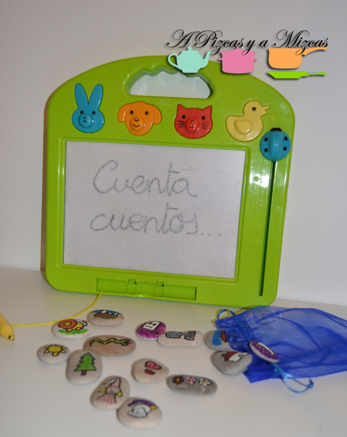
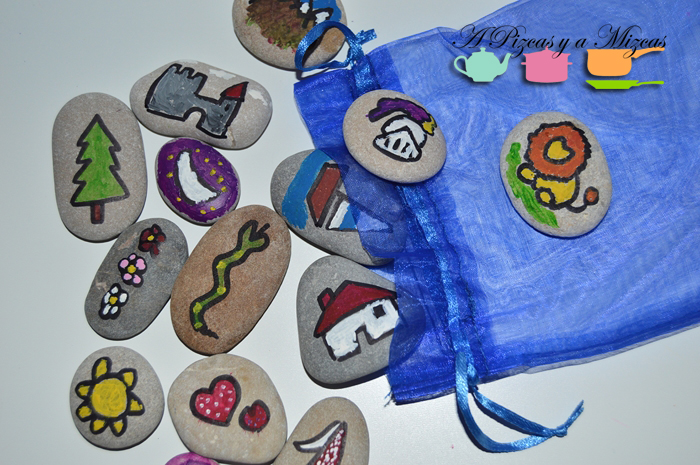

Estos días de vacaciones en la playa uno de los juegos favoritos de Trizcas era coger piedras de la playa pequeñas, medianas y grandes. Así que llegamos a casa cargados de pedretes. Habíamos visto en internet algunas ideas para hacer con las piedras: dominós, dibujos para contar cuentos. Y esta última idea nos gustó y decidimos hacer unos dibujitos en algunas de las piedras que nos sirvieran después para contar cuentos. Y las piedras cuenta cuentos se ha convertido en uno de sus juegos favoritos

## Todo lo que necesitas para las piedras cuenta cuentos

- Piedras de distintos tamaños de la playa
- Rotulador permanente
- Pinturas de distintos colores (nosotros utilizamos pintura de dedos)
- Pinceles finos

Ya tenemos todo le necesario preparado. Nosotros hicimos dibujos sencillos con un permanente: una princesa, un caballero, un castillo, un león, un barco, flores, corazones, un fantasma, un sol, una luna. Podeís hacer todo lo que os imagineís o adaptar vuestro cuento favorito. Una vez listos todos los dibujos, ha llegado la hora de mancharse a pintar.Sobretodo muchísima imaginación!

Ahora ya tenemos un montón de personajes que van a dar vida a muchísimas historias distintas. Aunque por ahora las que más repetimos son las historias de nuestro león Simba.

